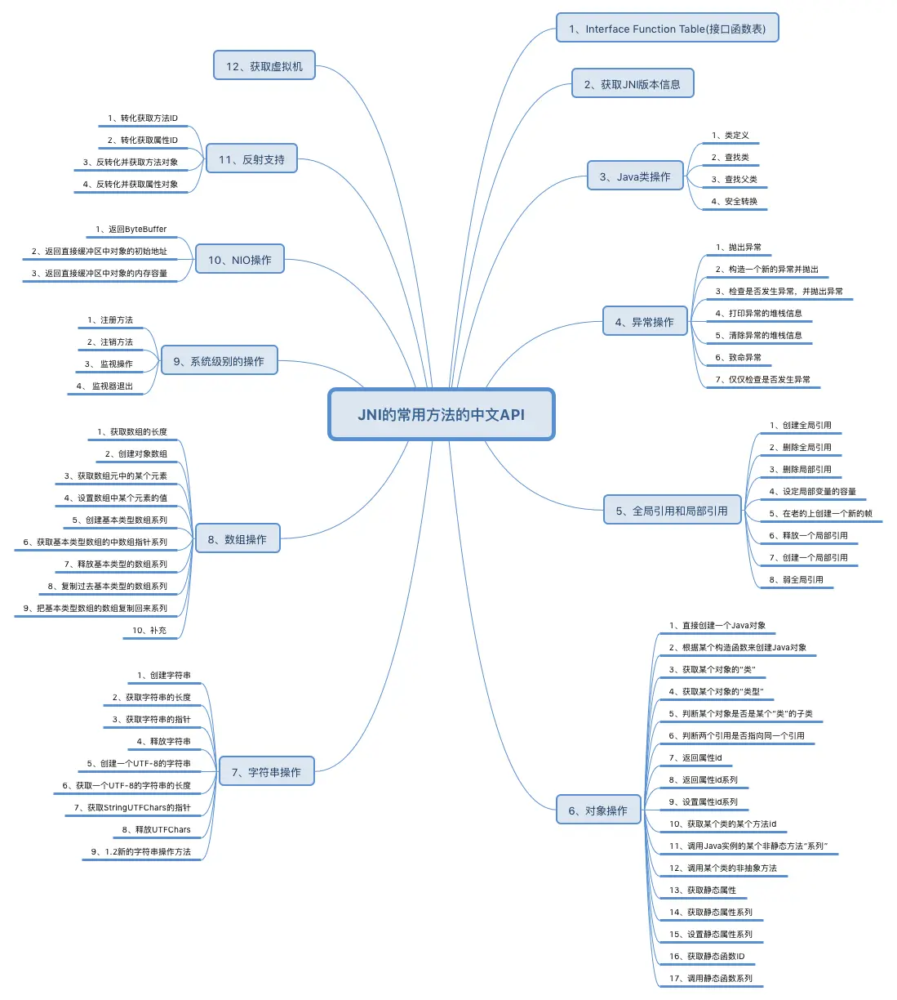

### 1. JNI

#### 1.1 JNI一般开发流程

1. 定义好本地`native`方法

2. `javah -jni` 生成`.h`头文件

3. 拷贝`xxx.h、jni.h、jni_md.h`到native方法定义工程下并添加依赖

4. 实现`xxx.h`的中的`native`方法

5. 生成动态库，java加载动态库

    ```java
    //加载apk中libs目录下的库
    System.loadLibrary("native-lib");
    //加载一个具体路径上的库（去服务器上下载再加载）
    ```

#### 1.2 JNI函数详解

```c++
extern "C"
JNIEXPORT jstring JNICALL
Java_com_example_project_class_func(JNIEnv *env, jclass clazz) {
    return env->NewStringUTF("hello world!");
}
```

##### 1.2.1 **extern "C"** 

​	按照C语言方式编译和连接。

##### 1.2.2 **JNIEXPORT** 宏定义

> 该声明的作用是保证在本动态库中声明的方法 , 能够在其他项目中可以被调用 

##### 1.2.3 **JNICALL** 宏定义

> - Windows：JNICALL 被定义为 __stdcall , __stdcall 是一种函数调用参数的约定 , 在 Windows 中调用函数时 , 该函数的参数是以 栈 的形式保存的 , 栈 中元素是后进先出的 , __stdcall 表示参数是从右到左保存的 ;
> - Linux：JNICALL 没有进行定义 , 直接置空 ; 在 Linux 中可以不用写 JNIEXPORT 和 JNICALL 宏 ;

##### 1.2.4 **JNIEnv** 指针

JNI 中定义的函数指针 , 实际都定义在 JNINativeInterface 结构体中。

```c++
#if defined(__cplusplus)
typedef _JNIEnv JNIEnv;
typedef _JavaVM JavaVM;
#else
typedef const struct JNINativeInterface* JNIEnv;
typedef const struct JNIInvokeInterface* JavaVM;
#endif
```

> C 语言中的 JNIEnv * env 实际上是 JNINativeInterface ** 类型 , 调用其中的方法指针时 , 先解引用 , 得到其一维指针 , 然后调用对用函数指针 (* env)->函数指针 ;
>
> C++ 中专门定义了 JNIEnv 结构体类型 , 其中的函数直接封装调用了 JNINativeInterface 结构体中的函数指针 , 只需要调用 JNIEnv 结构体中的方法即可 , C++ 中的 JNIEnv * env , 可以直接调用其中的方法 , 将其当做一个对象使用 , env->方法名称 , 即可完成调用 ;

> **注意：在C++创建的子线程中获取JNIEnv，要通过调用JavaVM的AttachCurrentThread函数获 得。在子线程退出时，要调用JavaVM的DetachCurrentThread函数来释放对应的资源，否则会出错。**

#### 1.3 JNI数据类型

##### 1.3.1 基本数据类型

| Java    | JNI      | C++            | C++ typedef                 |
| ------- | :------- | -------------- | :-------------------------- |
| boolean | jboolean | unsigned char  | uint8_t / unsigned 8 bits   |
| byte    | jbyte    | char           | int8_t / signed 8 bits      |
| char    | jchar    | unsigned short | uint16_t / unsigned 16 bits |
| short   | jshort   | short          | int16_t / signed 16 bits    |
| int     | jint     | int            | int32_t / signed 32 bits    |
| long    | jlong    | long long      | int64_t / signed 64 bits    |
| float   | jfloat   | float          | float / 32-bit IEEE 754     |
| double  | jdouble  | double         | double / 64-bit IEEE 754    |

##### 1.3.2 引用数据类型

| Java                | JNI           | 类型描述                     |
| ------------------- | ------------- | ---------------------------- |
| java.lang.Object    | jobject       | 表示任何Java的对象           |
| java.lang.String    | jstring       | Java的String字符串类型的对象 |
| java.lang.Class     | jclass        | Java的Class类型对象          |
| java.lang.Throwable | jthrowable    | Java的Throwable类型          |
| Object[]            | jobjectArray  | Java任何对象的数组           |
| boolean[]           | jbooleanArray | Java boolean型数组           |
| byte[]              | jbyteArray    | Java byte型数组              |
| char[]              | jcharArray    | Java char型数组              |
| short[]             | jshortArray   | Java short型数组             |
| int[]               | jintArray     | Java int型数组               |
| long[]              | jlongArray    | Java long型数组              |
| float[]             | jfloatArray   | Java float型数组             |
| double[]            | jdoubleArray  | Java double型数组            |

#### 1.4 JNI描述符

```shell
javap -p -s 全类名
```


##### 1.4.1 基本类型描述符

| Java Launage Type | Field Description |
| ----------------- | ----------------- |
| boolean           | Z                 |
| byte              | B                 |
| char              | C                 |
| short             | S                 |
| int               | I                 |
| long              | J                 |
| float             | F                 |
| double            | D                 |
| void              | V                 |
| 其它引用类型      | L+类全名+;        |
| 数组              | [                 |
| 方法              | (参数)返回值      |

```c++
//C
jfieldID    (*GetFieldID)(JNIEnv*, jclass, const char*, const char*);
jobject     (*GetObjectField)(JNIEnv*, jobject, jfieldID);
jmethodID   (*GetMethodID)(JNIEnv*, jclass, const char*, const char*);
//C++
//name为 Java 的属性字段名字，sig 为域描述符
jfieldID GetFieldID(jclass clazz, const char* name, const char* sig)
    { return functions->GetFieldID(this, clazz, name, sig); }
jobject GetObjectField(jobject obj, jfieldID fieldID)
    { return functions->GetObjectField(this, obj, fieldID); }
//jclass 是获取到的类对象，name 是 Java 对应的方法名字，sig 就是上面说的方法描述符
jmethodID GetMethodID(jclass clazz, const char* name, const char* sig)
    { return functions->GetMethodID(this, clazz, name, sig); }
```


##### 1.4.2 类描述符

类描述符是类的完整名称（包名+类名）,将原来的 . 分隔符换成 / 分隔符。

```c++
//C
jclass  (*FindClass)(JNIEnv*, const char*);
//C++
jclass FindClass(const char* name)
    { return functions->FindClass(this, name); }
```

> 完整类名：		java.lang.String
> 对应类描述符：java/lang/String
> 对应域描述符：Ljava/lang/String;
>
> 例如：
> 使用类描述符：  jclass intCls = env->FindClass(“java/lang/String”)
> 等同于域描述符： jclass intCls = env->FindClass(“Ljava/lang/String;”)

#### 1.5 JNI常用操作

##### 1.5.1 native获取Java字段，调用Java方法

访问 Java 类的字段，大致步骤如下：

1. 获取 Java 对象的类
2. 获取对应字段的 id
3. 获取具体的字段值 以访问以上 Animal 类的 name 字段，并将其修改为例：

```java
public class Animal {
    protected String name;
    public static int num = 0;
    
    public Animal(String name) {
        this.name = name;
    }
    public String getName() {
        return this.name;
    }
    public int getNum() {
        return num;
    }
}
private native void func(Animal animal);
```

```c++
//获取字段
extern "C"
JNIEXPORT void JNICALL
Java_com_example_project_class_func(JNIEnv *env, jclass clazz, jobject animal) {
    jfieldID fid; // 想要获取的字段 id
    jstring jstr; // 字段对应的具体的值
    const char *str; // 将 Java 的字符串转换为 Native 的字符串
    jclass cls = env->GetObjectClass(animal); // 获取 Java 对象的类
    fid = env->GetFieldID(cls/clazz, "name", "Ljava/lang/String;"); // 获取对应字段的 id
    if (fid == NULL) { // 如果字段为 NULL ，直接退出，查找失败
        return;
    }
    jstr = (jstring) env->GetObjectField(animal, fid); // 获取字段对应的值
    str = env->GetStringUTFChars(jstr, NULL);
    if (str == NULL) {
        return;
    }
    LOGD("name is %s", str);
    env->ReleaseStringUTFChars(jstr, str);
    jstr = env->NewStringUTF("replaced name");
    if (jstr == NULL) {
        return;
    }
    env->SetObjectField(animal, fid, jstr); // 修改字段对应的值
    //->SetStaticIntField(env,jcls,j_fid,age);
}

//调用方法
JNIEXPORT void JNICALL Java_com_example_project_class_callAddMathod
(JNIEnv *env, jobject jobj){
	
	jclass j_clz = (*env)->GetObjectClass(env,jobj);
	// 获取 methodid 
	jmethodID j_mid = (*env)->GetMethodID(env, j_clz, "add", "(II)I");
	// 去调用 java 的方法
	jint sum = (*env)->CallIntMethod(env, jobj, j_mid,2,3);
    //jint sum = (*env)->CallStaticObjectMethod(env, jobj, j_mid,2,3);

	printf("sum = %d",sum);
}
```

> NativeType Call<type>Method(JNIEnv *env, jobject obj, jmethodID methodID, ...);
>
> NativeType Call<type>MethodA(JNIEnv *env, jobject obj, jmethodID methodID, const jvalue *args);
>
> NativeType Call<type>MethodV(JNIEnv *env, jobject obj, jmethodID methodID, va_list args);
>
> 这三个操作的方法用于从本地方法调用Java 实例方法。它们的差别仅在于向其所调用的方法传递参数时所用的机制。
>
> 这三个操作将根据所指定的方法 ID 调用 Java 对象的实例（非静态）方法`。`参数` methodID` 必须通过调用 `GetMethodID()` 来获得。
>
> 当这些函数用于调用私有方法和构造函数时，方法 ID 必须从 `obj` 的真实类派生而来，而不应从其某个超类派生。
>
> #### **Call<type>Method Routines**
>
> 编程人员应将要传给方法的所有参数紧跟着放在 `methodID` 参数之后。Call<type>Method routine 接受这些参数并将其传给编程人员所要调用的 Java 方法。
>
> #### **Call<type>MethodA Routines**
>
> 编程人员应将要传给方法的所有参数放在紧跟在 `methodID` 参数之后的 `jvalues` 类型数组 args 中。Call<type>MethodA routine 接受这些数组中的参数并将其传给编程人员所要调用的 Java 方法。
>
> #### **Call<type>MethodV Routines**
>
> 编程人员将方法的所有参数放在紧跟着在 `methodID` 参数之后的 `va_list` 类型参数变量中。Call<type>MethodV routine 接受这些参数并将其传给编程人员所要调用的 Java 方法。
>
> 下表根据结果类型说明了各个方法调用例程。用户应将Call<type>Method 中的 type 替换为所调用方法的 Java 类型（或使用表中的实际方法调用例程名），同时将 NativeType 替换为该例程相应的本地类型。 

##### 1.5.2 native构建Java对象

```c++
//1.获取类描述符
jclass clz = env->FindClass("com/example/project/Animal");
//2.获取构造函数id
jmethodID method_id = env->GetMethodID(clz, "<init>", "(Ljava/lang/String;)V");
//2.生成对象
jobject animal_obj = env->NewObject(clz, method_id, "param");
```

1.4.5 Java与C++对象对应

C++创建对象，转成long类型返回，此时返回的是对象的地址；

Java保存long类型对象地址以供后续调用；

```c++
return reinterpret_cast<jlong>(gifFileType);
```

##### 1.5.3 数组操作

```c++
JNIEXPORT void JNICALL Java_com_example_project_class_sort
(JNIEnv * env, jclass jclz, jintArray jarray){

	// 对 jarray 进行排序 （sort）
	jint* intArray = (*env)->GetIntArrayElements(env,jarray,NULL);

	int length = (*env)->GetArrayLength(env,jarray);

	// 第一个参数：void* 数组的首地址
	// 第二个参数：数组的大小长度
	// 第三个参数：数组元素数据类型的大小
	// 第四个参数：数组的一个比较方法指针（Comparable）
	qsort(intArray, length, sizeof(int), compare);

	// 同步数组的数据给 java 数组 intArray 并不是 jarray ，可以简单的理解为 copy
	// 0 : 既要同步数据给 jarray ,又要释放 intArray
	// JNI_COMMIT:  会同步数据给 jarray ，但是不会释放 intArray
	// JNI_ABORT: 不同步数据给 jarray ，但是会释放 intArray
	(*env)->ReleaseIntArrayElements(env,jarray,intArray,0);
}
```

##### 1.5.4 局部引用和全局引用

- 局部变量：new需要手动回收，除非作为返回值

    ```c++
    JNIEXPORT void JNICALL Java_com_example_project_class_localRef
    (JNIEnv *env, jclass jclz){
        // 在 native 层构建的 Java 对象，你不用了该怎么管理？
        // native 层开辟的内存由谁管理，你能开辟多大
    
        // 字符串截取，String 对象
        jclass str_clz = (*env)->FindClass(env,"java/lang/String");
        jmethodID init_mid = (*env)->GetMethodID(env,str_clz,"<init>","()V");
        jobject j_str = (*env)->NewObject(env, str_clz, init_mid);
    
        // 还有 100 行代码
    
        // jobject 不要再使用了，要回收 javaGC 的源码
        (*env)->DeleteLocalRef(env,j_str);
        // 删除了就不能再使用了，C 和 C++ 都需要自己释放内存（静态开辟的不需要，动态开辟的需要）
    }
    ```

- 全局变量操作

  ```java
  saveGlobalRef("Darren");
  System.out.println(getGlobalRef());
  // 合适的时机去释放
  delteGlobalRef();
  ```

  ```c++
  // 全局变量
  jstring globalStr;
  
  JNIEXPORT void JNICALL Java_com_example_project_class_saveGlobalRef
  (JNIEnv *env, jclass jclz, jstring str){
  	// 保存全局变量，其他方法需要用到
  	globalStr = (*env)->NewGlobalRef(env, str);
  
  	// NewWeakGlobalRef (java 中的软引用很像) 无法保证对象不为空
  }
  
  JNIEXPORT jstring JNICALL Java_com_example_project_class_getGlobalRef
  (JNIEnv *env, jclass jclz){
  	return globalStr;
  }
  
  JNIEXPORT void JNICALL Java_com_example_project_class_delteGlobalRef
  (JNIEnv *env, jclass jclz){
  	(*env)->DeleteGlobalRef(env,globalStr);
  }
  ```

##### 1.5.5 缓存策略

需要频繁调用数据再native层通过static设置缓存，避免重复初始化，延长生命周期。

```c++
// 全局静态缓存，在构造函数中初始化的时候会去缓存
static jfieldID f_name_id = NULL;
static jfieldID f_name1_id = NULL;
static jfieldID f_name2_id = NULL;

JNIEXPORT void JNICALL Java_com_example_project_class_initStaticCache
(JNIEnv *env, jclass jclz){
	// 初始化全局静态缓存
	f_name_id = (*env)->GetStaticFieldID(env, jclz, "name", "Ljava/lang/String;");
	f_name1_id = (*env)->GetStaticFieldID(env, jclz, "name1", "Ljava/lang/String;");
	f_name2_id = (*env)->GetStaticFieldID(env, jclz, "name2", "Ljava/lang/String;");
}

JNIEXPORT void JNICALL Java_com_example_project_class_staticLocalCache
(JNIEnv *env, jclass jclz, jstring name){
	// 如果这个方法会反复的被调用，那么不会反复的去获取 jfieldID
	(*env)->SetStaticObjectField(env, jclz, f_name_id, name);
}
```

##### 1.5.6 异常处理

```c++
JNIEXPORT void JNICALL Java_com_example_project_class_exception
(JNIEnv *env, jclass jclz){
	
	// 假设现在想给 ，name 赋值 name3
	jfieldID f_id = (*env)->GetStaticFieldID(env, jclz, "name3", "Ljava/lang/String;");

	// 好几种方式
	// 1. 补救措施 ，name3 我拿 name
	// 1.1 有没有异常
	jthrowable throwable = (*env)->ExceptionOccurred(env);
	/*if (throwable){
		// 补救措施，先把异常清除
		printf("有异常");
		// 清除异常
		(*env)->ExceptionClear(env);
		// 重新获取 name 属性
		f_id = (*env)->GetStaticFieldID(env, jclz, "name", "Ljava/lang/String;");
	}*/

	// 2. 想给 java 层抛一个异常
	if (throwable){
		// 清除异常
		(*env)->ExceptionClear(env);
		// Throw 抛一个 java 的 Throwable 对象
		jclass no_such_clz = (*env)->FindClass(env,"java/lang/NoSuchFieldException");
		(*env)->ThrowNew(env, no_such_clz,"NoSuchFieldException name3");

		return;// 记得 return
	}

	jstring name = (*env)->NewStringUTF(env, "Darren");
	(*env)->SetStaticObjectField(env, jclz, f_id, name);
}
```

#### 1.6 常用API一览图


