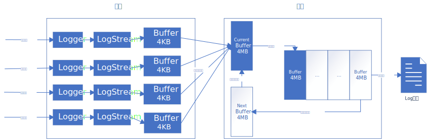
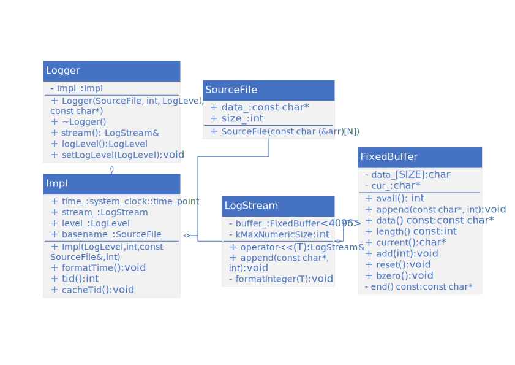
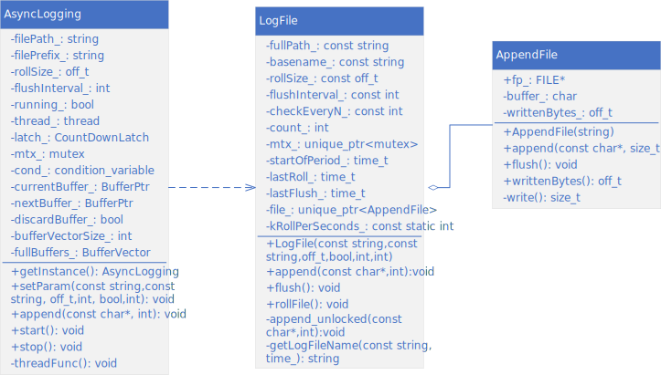
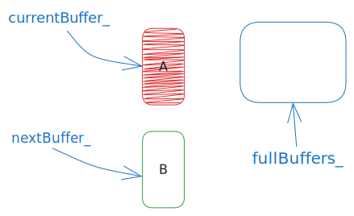
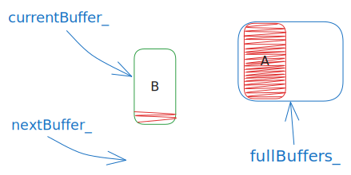

# CBB日志库

这是计划的一部分。

## 简介

`mldlog`是一个轻量级的异步日志记录库，支持多级别日志记录、文件输出、格式化输出等功能，并能设置文件大小或时间自动滚动文件，具有可扩展性。

## 功能特性

- 支持日志级别控制。 `FATAL,ERROR,WARN,INFO,DEBUG,TRACE`

- 支持同步/异步输出。 `AsyncLogging`

- 支持按照日志文件大小/间隔时间进行滚动。 `AsyncLogging::rollSize_, AsyncLogging::flushInterval`
- 支持扩展，可以自定义日志处理器。`Logger::setOutput`
- 支持多线程安全。
- 支持跨平台。`windows, linux`

## 使用方法

### 基本用法

设置日志过滤等级，并输出日志到控制台。

```c++
#include "logging.h"

using namespace mld;

int main(int argc, char const* argv[])
{
    Logger::setLogLevel(Logger::TRACE);

    LOG_TRACE << "trace";
    LOG_DEBUG << "debug";
    LOG_INFO << "info";
    LOG_WARN << "warn";
    LOG_ERROR << "error";
    LOG_SYSERR << "system error";
    LOG_FATAL << "fatal";
    LOG_SYSFATAL << "system fatal";

    return 0;
}
```

### 同步输出

输出到文件时，可以设置`LogFile::flushInterval`参数来定时将缓存flush到文件。

```c++
#include "logfile.h"
#include "logging.h"

using namespace mld;

int main(int argc, char const* argv[])
{
    Logger::setLogLevel(Logger::TRACE);
    LogFile output("./", "test", 1024 * 1024 * 500);
    Logger::setOutput(
        [&](const char* msg, int len) { output.append(msg, len); });

    LOG_TRACE << "trace";
    LOG_DEBUG << "debug";
    LOG_INFO << "info";
    LOG_WARN << "warn";
    LOG_ERROR << "error";
    LOG_SYSERR << "system error";
    output.flush();
    LOG_FATAL << "fatal";
    LOG_SYSFATAL << "system fatal";

    return 0;
}
```

> [!CAUTION]
>
> 如果输出`FATAL`级别的日志，则会调用`abort()`中断程序运行，在此之前，需要确保将缓存中的日志写入文件，如手动调用`flush()`

### 异步输出

异步输出需要获取`AsyncLogging`单例对象，其负责处理收到的日志，并进行异步输出。同样支持设置写入策略相关参数。`AsyncLogging::setParam()`

```c++
#include "asynclogging.h"
#include "logfile.h"
#include "logging.h"

using namespace mld;

int main(int argc, char const* argv[])
{
    Logger::setLogLevel(Logger::TRACE);
    auto& gAsyncLog = AsyncLogging::getInstance();
    gAsyncLog.setParam(
        "/home/wlkkk/workspace/mldlog/out/", "example", 1024 * 1024 * 512, 3);
    gAsyncLog.start();
    Logger::setOutput(
        [&](const char* msg, int len) { gAsyncLog.append(msg, len); });

    LOG_TRACE << "trace";
    LOG_DEBUG << "debug";
    LOG_INFO << "info";
    LOG_WARN << "warn";
    LOG_ERROR << "error";
    LOG_SYSERR << "system error";

    return 0;
}
```

### 自定义日志处理器

```c++
#include "asynclogging.h"
#include "logfile.h"
#include "logging.h"

using namespace mld;

int main(int argc, char const* argv[])
{
    Logger::setLogLevel(Logger::TRACE);
    Logger::setOutput([&](const char* msg, int len) {
        // 自定义日志处理器
        // 比如将收到日志通过网络发送到其他服务器
    });

    LOG_TRACE << "trace";
    LOG_DEBUG << "debug";
    LOG_INFO << "info";
    LOG_WARN << "warn";
    LOG_ERROR << "error";
    LOG_SYSERR << "system error";

    return 0;
}
```

## 实现原理

### 总体流程



前端负责构造日志消息，每条日志消息最大为`4KB`，并将消息传递给后端进行处理；

后端收到消息后放入缓冲区`4MB`，缓冲区满时触发入队，同时切换空缓冲区让前端继续写入，并通知写入线程将日志写入文件；写入线程消费后将空缓冲区放回去进行复用。

这样除了写入缓冲区时，只有在切换缓冲区时才进行锁切换，减少阻塞。

### 前端

`Logger`类提供日志创建接口，详细实现由内部类`Impl`实现；创建日志时，Logger通过传入的 `__FILE__, __LINE__，LogLevel`等参数构造`Impl`对象，`Impl`在构造中获取线程id、创建时间等其他信息；`Logger`类在析构时通过`g_output` 重定向输出`Impl`中的日志。

`SourceFile`类将传入的`__FILE__`进行裁剪，获取去掉路径的源文件名。

`LogStream`主要提供`operator<<`操作，重载整型数、浮点数、字符、字符串、字符数组等格式的输出，将数据保存到持有的`FixedBuffer`中；

`FixedBuffer`是维护一块内存空间，可通过模板设置缓冲区大小，用于存放具体的日志内容，内部维护一个`char`数组，对外提供基础的操作；

总结就是`Logger`提供用户接口，实现细节在`Impl`中；`Impl`实现除去正文以外的日志消息组装；`LogStream`重载操作符用来格式化输入，转换为字符串保存到内部的`FixedBuffer<kSmallBuffer>`中。

### 后端



`AsyncLogging`类提供大缓冲区`FixedBuffer<kLargeBuffer>`来存放前端送入的日志消息，为前端线程提供线程安全的写缓冲区操作；满时放入缓冲区队列`BufferVector`；内部独立线程`thread_`及处理函数`threadFunc()`负责将队列中的大缓冲区通过`LogFile`提供的接口写入磁盘。

`LogFile`实现了日志文件的操作，包括日志根据大小、间隔时间进行滚动，将日志消息写入磁盘等。

`AppendFile`封装了底层文件`IO`操作，采用`RAII`方式管理文件资源，构建时即打开文件，析构时即关闭文件。

### 双缓冲机制

后端采用双缓冲机制，同`glog`。基本思路如下：



- 初始状态下构造两个缓冲区`FixedBuffer<kLargeBuffer>`，用来存储多条`log`；缓冲区分别被`currentBuffer_`和`nextBuffer_`两个`BufferPtr`指向，`BufferPtr`本质是`std::unique_ptr<Buffer>`；同时还提供了已满缓冲区队列`fullBuffers_`来存储一个周期内要写入磁盘的日志，使用队列可以提高双缓冲区的容错性。

  

- 前端调用`AsyncLogging::append()`写入消息，消息会被保存到`currentBuffer_`管理的缓冲区；

  - 当`currentBuffer_`写满后，此时将`currentBuffer_`将指向的缓冲区`FixedBuffer<kLargeBuffer>`移入已满缓冲队列`fullBuffers_`；

  - 同时将`nextBuffer_`管理的缓冲区所有权移交给`currentBuffer_`使用，继续写入日志消息；<u>此时`nextBuffer_`已无缓冲区管理</u>。

  - 最后`notify`后端线程有数据可写，线程解除阻塞进行写磁盘操作。

    

    

- 后端线程函数`AsyncLogging::threadFunc()`同样准备了两个备用缓冲区指针`tempBuffer1`和`tempBuffer2`并分配缓冲区、待写入队列`toWriteBuffers`；备用缓冲区用来替换当前的`currentBuffer_`和`nextBuffer_`。

  - 线程启动后会检查`fullBuffers_`是否有数据可写，没有则进行阻塞等待；可通过`AsyncLogging::flushInterval_`设置自动唤醒的时间。

    

  - 受到唤醒后，进入加锁状态，将当前还没写满的`currentBuffer_`放入队列`fullBuffers_`；<u>此时`currentBuffer_`、`nextBuffer_`均无缓冲区管理</u>，所以将`tempBuffer1`、`tempBuffer2`管理的缓冲区所有权移交给它们管理。

    

  - 交换`fullBuffers_`和`toWriteBuffers`，解除锁。交换后`fullBuffers_`为空，待写入数据在`toWriteBuffers`中，存在2个缓冲区；<u>此时`tempBuffer1`、`tempBuffer2`无缓冲区管理</u>。

    

  - 将`toWriteBuffers`的数据写入磁盘后，将其中的缓冲区重新分配给`tempBuffer1`、`tempBuffer2`管理，以便下次交换使用。

- 在前端把2个缓冲区都写满消息时，如果后端写入磁盘还没有完成，此时会进行`new Buffer`操作，并将其所有权交给`currentBuffer_`继续写入；而后端线程在将所有`Buffer`写入磁盘后，将会回收掉多余的`Buffer`，保证前端和后端只有4个`Buffer`。

