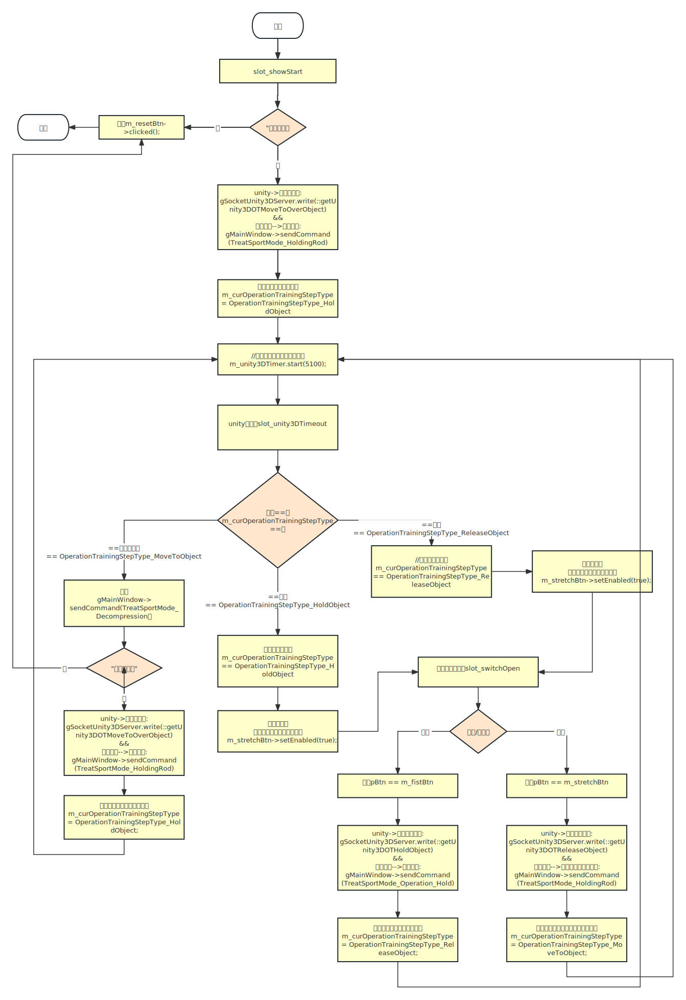

##### 一、登陆成功后跳转选择病员界面逻辑：

1. ```c++
   ---SoftExoskeletonPro\main.cpp
   //打开登录弹窗
   int main(){
       gLoginDlg = new LoginDialog();
       gLoginDlg->setAttribute( Qt::WA_DeleteOnClose );
       gLoginDlg->showFullScreen();
   }
   ```

2. ```c++
   ---SoftExoskeletonPro\MainWidget\logindialog.cpp
   //logindialog构造进行初始化操作
   LoginDialog::LoginDialog(QWidget *parent) :
       QDialog(parent),
       ui(new Ui::LoginDialog)
   {
       createObject();
   }
   
   void LoginDialog::createObject()
   {	
       //调用mainwindow构造初始化
   	MainWindow *w = new MainWindow();
       QObject::connect( this, SIGNAL(sig_login( bool , QString)), gMainWindow, SLOT(slot_hasSearchHardware(bool,QString)) );
   }
   ```
   
2. ```c++
   ---SoftExoskeletonPro\mainwindow.cpp
   //初始化mianwindow对象
   MainWindow::MainWindow(QWidget *parent)
       : QMainWindow(parent)
   {
       //赋值全局变量
       gMainWindow = this;
       createObject();
       initUI();
   }
   
   void MainWindow::createObject()
   {
       //初始化选择病员界面，并放到QStackedWidget第一个位置
       m_funcAreaWidget = new QStackedWidget( this );
       m_selectPatientWidget = new SelectPatientWidget( m_pPatientBasicModel, this );
       m_funcAreaWidget->addWidget( m_selectPatientWidget );
   }
   ```
   
   
   
3. ```c++
   ---SoftExoskeletonPro\MainWidget\logindialog.cpp
   //点击登录按钮触发按钮点击事件
   void LoginDialog::on_m_loginBtn_clicked()
   {
       //登陆成功后发送信号
       emit sig_login( m_bSearched,m_strPort );
   }
   ```
   
5. ```c++
   ---SoftExoskeletonPro\mainwindow.cpp
   //sig_login信号触发该槽函数
   void MainWindow::slot_hasSearchHardware( bool bSearched, QString strPort )
   {
       // 全屏显示主窗口，此时第一个就是选择病员界面
       this->showWindow();
   }
   
   void MainWindow::showWindow()
   {
       if( !this->isVisible() && m_bSerialPortConnecting )
       {
           this->showFullScreen();
           gLoginDlg->deleteLater();
       }
   }
   ```

   

##### 二、选择病员界面跳转主页治疗方案逻辑：

1. ```c++
   ---SoftExoskeletonPro\mainwindow.cpp
   //登录流程中会创建选择病员界面
   void MainWindow::createObject()
   {
       m_selectPatientWidget = new SelectPatientWidget( m_pPatientBasicModel, this );
   }
   ```

2. ```c++
   ---SelectPatientWidget\selectpatientwidget.cpp
   SelectPatientWidget::SelectPatientWidget(PatientBasicTableModel *&pModel, QWidget *parent)
       : QWidget(parent), m_pModel(pModel), m_completePtr(new CompleteWidgetPrivate())
   {
       createObject();
       initUI();
       initRes();
       initConnect();
   }
   
   //双击表格或点击开始绑定槽函数
   void SelectPatientWidget::initConnect()
   {
       QObject::connect( m_patientInfoTab, SIGNAL(doubleClicked(QModelIndex)),
                         this, SLOT(slot_tabDoubleClicked(QModelIndex)) );
       QObject::connect( m_startBtn, SIGNAL(clicked()),
                         this, SLOT(slot_startBtnClicked()) );
   }
   
   //都会执行到selectedPatientInfoPrepare
   void SelectPatientWidget::slot_tabDoubleClicked(QModelIndex index)
   {
       if( pModel && index.isValid() )
       {
           selectedPatientInfoPrepare( pModel, m_selectPatientFilterProxyModel->mapToSource(index) );
       }
   }
   void SelectPatientWidget::slot_startBtnClicked()
   {
       if( pModel && index.isValid() )
       {
           selectedPatientInfoPrepare( pModel, m_selectPatientFilterProxyModel->mapToSource(index) );
       }
   }
   ```

3. ```c++
   ---SelectPatientWidget\selectpatientwidget.cpp
   //跳转主页前的准备工作
   void SelectPatientWidget::selectedPatientInfoPrepare( PatientBasicTableModel *pModel, const QModelIndex& index )
   {
       gMainWindow->setCurrentPatient( patient );
       //发送一堆数据库查询信号
       emit sig_dbOperator(static_cast<QObject*>(this)...DatabaseWorker::DatabaseOperatorType_Select...
   }
   ```

4. ```c++
   ---database\databaseworker.cpp
   //数据库操作槽函数
   void DatabaseWorker::slot_dbOperator( QObject *pReceiver, int dbOpType, int dbTable, const QVariant& opData )
   {
       //查询
       case DatabaseOperatorType_Select:
       	//结果返回
       	emit sig_operatorResult( pReceiver, dbOpType, dbTable, OperatorResult_OK, var );
   }
   ```

5. ```c++
   ---SoftExoskeletonPro\mainwindow.cpp
   //接受数据库结果
   void MainWindow::slot_operatorResult( QObject *pReceiver, int dbOpType, int DbTable, int opResult, const QVariant& rtData )
   {
       DatabaseOperatorSelectEvent<> *pEvent 
       event = pEvent;
       //发送事件到pReceiver(SelectPatientWidget)
       QApplication::postEvent( pReceiver, event );
   }
   ```

6. ```c++
   ---SelectPatientWidget\selectpatientwidget.cpp
   //自定义事件
   void SelectPatientWidget::customEvent( QEvent *event )
   {
       //界面切换 治疗方案选择页面（治疗）
       emit sig_pageSwitch( MainPageIndexValue_TreatSolutionPagesWidget,
                                        patient );
   }
   ```

7. ```c++
   ---SoftExoskeletonPro\mainwindow.cpp
   //根据参数选择界面更新显示
   void MainWindow::slot_pageSwitch( int iMainPage, const PatientInformation& information )
   {
       case MainPageIndexValue_TreatSolutionPagesWidget:       // 主页-治疗方案
       {
           m_funcAreaWidget->setCurrentIndex( val );
           m_informationWidget->setCurrentPageName( COMPILER_CODE_FOR_CHINESE("治疗方案") );
           m_informationWidget->setPatientInfo(QString(COMPILER_CODE_FOR_CHINESE(""))
                                               .arg(m_currentPatientInfo.m_name.left(20)));
       }
       	break;
       
       this->update();
   }
   ```

##### 三、气电联合治疗逻辑：

1. ```c++
   ---SoftExoskeletonPro\mainwindow.cpp
   //登陆的的时候统一初始化的界面
   void MainWindow::createObject()
   {
       m_centerWidget = new QWidget( this );
       m_mainLayout = new QVBoxLayout;
       QStringList strList;
       strList << COMPILER_CODE_FOR_CHINESE("主页")
               << COMPILER_CODE_FOR_CHINESE("患者管理")
               << COMPILER_CODE_FOR_CHINESE("系统设置");
   
       m_treatSolutionPagesWidget = new TreatSolutionPagesWidget( this );
       m_treatCoursePagesWidget = new TreatCoursePagesWidget( this );
   }
   ```

2. ```c++
   ---TreatSolutionPagesWidget\treatsolutionpageswidget.cpp
   //页面展示时触发showevent()
   void TreatSolutionPagesWidget::showEvent( QShowEvent *event )
   {
       if( !m_scrollPageWidget )
       {
           m_scrollPageWidget = new ScrollPageWidget( this );
           //根据产品型号区分 进行中间功能列表初始化
           this->initContentComponentContainer();
       }
       
       else
       {
           // 更新左侧已选择
           QStringList solutionList;
           currentSetManager.getSelectedSolutions( solutionList );
           this->refreshPageBySelectedSolutions( solutionList );
       }
   }
   
   void TreatSolutionPagesWidget::initContentComponentContainer()
   {
       else if( gProductType == ProductType_RSDRS3)
       {
           this->initRSD_RS3Func();
       }
   }
   
   //初始化该型号功能模块
   void TreatSolutionPagesWidget::initRSD_RS3Func()
   {
       // 气电联合治疗
       page = new ComponentWidget(ComponentWidget::ComponentWidgetTemplateType_BioelectrialStim，		
                                  ComponentWidget::/*ComponentWidgetType_SingleFunc*/ComponentWidgetType_MultiFunc);
       treatPage->addComponentWidget( page );
   }
   ```

3. ```c++
   ---TreatSolutionPagesWidget\treatsolutionpageswidget.cpp
   //点击开始按钮进行治疗
   void TreatSolutionPagesWidget::slot_startBtnClicked()
   {
       if( strSolutions != patient.m_selectedSolutions )
       {    // 保存已选方案
           // 对数据库中该用户的信息进行更新（已选方案数据m_selectedSolutions）
           emit sig_dbOperator( static_cast<QObject*>(this), DatabaseWorker::DatabaseOperatorType_Update, DatabaseWorker::DatabaseTable_PatientInformation, var );
       }
       emit sig_pageSwitch( MainPageIndexValue_TreatCoursePagesWidget, PatientInformation() );
   }
   ```

4. ```c++
   ---SoftExoskeletonPro\mainwindow.cpp
   //槽函数调用，选择页面
   void MainWindow::slot_pageSwitch( int iMainPage, const PatientInformation& information )
   {
       case MainPageIndexValue_TreatCoursePagesWidget:       // 治疗过程（练习）
       {
           m_funcAreaWidget->setCurrentIndex( val );
           m_informationWidget->setPatientInfo(QString(COMPILER_CODE_FOR_CHINESE("*当前患者:%1 手:%2")).arg(m_currentPatientInfo.m_name.left(20)).arg(m_currentPatientInfo.m_hand));
       }
           break;
       this->update();
   }
   ```

5. ```c++
   ---TreatCoursePagesWidget\treatcoursepageswidget.cpp
   //展示页面触发showevent()
   void TreatCoursePagesWidget::showEvent( QShowEvent *event )
   {
       //连接unity3d
   	if( !MainWindow::getWindowUnity3DWindowHwnd( m_treatCourseShowWidget ) )
       {
           ModelMessageBox::questionPlus( COMPILER_CODE_FOR_CHINESE("虚拟手进程连接失败，软件关闭！"), this );
           qApp->exit(0);
           return;
       }
       
       // 避免unity出现内存泄露的处理
       emit sig_showStart( strCurSolution );
   }
   ```
   
5. ```c++
   ---TreatCoursePagesWidget\treatcoursepageswidget.cpp
   void TreatCoursePagesWidget::slot_showStart( const QString& strSolution )
   {
   	else
       {
           this->startVoiceBroadcast( strSolution );
           //定时器5ms触发
           m_startTimer.start( 5 );
       }
   }
   
   void TreatCoursePagesWidget::slot_startTimeout()
   {
       if( !currentSetManager.getCurrentSolutionsActionState() )
       {   
           //定时器触发会调用开始按钮
           m_startOrPauseBtn->click();
       }   
   }
   
   void TreatCoursePagesWidget::slot_btnClicked()
   {
       else if( pBtn == m_startOrPauseBtn )
       {
           if( strText == COMPILER_CODE_FOR_CHINESE( "开始" ) )
           {
               // 判断是否从头开始治疗
               if( !currentSetManager.getCurrentSolutionsActionState() )
               {
               	LOG_DEBUG << "从头开始治疗";
                   if( solutionsActionType == 
                      CurrentPatientParameterSetManager::SolutionsActionType_ModeSet )
                   {   //开始治疗
                       this->startTreat();
                   }
               }
               else
               {
                   //暂停后的继续
                   LOG_DEBUG<< "暂停后的继续";
               }
           }
       }
   }
   ```
   
7. ```c++
   ---TreatCoursePagesWidget\treatcoursepageswidget.cpp
   void TreatCoursePagesWidget::startTreat()
   {
       for (int i = 0; i < solutionList.count(); ++i)
       {
           case TreatSolutionsItemManagement::SolutionType_Bio:
           {
               LOG_DEBUG << "SolutionType_Bio";
               StimTreatParamData stimTreatData;
               if (!patientRelate.getStimTreatParamData(
                   StimTreatParamData::getBiostimTypeByBioSolutionName(solutionList[i]), stimTreatData))
               {
                   stimTreatData.m_uId = patient.m_uId;
                   stimTreatData.m_bioType = StimTreatParamData::getBiostimTypeByBioSolutionName(solutionList[i]);
               }
               pItem = treatItemManage.bioTreatTreatSolutionAnalysis(stimTreatData);
           }
           break;
           treatItemManage.appendChild(pItem);
           //注册页面
           gMainWindow->registerSerialWidget(static_cast<QWidget *>(this));
       }
       
       // 开始治疗控制流程
       treatItemManage.begin();
       TreatSolutionsItem *pItem = treatItemManage.current();
       
       else if (pItem->m_sportMode == TreatSportMode_BioStim || pItem->m_sportMode == TreatSportMode_BioTriggerStim)
       {
           LOG_DEBUG << "this->bioTreatSolutionStartCmd";
           BiostimType bioType = 
               (pItem->m_belongToTreatSolution == COMPILER_CODE_FOR_CHINESE(BIOELECTRIAL_STIM) ? 
                BiostimType_Normal : BiostimType_Trigger);
           //气电联合治疗开始
           this->bioTreatSolutionStartCmd(bioType);
           LOG_DEBUG << "this->bioTreatSolutionStartCmd END";
       }
   }
   
   void TreatCoursePagesWidget::bioTreatSolutionStartCmd(BiostimType bioType)
   {
       SerialResponseData srData;
       srData.m_motionModel = (bioType == BiostimType_Normal ? TreatSportMode_BioStim : TreatSportMode_BioTriggerStim);
       srData.m_motionFlag = 1;//1开始，2结束
   
       SerialPortUpEvent<SerialResponseData> *prEvent =
           new SerialPortUpEvent<SerialResponseData>((QEvent::Type)Serial_Port_Event_Type_Response);
       prEvent->setData(srData);
   
       LOG_DEBUG << "发送事件到customevent";
       QApplication::sendEvent(this, prEvent);
   }
   ```
   
8. ```c++
   ---TreatCoursePagesWidget\treatcoursepageswidget.cpp
   void TreatCoursePagesWidget::customEvent(QEvent *event)
   {
       SerialPortEvent *pSerialEvent = dynamic_cast<SerialPortEvent *>(event);
       if (pSerialEvent)
       {
           else if (eType == Serial_Port_Event_Type_Response)
           {
               if ((strCurSolution == COMPILER_CODE_FOR_CHINESE(BIOELECTRIAL_STIM) || strCurSolution == COMPILER_CODE_FOR_CHINESE(BIOELECTRIAL_TRIGGER_STIM)) && (pCurItem->m_sportMode == TreatSportMode_BioStim || pCurItem->m_sportMode == TreatSportMode_BioTriggerStim))
               {
                   if (TreatSportMode(rData.m_motionModel) == TreatSportMode_BioStim || TreatSportMode(rData.m_motionModel) == TreatSportMode_BioTriggerStim)
                   {
                       if (rData.m_motionFlag == 1)
                       {
                           currentSetManager.beginCurrentSolutionsAction();
                           // 启动计时定时器 时间间隔1s
                           gMainWindow->startTreatTimer(0);
                       }
                       //开始治疗
                       this->startBioTreatSolution(bioType);
                   }
               }
           }
       }
   }
   ```

9. ```c++
   ---TreatCoursePagesWidget\treatcoursepageswidget.cpp
   
   void TreatCoursePagesWidget::startBioTreatSolution(BiostimType bioType)
   {
       //电刺激
       if (!m_StimThread)
       {
           LOG_DEBUG << "NEW QStimThread";
           m_StimThread = new QStimThread;
           QObject::connect(m_StimThread, SIGNAL(sig_stimControl(StimTreatParamData, bool, int, bool)), this, SLOT(slot_stimControl(StimTreatParamData, bool, int, bool)));
           QObject::connect(m_StimThread, SIGNAL(sig_stimStatus(int)), this, SLOT(slot_stimStatus(int)));
           QObject::connect(m_StimThread, SIGNAL(sig_handAction(int)), this, SLOT(slot_handAction(int)));
       }
       ////默认先做一次抬腕动画
       gSocketUnity3DServer.write(::getUnity3DRelaseHandAndFist(TreatSportMode_None, handcode, 1, stimTreatParam.m_background));
       
       //启动电刺激线程
       m_StimThread->Start(stimTreatParam, bioType);
   }
   ```
   
9. ```c++
   ---ThreadRelate\qstimthread.cpp
   void QStimThread::Start(/*int channel, */StimTreatSolutionData sData, BiostimType type)
   {
       //start函数会执行线程run()函数
       this->start();
   }
   
   void QStimThread::run()
   {
       LOG_DEBUG << "enter";
       this->WorkRestThreadRun();
       LOG_DEBUG << "end";
   }
   
   //执行具体Work和Rest
   void QStimThread::WorkRestThreadRun()
   {
       while(m_bThreadisRunning)
       {
           sync.lock();
           if(is_pause)
               pauseCond.wait(&sync);
           sync.unlock();
   
           if (m_bThreadisRunning == false || m_nPointCount4Treat >= treatDuration) break; //超过时间就退出
   
           for (int i=0; i</*m_CurrentItem.stimNumberInt*/1; i++) //循环多少次
           {
               if (m_bThreadisRunning == false || m_nPointCount4Treat >= treatDuration) break; //超过时间就退出
               bool bFist = false;
               //work中会发送startBioTreatSolution()中connect的信号
               Work( bFist );
   
               if (m_bThreadisRunning == false || m_nPointCount4Treat >= treatDuration) break; //超过时间就退出
               //Rest中会发送startBioTreatSolution()中connect的信号
               Rest( bFist );
           }
       }
   }
   ```
   
9. ```c++
   ---TreatCoursePagesWidget\treatcoursepagesairbioelectrialstimwidget.cpp
   //信号会从发送手套控制命令，调用mainwindow的sendCommand()函数，会发送串口数据
   void TreatCoursePagesAirBioelectrialStimWidget::slot_handAction( int actionType )
   {
       gMainWindow->sendCommand( ::strHandSizeToInt(patient.m_handSize), TreatSportMode_Impedance, channelList[0].m_workTime+1/**固件会把时间-1，所以这里把发过去的时间先+1以抵消**/
                   , PatientInformation::getHandCode(patient.m_hand), param );
   }
   ```
   
12. ```c++
    ---SoftExoskeletonPro\mainwindow.cpp
    bool MainWindow::sendCommand( int iHandSize, TreatSportMode mode, int iDuration, int iHand, const TreatSolutionParameter& param, bool bMasterSwitch )
    {
    	packetDownData( iHandSize, cmd, mode, iDuration, iHand, fingerList[0].m_maxRange, fingerList[1].m_maxRange, 
                       fingerList[2].m_maxRange, fingerList[3].m_maxRange,fingerList[4].m_maxRange, fingerList[0].m_maxRange,
                       fingerList[1].m_maxRange, fingerList[2].m_maxRange, fingerList[3].m_maxRange,fingerList[4].m_maxRange 
                      );
    
        m_serialPortThread.send( cmd );
        return true;
    }
    ```

13. ```c++
    ---SerialPortRelate\JasonQt_SerialPort.cpp
    //信号槽关联
    void JasonQt_SerialPort_run::open(const QString &portName, const int &baudRate, const QSerialPort::DataBits &dataBits, const QSerialPort::Parity &parity, const QSerialPort::StopBits &stopBits)
    {
    	connect(m_serialPort, SIGNAL(readyRead()), this, SLOT(accepted()), Qt::DirectConnection);
    }
    void JasonQt_SerialPort::run(void)
    {
    	connect( this, SIGNAL(accepted(QVariant)), this, SIGNAL(sig_validData(QVariant)) );
    }
    
    //在串口类写入数据
    void JasonQt_SerialPort_run::send(const QByteArray &data)
    {
        if(m_serialPort)
        {
            if( data[4] == TreatSportMode_MasterSlave )
            {
                m_bMasterSlaving = true;
                m_iHand = data[16];
                if( data[17] == 100 )
                    return;
            }
            else {
                m_bMasterSlaving = false;
                m_iHand = 0;
            }
            m_serialPort->write(data);
        }
    }
    
    //串口响应数据会触发readyRead()信号
    void JasonQt_SerialPort_run::accepted(void)
    {
        else
        {   // 其他为 响应数据
            SerialResponseData srData;
            getPacketUpData2( intactData, srData.m_motionModel, srData.m_motionFlag );
            var.setValue<SerialResponseData>(srData);
        }
    
        emit m_parent->accepted(var);
        m_parent->zeroHeartBeatTickCount();   
    }
    ```

14. ```c++
    ---SoftExoskeletonPro\mainwindow.cpp
    //信号槽关联
    void MainWindow::initConnect()
    {
    	QObject::connect( &m_serialPortThread, SIGNAL(sig_validData(QVariant)), this,
                          SLOT(slot_validData(QVariant)) );
    }
    
    //处理以上串口数据返回的数据
    void MainWindow::slot_validData( const QVariant& data )
    {
        SerialPortEvent *event = NULL;
    
        QString strType = data.typeName();
        
        else if( strType == "SerialResponseData" )
        {
            LOG_DEBUG << "data.typeName:" << strType;
            // 响应
            SerialResponseData rData = data.value<SerialResponseData>();
            SerialPortUpEvent<SerialResponseData> *prEvent =
                    new SerialPortUpEvent<SerialResponseData>( (QEvent::Type)Serial_Port_Event_Type_Response );
            prEvent->setData(rData );
            event = prEvent;
            //发送事件
            QApplication::postEvent( m_currentTreatWidget, event );
            return;
            }
        }
    }
    ```

15. ```c++
    ---TreatCoursePagesWidget\treatcoursepageswidget.cpp
    //自定义事件接受结果进行处理与播放unity3d动画
    void TreatCoursePagesWidget::customEvent(QEvent *event)
    {
        SerialPortEvent *pSerialEvent = dynamic_cast<SerialPortEvent *>(event);
        if (pSerialEvent)
        {
            else if( eType == Serial_Port_Event_Type_Response )
            {
                else if( TreatSportMode(rData.m_motionModel) == TreatSportMode_Impedance )
                {
    				gSocketUnity3DServer.write( ::getUnity3DLiftHandData(TreatSportMode_None,handcode
                                                                          ,2,stimTreatData.m_background,true) );
                }
                else if( TreatSportMode(rData.m_motionModel) == TreatSportMode_Impedance_Stretch )
                {
                    if( rData.m_motionFlag == 1 )
                    {
    					gSocketUnity3DServer.write( ::getUnity3DRelaseHandAndFist(TreatSportMode_None,handcode,1,
                                                                                  stimTreatData.m_background) );
                    }
                    else if(rData.m_motionFlag == 2)
                    {
                        gSocketUnity3DServer.write( ::getUnity3DRelease(TreatSportMode_None,handcode
                                                                        ,1,stimTreatData.m_background) );
                    }
                }
            }
        }
    }
    ```


##### 四、握拳训练：

1. 主页勾选握拳训练，然后点击开始按钮

   ```c++
   ---SoftExoskeletonPro\mainwindow.cpp
   //mianwindow初始化的时候会预加载所有界面
   void MainWindow::initUI()
   {
       //这里添加了主页
       m_funcAreaWidget->addWidget(m_treatSolutionPagesWidget); // 1
   }
   
   ---TreatSolutionPagesWidget\treatsolutionpageswidget.cpp
   //主页
   void TreatSolutionPagesWidget::initConnect()
   {
       QObject::connect(m_startBtn, SIGNAL(clicked()), this, SLOT(slot_startBtnClicked()));
   }
   
   //点击开始按钮，调用槽函数
   void TreatSolutionPagesWidget::slot_startBtnClicked()
   {
       //主页跳转到治疗界面（TreatCoursePagesWidget）
       emit sig_pageSwitch(MainPageIndexValue_TreatCoursePagesWidget, PatientInformation());
   }
   ```

2. 治疗界面中开始治疗逻辑

   ```c++
   ---TreatCoursePagesWidget\treatcoursepageswidget.cpp
   //程序启动阶段初始化的
   void TreatCoursePagesWidget::initConnect()
   {
   	QObject::connect(m_startOrPauseBtn, SIGNAL(clicked()), this, SLOT(slot_btnClicked()));
       QObject::connect(&m_treatCourseIntervalTimer, SIGNAL(timeout()), this, SLOT(slot_timeOut()));
       QObject::connect(&m_unity3DAnimateTimer, SIGNAL(timeout()), this, SLOT(slot_unity3DAnimateTimeOut()));
       QObject::connect(this, SIGNAL(sig_showStart(QString)), this, SLOT(slot_showStart(QString)), Qt::QueuedConnection);
       QObject::connect(&m_startTimer, SIGNAL(timeout()), this, SLOT(slot_startTimeout()));
   }
       
   //页面已经初始化过，现在首先调用showEvent
   void TreatCoursePagesWidget::showEvent(QShowEvent *event)
   {
       //设置页面标题
       QString strPageName = QString(COMPILER_CODE_FOR_CHINESE("治疗:练习“%1”")).arg(strCurSolution);
       //连接 unity3D window
       if (!MainWindow::getWindowUnity3DWindowHwnd(m_treatCourseShowWidget))
       {
           ModelMessageBox::questionPlus(COMPILER_CODE_FOR_CHINESE("虚拟手进程连接失败，软件关闭！"), this);
           qApp->exit(0);
           return;
       }
       
       //获取参数，初始化unity3d
       else if (strCurSolution == COMPILER_CODE_FOR_CHINESE(FIST) || ...)
       {
           TreatSolutionParameter param;
           if (!patientRelate.getTreatSolutionParameter(strCurSolution, param))
           {
               param.m_uId = info.m_uId;
               param.m_solutionName = strCurSolution;
               // 取原始治疗方案参数  通过患者 康复阶段 信息
               TreatSolutionOriginalParameterManager &treatOriginalManager = 
                   Singleton<TreatSolutionOriginalParameterManager>::instance();
               TreatSolutionOriginalParameter treatOriginalParam;
               if (treatOriginalManager.find(info.m_rehabilitationPhases, treatOriginalParam, strCurSolution))
               { // 找到
                   param = treatOriginalParam;
               }
               else
               { // 未找到
                   consoleShowInfo(COMPILER_CODE_FOR_CHINESE("在原始参数数据中未找到 对应该康复阶段的数据信息！"));
               }
           }
           iBackground = param.m_background;
           //init Unity3D
           gSocketUnity3DServer.write(::getUnity3DInitData(TreatSportMode_Fist, 
                                                           /*::getUnity3DHandCode(info.m_hand)*/ iHand, 0, iBackground));
       }
       
       // 避免unity出现内存泄露的处理
       emit sig_showStart(strCurSolution);
   }
   
   void TreatCoursePagesWidget::slot_showStart(const QString &strSolution)
   {
       if (strSolution != COMPILER_CODE_FOR_CHINESE(MOTION_ASSESS))
       {
           else
           {
               this->startVoiceBroadcast(strSolution);
               //启动定时器
               m_startTimer.start(5);
           }
       }
   }
   
   void TreatCoursePagesWidget::slot_startTimeout()
   {
       m_startTimer.stop();
   
       if (!currentSetManager.getCurrentSolutionsActionState())
       {	
           //定时器中调用开始按钮进行点击
           m_startOrPauseBtn->click();
       }
   }
   
   //是开始按钮调用的
   void TreatCoursePagesWidget::slot_btnClicked()
   {
       else if (pBtn == m_startOrPauseBtn)
       {
           QString strText = m_startOrPauseBtn->text();
           if (strText == COMPILER_CODE_FOR_CHINESE("开始"))
           { // start
               // 判断是否从头开始治疗
               if (!currentSetManager.getCurrentSolutionsActionState())
               { // 从头
                   m_SmoothA.SetSmoothLength((int)(gChannelSmooth[0] * MD_SF_EMG_RMS));
                   m_SmoothB.SetSmoothLength((int)(gChannelSmooth[1] * MD_SF_EMG_RMS));
                   m_SmoothC.SetSmoothLength((int)(gChannelSmooth[2] * MD_SF_EMG_RMS));
                   m_SmoothD.SetSmoothLength((int)(gChannelSmooth[3] * MD_SF_EMG_RMS));
   
                   m_bBtnControl = true;
                   treatItemManage.clear();
   
                   // 治疗记录数据重置
                   m_fingerSerialData.resetElementValue();
                   // 评估详细数据重置
                   m_assessDetailedData.resetElementValue();
   
                   if (solutionsActionType == CurrentPatientParameterSetManager::SolutionsActionType_ModeSet)
                   { 	// 在这里开始治疗
                       this->startTreat();
                   }
               }
           }
       }
   }
   
   
   void TreatCoursePagesWidget::startTreat()
   {
       CurrentPatientParameterSetManager::SolutionsActionType solutionsActionType = 
           currentSetManager.getCurrentSolutionsActionType();
       QStringList solutionList;
       QString strCur;
       if (solutionsActionType == CurrentPatientParameterSetManager::SolutionsActionType_ModeSet)
       {
           //获取治疗方案
           strCur = currentSetManager.getCurrentSolution();
           currentSetManager.getSelectedSolutions(solutionList);
       }
       
       //获取治疗参数相关
       for (int i = 0; i < solutionList.count(); ++i)
       {
           LOG_DEBUG << solutionList[i];
           TreatSolutionsItem *pItem = NULL;
           TreatSolutionsItemManagement::SolutionType type = treatItemManage.getSolutionType(solutionList[i]);
   
           switch (type)
           {
               case TreatSolutionsItemManagement::SolutionType_Simple:
               {
                   TreatSolutionParameter param;
                   if (!patientRelate.getTreatSolutionParameter(solutionList[i], param))
                   { // 未做设置
                       param.m_uId = patient.m_uId;
                       param.m_solutionName = solutionList[i];
                       // 取原始治疗方案参数  通过患者 康复阶段 信息
                       TreatSolutionOriginalParameter treatOriginalParam;
                       if (treatOriginalManager.find(patient.m_rehabilitationPhases, treatOriginalParam, solutionList[i]))
                       { // 找到
                           param = treatOriginalParam;
                       }
                       else
                       { // 未找到
                           consoleShowInfo(COMPILER_CODE_FOR_CHINESE("在原始参数数据中未找到 对应该康复阶段的数据信息！"));
                       }
                   }
                   pItem = treatItemManage.treatSolutionAnalysis(solutionList[i], /*m_treatSolutionParameter*/ param);
               }
               break;
           }
           //获取/设置治疗项目
           pItem->setParentItem(treatItemManage.root());
           treatItemManage.appendChild(pItem);
       }
       
       //注册串口界面
       gMainWindow->registerSerialWidget(static_cast<QWidget *>(this));
       // 开始治疗控制流程
       treatItemManage.begin();
       TreatSolutionsItem *pItem = treatItemManage.current();
       
       if (pItem)
       {
           else
           {
               QString strSolution = pItem->m_belongToTreatSolution;
               TreatSolutionParameter param;
               if (!patientRelate.getTreatSolutionParameter(strSolution, param))
               {
                   param.m_uId = patient.m_uId;
                   param.m_solutionName = strSolution;
                   // 取原始治疗方案参数  通过患者 康复阶段 信息
                   TreatSolutionOriginalParameter treatOriginalParam;
                   if (treatOriginalManager.find(patient.m_rehabilitationPhases, treatOriginalParam, strSolution))
                   { // 找到
                       param = treatOriginalParam;
                   }
               }
               TreatSportMode tMode = TreatSportMode_None;
               
               else
               {
                   tMode = pItem->m_sportMode;
               }
               LOG_DEBUG << "tMode:" << tMode << ", m_stepDuration:" << pItem->m_stepDuration;
               
               //很关键！！！ 调用unity,下发 握拳动作 的命令
    			if (gMainWindow->sendCommand(::strHandSizeToInt(patient.m_handSize), 
                                            /*pItem->m_sportMode*/ tMode, pItem->m_stepDuration, 
                                            PatientInformation::getHandCode(patient.m_hand), param))
               {
                   consoleShowInfo("ok!");
               }
           }
       }
   }
   ```

3. 从调用unity开始，后续通过串口通信&customEvent()进行整个流程的控制

   ```c++
   ---SoftExoskeletonPro\mainwindow.cpp
   void MainWindow::initConnect()
   {
       QObject::connect(&m_serialPortThread, SIGNAL(sig_validData(QVariant)), this,
                        SLOT(slot_validData(QVariant)));
   }
   //发送命令
   bool MainWindow::sendCommand(int iHandSize, TreatSportMode mode, int iDuration, int iHand, const TreatSolutionParameter &param, bool bMasterSwitch)
   {	
       ... ...
       //调用串口线程发送
       m_serialPortThread.send(cmd);
       return true;
   }
   
   ---SerialPortRelate\JasonQt_SerialPort.cpp
   //线程启动时关联信号槽
   void JasonQt_SerialPort::run(void)
   {
       connect(this, SIGNAL(controlSend(QByteArray)), m_serialPort, SLOT(send(QByteArray)));
       connect(this, SIGNAL(accepted(QVariant)), this, SIGNAL(sig_validData(QVariant)));
   }
   
   //发送
   void JasonQt_SerialPort::send(const QByteArray &data)
   {
       emit controlSend(data);
   }
   
   //调用到子对象中的send
   void JasonQt_SerialPort_run::send(const QByteArray &data)
   {
       m_serialPort->write(data);
   }
   
   //子对象中绑定的信号槽
   void JasonQt_SerialPort_run::open(const QString &portName, const int &baudRate, const QSerialPort::DataBits &dataBits, const QSerialPort::Parity &parity, const QSerialPort::StopBits &stopBits)
   {
       connect(m_serialPort, SIGNAL(readyRead()), this, SLOT(accepted()), Qt::DirectConnection);
       connect(m_serialPort, SIGNAL(error(QSerialPort::SerialPortError)), this, 
               SLOT(error(QSerialPort::SerialPortError)), Qt::DirectConnection);
   }
   
   //收到下位机响应消息时
   void JasonQt_SerialPort_run::accepted(void)
   {
       //会调用到父对象的信号处理，此信号关联了sig_validData信号
       emit m_parent->accepted(var);
   }
   
   //sig_validData关联了mainwindow的slot_validData()
   void MainWindow::slot_validData(const QVariant &data)
   {
       SerialPortEvent *event = NULL;
   
       QString strType = data.typeName();
       else if (strType == "SerialResponseData")
       {
           // 响应
           SerialResponseData rData = data.value<SerialResponseData>();
           SerialPortUpEvent<SerialResponseData> *prEvent =
               new SerialPortUpEvent<SerialResponseData>((QEvent::Type)Serial_Port_Event_Type_Response);
           prEvent->setData(rData);
           event = prEvent;
       }
       if (!m_currentSerialWidget || !EmergencyStopState /*急停按钮按下时*/)
           return;
   
       if (event != NULL)
       {
           //响应的值封装成event发送给注册的串口Widget
           QApplication::postEvent(m_currentSerialWidget, event);
       }
   }
   
   ---TreatCoursePagesWidget\treatcoursepageswidget.cpp
   //处理事件
   void TreatCoursePagesWidget::customEvent(QEvent *event)
   {
      SerialPortEvent *pSerialEvent = dynamic_cast<SerialPortEvent *>(event);
      if (pSerialEvent)
      {
           const int eType = pSerialEvent->type();
   
           else if (eType == Serial_Port_Event_Type_Response)
           {
               LOG_DEBUG << "Serial_Port_Event_Type_Response";
               SerialPortUpEvent<SerialResponseData> *pResponseEvent =
                   dynamic_cast<SerialPortUpEvent<SerialResponseData> *>(pSerialEvent);
               SerialResponseData rData = pResponseEvent->getData();
               
               LOG_DEBUG << "rData.m_motionmodel:" << rData.m_motionModel << ", rData.m_motionFlag:" << rData.m_motionFlag;
   
               PatientInformation patient = gMainWindow->getCurrentPatient();
               TreatSolutionsItemManagement &treatItemManage = Singleton<TreatSolutionsItemManagement>::instance();
   
               TreatSolutionsItem *pCurItem = treatItemManage.current();
               if (!pCurItem)
                   return;
   
               QString strCurSolution;
               if (solutionsActionType == CurrentPatientParameterSetManager::SolutionsActionType_ModeSet)
               {
                   //获取方案集
                   strCurSolution = currentSetManager.getCurrentSolution();
               }
   
               else
               {
                   //上下层串口通信：上位机发送成功后，下位机在单次动作【开始和结束】时向上位机发送相应指令
                   //所以上位机发送后，下位机会发送两次响应
                   //	struct SerialResponseData
                   //	{
                   //		// data1：模式  范围0x01~0x7
                   //		//0x01 握拳运动、握杆运动、单指运动模式、拿捏运动、对指运动、主从控制运动、泄压七种模式
                   //		int m_motionModel;    			
   				//		//data2：动作开始或结束标志 （0x01 开始 ，0x02结束）
                   //		int m_motionFlag; 
                   //	}
                   //下位机（气动手套）开始动作
                   if (rData.m_motionFlag == 1)
                   { // 开始动作 上行指令
                       // unity动画相关
                       int iSingleTime = 0, iSingleMin = 0;
                       else if (pCurItem->m_sportMode == TreatSportMode_Fist)
                       { // 握拳、握杆
                           QString strSolution = pCurItem->m_belongToTreatSolution;
                           TreatSolutionParameter param;
                           if (!patientRelate.getTreatSolutionParameter(strSolution, param))
                           {
                               param.m_uId = patient.m_uId;
                               param.m_solutionName = strSolution;
                               // 取原始治疗方案参数  通过患者 康复阶段 信息
                               TreatSolutionOriginalParameter treatOriginalParam;
                               if (treatOriginalManager.find(patient.m_rehabilitationPhases, treatOriginalParam, strSolution))
                               { // 找到
                                   param = treatOriginalParam;
                               }
                           }
                           for (int i = 0; i < param.m_fingers.count(); ++i)
                           {
                               param.m_fingers[i].m_maxRange = param.m_fingers[i].m_maxRange / 180.0 * 150;
                               param.m_finger1s[i].m_maxRange = param.m_finger1s[i].m_maxRange / 180.0 * 150;
                           }
                           iSingleMin = TreatSolutionParameter::getDefaultSingleTimeSpan(pCurItem->m_belongToTreatSolution);
                           iSingleTime = TreatSolutionParameter::algorithmParam(param);
                           if (iSingleTime < iSingleMin)
                           {
                               iSingleTime = iSingleMin;
                           }
                           else if (iSingleTime > TreatSolutionParameter::getDefaultSingleMaxTimeSpan(strSolution))
                           {
                               iSingleTime = TreatSolutionParameter::getDefaultSingleMaxTimeSpan(strSolution);
                           }
                           param.m_speed = iSingleTime;
   
                           // DONE: 音频播放完成再播放动画
                           QEventLoop loop;
                           this->startVoiceBroadcastByPath(gMainWindow->getApplicationDirPath() + 
                                                           "\\Resources\\music\\action_fist.mp3");
                           QMetaObject::Connection conn = 
                               connect(m_voicePlayer, &QMediaPlayer::stateChanged, this, [&](QMediaPlayer::State state)
                              		{ 
                                       if (state == QMediaPlayer::StoppedState)
                                       {//播放握拳动画
                                          gSocketUnity3DServer.write(::getUnity3DFistHoldingRodData(/*TreatSportMode_Fist*/ 
                                              TreatSportMode_HoldingRod, ::getUnity3DHandCode(patient.m_hand), 0, 
                                              param, true));
                                       } 
                                       loop.quit(); 
                                  	});
                           loop.exec();
                           disconnect(conn);
   
                           double dSpeed = param.m_speed * 1000;
                           dSpeed = 1500 + (dSpeed - 1500) / 2 + (dSpeed - 1500) / 2 / 6;
                           LOG_DEBUG << "dSpeed:" << dSpeed;
                           //进行下一步动画的定时器启动
                           m_unity3DAnimateTimer.start(dSpeed);
                       }
                   }
                   //下位机动作结束，发送的第二次响应
                   else
                   { // 结束动作 上行指令
                       TreatSolutionsItem *pPrevItem = treatItemManage.current();
                       treatItemManage.next();
                       pCurItem = treatItemManage.current();
                       LOG_DEBUG << "pre.m_sportMode:" << pPrevItem->m_sportMode << 
                           ", pCurItem.m_sportMode:" << pCurItem->m_sportMode;
                       LOG_DEBUG << "move to next item";
   
                       else
                       {
                           // 启动定时器
                           int iInterval = 0;
                           int iPrecision = 0;
                           QString strBelongSolution = pCurItem->m_belongToTreatSolution;
   
                           else
                           {
                               iInterval = pPrevItem->m_stepInterval;
                               iPrecision = pPrevItem->m_stepIntervalPrecision;
                           }
   
                           // DONE:握拳命令下一套动作命令发送前,播放放松语音
                           if (pPrevItem->m_sportMode == TreatSportMode::TreatSportMode_Fist)
                           {
                               this->startVoiceBroadcastByPath(gMainWindow->getApplicationDirPath() + 
                                                               "\\Resources\\music\\relax.mp3");
                           }
   
                           LOG_DEBUG << "iInterval = " << iInterval;
                           if (iInterval)
                           {
                               //进行下一轮治疗的定时器启动
                               m_treatCourseIntervalTimer.start(iInterval * 1000 + (iPrecision > 0 ? iPrecision : 0));
                               return;
                           }
                   }
               }
           }
       } 
   }
   
   //接着握拳动画之后，进行伸展动画&语音的播放
   void TreatCoursePagesWidget::slot_unity3DAnimateTimeOut()
   {
       m_unity3DAnimateTimer.stop();
   
       PatientInformation patient = gMainWindow->getCurrentPatient();
       PatientRelateDatasManager &patientManager = Singleton<PatientRelateDatasManager>::instance();
       PatientRelateData &patientRelate = patientManager.getPatientRelateDataById(patient.m_uId);
       TreatSolutionOriginalParameterManager &treatOriginalManager = Singleton<TreatSolutionOriginalParameterManager>::instance();
       CurrentPatientParameterSetManager &currentSetManager = Singleton<CurrentPatientParameterSetManager>::instance();
       TreatSolutionsItemManagement &treatItemManage = Singleton<TreatSolutionsItemManagement>::instance();
       TreatSolutionsItem *pCurItem = treatItemManage.current();
       if (!pCurItem)
       {
           return;
       }
   
       CurrentPatientParameterSetManager::SolutionsActionType solutionsActionType = currentSetManager.getCurrentSolutionsActionType();
   
       int iSingleMin = 0, iSingleTime = 0;
   
       else if (pCurItem->m_sportMode == TreatSportMode_Fist /* || pCurItem->m_sportMode == TreatSportMode_HoldingRod*/)
       {
           QString strSolution = pCurItem->m_belongToTreatSolution;
           TreatSolutionParameter param;
           if (!patientRelate.getTreatSolutionParameter(strSolution, param))
           {
               param.m_uId = patient.m_uId;
               param.m_solutionName = strSolution;
               // 取原始治疗方案参数  通过患者 康复阶段 信息
               TreatSolutionOriginalParameter treatOriginalParam;
               if (treatOriginalManager.find(patient.m_rehabilitationPhases, treatOriginalParam, strSolution))
               { // 找到
                   param = treatOriginalParam;
               }
           }
           param.m_speed = iSingleTime;
   
           // DONE:语音与动画同时播放时，语音略慢于动画，需要保持同步
           QEventLoop loop;
           this->startVoiceBroadcastByPath(gMainWindow->getApplicationDirPath() + "\\Resources\\music\\stretch.mp3");
           QMetaObject::Connection conn = 
               connect(m_voicePlayer, &QMediaPlayer::stateChanged, this, [&](QMediaPlayer::State state)
                                                  { 
                       if (state == QMediaPlayer::StoppedState)
                       {
                           //播放伸展动画
                           gSocketUnity3DServer.write(::getUnity3DFistHoldingRodData(/*TreatSportMode_Fist*/ 
                               TreatSportMode_HoldingRod, ::getUnity3DHandCode(patient.m_hand), 0, param, false));
                       } 
                       loop.quit(); });
   
           loop.exec();
           disconnect(conn);
       }
   } 
   
   //进行下一次治疗的定时器（m_treatCourseIntervalTimer）槽函数
   void TreatCoursePagesWidget::slot_timeOut()
   {
       LOG_DEBUG << "slot_timeOut";
       QTimer *pTimer = qobject_cast<QTimer *>(this->sender());
       pTimer->stop(); // 结束定时器
       PatientInformation patient = gMainWindow->getCurrentPatient();
       TreatSolutionsItemManagement &treatItemManage = Singleton<TreatSolutionsItemManagement>::instance();
       PatientRelateDatasManager &patientManager = Singleton<PatientRelateDatasManager>::instance();
       PatientRelateData &patientRelate = patientManager.getPatientRelateDataById(patient.m_uId);
       TreatSolutionOriginalParameterManager &treatOriginalManager = Singleton<TreatSolutionOriginalParameterManager>::instance();
   
       TreatSolutionsItem *pCurItem = treatItemManage.current();
   
       if (!pCurItem)
           return;
       LOG_DEBUG << "pCurItem" << pCurItem;
       
       else
       { // general treat mode
           QString strSolution = pCurItem->m_belongToTreatSolution;
           TreatSolutionParameter param;
           if (!patientRelate.getTreatSolutionParameter(strSolution, param))
           {
               param.m_uId = patient.m_uId;
               param.m_solutionName = strSolution;
               // 取原始治疗方案参数  通过患者 康复阶段 信息
               TreatSolutionOriginalParameter treatOriginalParam;
               if (treatOriginalManager.find(patient.m_rehabilitationPhases, treatOriginalParam, strSolution))
               { // 找到
                   param = treatOriginalParam;
               }
               else
               { // 未找到
                   consoleShowInfo(COMPILER_CODE_FOR_CHINESE("在原始参数数据中未找到 对应该康复阶段的数据信息！"));
               }
           }
           TreatSportMode tMode = TreatSportMode_None;
          
           else
           {
               tMode = pCurItem->m_sportMode;
           }
           LOG_DEBUG << "tMode:" << tMode << ", m_stepDuration:" << pCurItem->m_stepDuration;
           
           //跟调用开始按钮一样，会发送 握拳动作 的命令给下位机
           //后续下位机响应两次，再次进入自定义事件循环进行处理
           //1.第一次响应：下位机动作开始
           //			1. 播放握拳语音&动画
          	//			2. 调用m_unity3DAnimateTimer定时器处理 伸展语音&动画的播放
           //2.第二次响应：下位机动作结束
           //			1.一个治疗项结束，播放 放松 语音
           //			2.重新发送 握拳命令 给下位机
           //3.以上形成处理循环，知道次数完成
           if (!gMainWindow->sendCommand(::strHandSizeToInt(patient.m_handSize), /*pCurItem->m_sportMode*/ tMode, 
                                         pCurItem->m_stepDuration,
                                         PatientInformation::getHandCode(patient.m_hand), param))
           {
               ModelMessageBox::information(COMPILER_CODE_FOR_CHINESE("治疗命令发送失败！"), this);
           }
       }
   }
   ```

##### 五、作业训练

1. ```c++
   ---SoftExoskeletonPro\mainwindow.cpp
   //页面再启动的时候全部创建
   //主页点击功能调用slot_pageSwitch()跳转到TreatCoursePagesOperationtrainingWidget
   void MainWindow::slot_pageSwitch(int iMainPage, const PatientInformation &information)
   {
       case MainPageIndexValue_TreatCoursePagesOperationtrainingWidget:
       {
           m_funcAreaWidget->setCurrentIndex(val);
           m_informationWidget->setCurrentPageName(COMPILER_CODE_FOR_CHINESE("治疗：练习“作业训练”"));
           m_informationWidget->setPatientInfo(QString(COMPILER_CODE_FOR_CHINESE("*当前患者:%1 手:%2")).arg(m_currentPatientInfo.m_name.left(20)).arg(m_currentPatientInfo.m_hand));
       }
       break;
   }
   
   ---TreatCoursePagesWidget\treatcoursepagesoperationtrainingwidget.cpp
   //初始化信号槽
   void TreatCoursePagesOperationtrainingWidget::initConnect()
   {
       QObject::connect(m_stretchBtn, SIGNAL(clicked()), this, SLOT(slot_switchOpen()));
       QObject::connect(m_fistBtn, SIGNAL(clicked()), this, SLOT(slot_switchOpen()));
       QObject::connect(&m_unity3DTimer, SIGNAL(timeout()), this, SLOT(slot_unity3DTimeout()));
       QObject::connect(this, SIGNAL(sig_showStart(QString)), this, SLOT(slot_showStart(QString)), Qt::QueuedConnection);
   }    
       
   //首先进入showEvent
   void TreatCoursePagesOperationtrainingWidget::showEvent(QShowEvent *event)
   {
       //设置标题
       pWidget->setText(/*strCurSolution*/ COMPILER_CODE_FOR_CHINESE("作业训练"));
       m_LeftWidget->addSelectedSolutionComponentWidget(type, pWidget);
   
       QString strPageName = COMPILER_CODE_FOR_CHINESE("治疗：练习“%1”").arg(strCurSolution);
       
       // unity3D window
       if (!MainWindow::getWindowUnity3DWindowHwnd(m_treatCourseShowWidget))
       {
           ModelMessageBox::questionPlus(COMPILER_CODE_FOR_CHINESE("虚拟手进程连接失败，软件关闭！"), this);
           qApp->exit(0);
           return;
       }
       
       // 避免unity出现内存泄露的处理
       //跳转槽函数
       emit sig_showStart(strCurSolution);
   }
   
   //开始处理槽函数
   void TreatCoursePagesOperationtrainingWidget::slot_showStart(const QString &strSolution)
   {
       if (!EmergencyStopState)
       {
           return;
       }
       if (strSolution == COMPILER_CODE_FOR_CHINESE(OT))
       {
           PatientInformation patient = gMainWindow->getCurrentPatient();
           this->startVoiceBroadcast(OperationTrainingStepType_Init);
           // 开始OT模式
           CurrentPatientParameterSetManager &currentSetManager = Singleton<CurrentPatientParameterSetManager>::instance();
           if (!currentSetManager.getCurrentSolutionsActionState())
           {
               //弹出询问框
               if (!ModelMessageBox::question("确认开始？", this))
               {
                   // 否，恢复到重置状态
                   emit m_resetBtn->clicked();
                   return;
               }
   
               currentSetManager.beginCurrentSolutionsAction();
               // 启动定时器 时间间隔1s
               gMainWindow->startTreatTimer(0);
               // 设置按钮状态
               m_startOrPauseBtn->setIcon(QIcon(":/button/Resources/button/BTN-general_pause1.png"));
               m_startOrPauseBtn->setDisabledIcon(QIcon(":/button/Resources/button/BTN-general_pause2.png"));
               m_startOrPauseBtn->setText(COMPILER_CODE_FOR_CHINESE("暂停"));
   
               m_fistBtn->setChecked(false);
               m_stretchBtn->setChecked(false);
               m_fistBtn->setEnabled(false);
               m_stretchBtn->setEnabled(false);
   
               m_resetBtn->setEnabled(true);
               m_goBackBtn->setEnabled(false);
   
               //获取治疗参数
               TreatSolutionParameter param;
               currentSetManager.getGeneralSolutionParamByName(COMPILER_CODE_FOR_CHINESE(OT), param);
   			
               //总时长定时器，到了停止治疗
               m_totalTimer.start(param.m_time * 60 * 1000);
   			
               //进行步骤判断，代表不同形状的物体
               //0-球，1-正方体，2-圆锥，3-圆柱体
               m_iCurFruitIndex = ::getOperationTrainingFruit(0);
               
               //unity动画：移动到物体上方
               gSocketUnity3DServer.write(::getUnity3DOTMoveToOverObject(param.m_background, m_iCurFruitIndex, 5100));
               
               // 在第一步增加一个伸展动作 ：气动手套--》TreatSportMode_HoldingRod 强直牵拉
               gMainWindow->sendCommand(::strHandSizeToInt(patient.m_handSize), TreatSportMode_HoldingRod, 5100, 
                                        PatientInformation::getHandCode(patient.m_hand), ::GetOperationTrainingParam());
               
               //设置下一步操作：抓握物体
               m_curOperationTrainingStepType = OperationTrainingStepType_HoldObject;
               
               //定时器触发执行下一步操作
               m_unity3DTimer.start(5100);
   
               m_LeftWidget->startAnimation(ComponentWidget::getComponentTemplateType(COMPILER_CODE_FOR_CHINESE(OT)), param.m_time * 60, 100);
   
               this->startTreatMusicPlayByPath(this->getTreatMusicPlayPath(COMPILER_CODE_FOR_CHINESE(OT)));
   
               m_bNormalEnd = false;
           }
       }
   }
   
   //负责动画&启动手套操作的控制，对不同的阶段进行不同的处理
   void TreatCoursePagesOperationtrainingWidget::slot_unity3DTimeout()
   {
       m_unity3DTimer.stop();
       this->startVoiceBroadcast(m_curOperationTrainingStepType);
   
       CurrentPatientParameterSetManager &currentSetManager = Singleton<CurrentPatientParameterSetManager>::instance();
       
       //操作：移动到物体上方
       if (m_curOperationTrainingStepType == OperationTrainingStepType_MoveToObject)
       {
           PatientInformation patient = gMainWindow->getCurrentPatient();
           // 开始之前先泄压：TreatSportMode_Decompression 泄压
           gMainWindow->sendCommand(0, TreatSportMode_Decompression, 0, PatientInformation::getHandCode(patient.m_hand), TreatSolutionParameter());
   
           // 询问之前先暂停治疗时长计数
           m_totalTimer.stop();
   
           // DONE:弹出询问
           if (!ModelMessageBox::question("确认继续？", this))
           {
               // 否，重置
               emit m_resetBtn->clicked();
               return;
           }
           //继续计时
           m_totalTimer.start();
   
           TreatSolutionParameter param;
           currentSetManager.getGeneralSolutionParamByName(COMPILER_CODE_FOR_CHINESE(OT), param);
          
           //抓取的物体切换
           m_iCurFruitIndex = ::getOperationTrainingFruit(m_iCurFruitIndex);
           //unity动画：移动到物体上方
           gSocketUnity3DServer.write(::getUnity3DOTMoveToOverObject(param.m_background, m_iCurFruitIndex, 5100));
           // 在第一步增加一个伸展动作 ：气动手套--》TreatSportMode_HoldingRod 强直牵拉
           gMainWindow->sendCommand(::strHandSizeToInt(patient.m_handSize), TreatSportMode_HoldingRod, 5100, 
                                    PatientInformation::getHandCode(patient.m_hand), ::GetOperationTrainingParam());
           
           //设置下一步操作：抓握物体
           m_curOperationTrainingStepType = OperationTrainingStepType_HoldObject;
           //启动定时器处理下一步操作
           m_unity3DTimer.start(5100);
       }
       //操作：释放物体
       else if (m_curOperationTrainingStepType == OperationTrainingStepType_ReleaseObject)
       {
           //按钮可用了，此时需要用户手动点击按钮
           m_stretchBtn->setEnabled(true);
       }
       //操作：抓握物体
       else if (m_curOperationTrainingStepType == OperationTrainingStepType_HoldObject)
       {
           //按钮可用了，此时需要用户手动点击按钮
           m_fistBtn->setEnabled(true);
       }
   }
   
   //手动点击按钮对应的槽函数
   void TreatCoursePagesOperationtrainingWidget::slot_switchOpen()
   {
       PatientInformation patient = gMainWindow->getCurrentPatient();
       CurrentPatientParameterSetManager &currentSetManager = Singleton<CurrentPatientParameterSetManager>::instance();
       QPushButton *pBtn = qobject_cast<QPushButton *>(this->sender());
       //运行中&&没有暂停
       if (currentSetManager.getCurrentSolutionsActionState() && !m_bPaused)
       {
           TreatSolutionParameter param, otParam, otObjParam;
           //获取抓取的物体
           QString strOT = ::getOperationObjectName(m_iCurFruitIndex);
           LOG_DEBUG << "strOT = " << strOT << "  m_iCurFruitIndex = " << m_iCurFruitIndex;
           
           currentSetManager.getGeneralSolutionParamByName(COMPILER_CODE_FOR_CHINESE(OT), param);
           otParam = param;
           currentSetManager.getGeneralSolutionParamByName(strOT, otObjParam);
           //抓握按钮
           if (pBtn == m_fistBtn)
           {
               m_stretchBtn->setChecked(false);
               m_stretchBtn->setEnabled(true);
               m_fistBtn->setEnabled(false);
               m_stretchBtn->setEnabled(false);
               this->stopVoiceBroadcast();
               ::SetOperationTrainingUnityParamByOT(otParam, strOT);
               //unity动画：播放抓握物体动画
               gSocketUnity3DServer.write(::getUnity3DOTHoldObject(otParam, m_iCurFruitIndex));
               //设置下一步动作：释放物体
               m_curOperationTrainingStepType = OperationTrainingStepType_ReleaseObject;
               int iInterval = 4000 + param.m_speed * 1000;
               //处理下一步定时器
               m_unity3DTimer.start(iInterval);
               //气动手套：抓握操作
               gMainWindow->sendCommand(::strHandSizeToInt(patient.m_handSize), /*TreatSportMode_Impedance*/ 
                                        TreatSportMode_Operation_Hold, param.m_speed, 
                                        PatientInformation::getHandCode(patient.m_hand), otObjParam);
           }
           else //释放物体操作
           {
               m_fistBtn->setChecked(false);
               m_fistBtn->setEnabled(true);
               m_fistBtn->setEnabled(false);
               m_stretchBtn->setEnabled(false);
               this->stopVoiceBroadcast();
               ::SetOperationTrainingUnityParamByOT(otParam, strOT);
               //unity动画：释放物体
               gSocketUnity3DServer.write(::getUnity3DOTReleaseObject(otParam, m_iCurFruitIndex));
               //设置下一步操作：移动到物体上方
               m_curOperationTrainingStepType = OperationTrainingStepType_MoveToObject;
               int iInterval = 3000 + param.m_pause * 1000;
               //下一步操作定时器
               m_unity3DTimer.start(iInterval);
               //气动手套：强直牵拉（释放物体）
               gMainWindow->sendCommand(::strHandSizeToInt(patient.m_handSize), TreatSportMode_HoldingRod, param.m_pause, PatientInformation::getHandCode(patient.m_hand), ::GetOperationTrainingParam());
           }
       }
   }
   ```

   

