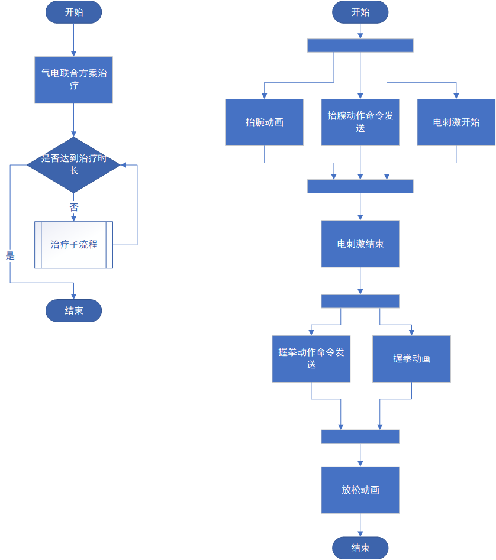

### 一、问题描述

售后反馈问题，客户使用的一台睿手设备在气电联合治疗过程中出现异常，详细信息如下：

- 治疗过程中出现部分动作uinty动画一闪而过；
- 治疗过程中气动手套会在握拳后，没有抬腕动作，直到下一次动作循环开始；
- 以上现象为偶现，但是随着治疗时间越长，问题复现几率增加；
- 客户治疗参数：刺激 10s，握拳 5s，放松 1s；

### 二、原因分析

气电联合模式的简单工作流程(左)及治疗项目详细流程（右）：

气电联合主要工作流程分析：

1. 启动**流程控制线程**，该线程生命周期贯穿整个治疗过程，负责控制**Work**（抬腕、电刺激）与**Rest**（握拳、放松）切换；
2. **控制线程**启动后，将会进入Work阶段，立即发送**抬腕**相关控制**信号**给**主线程**，随后进入**循环阻塞**，该阶段**持续时间**为设置的刺激时间（10s）；
3. **主线程**接收到信号后，对应的**槽函数**被调用，由于**信号**同时发送，所以抬腕动画、手套抬腕动作命令、电刺激开始命令接近**并行**；
4. **手套抬腕动作命令**发送后，**下位机（气动线程）**会在执行抬腕命令**开始**与**结束**时对上位机进行**回复**，**主线程**在**事件循环**处理回复事件；抬腕命令暂无处理；
5. 当Work循环阻塞**结束**，发送**电刺激结束**信号，主线程接收到发送**结束刺激**命令给**电刺激板**；
6. 随后进入**Rest阶段**，该阶段立即发送手套**握拳信号**，主线程槽函数被调用，发送**握拳动作**命令给**下位机（气动线程）**；
7. **下位机（气动线程）**接收到命令后，立即发送**开始事件**到主线程，同时执行握拳操作（5s），**主线程**事件循环收到握拳开始事件后**进行握拳动画**；
8. 当握拳动作结束后，下位机发送握拳**结束事件**到主线程，主线程收到事件后播放**放松**动画（<=1s时忽略）；
9. 若治疗未结束，则Work与Rest循环执行；

时序图如下：

根据问题描述，问题主要出现在在抬腕与握拳之间，缺少动作，很可能是气动手套下位机与上位机交互出现问题，导致部分命令丢失，治疗异常；

经过多次测试，成功复现问题，抓取的log分析结果主要存在2种异常:

1. 根据如上时序图，主线程发送握拳命令给气动线程后，随后收到了0x01启动事件，但在**5978ms**后发送抬腕命令后，0x02结束事件才发送回来；

2. 握拳动作启动事件（89次）与结束事件（12）数量不匹配，大量结束事件上位机未收到；

   

前面说了握拳设置的时间时5s，log握拳与抬腕命令之间的间隔时间为5.9s，控制线程已经额外增加了冗余时间来确保能够正常接收结束命令；后续根据代码分析，

握拳命令发送时，会在原定的5s时间上增加1s（6s），原因是下位机会在执行动作时，留下1s的时间用来泄压（握拳5s，泄压1s）；也就是说下位机的实际执行时间在理想状态下时6s，比上面计算出的命令间隔5.9s是要多的；所以在控制线程按照5s握拳计算时间间隔，下发抬腕命令时，真正的握拳动作（握拳+泄压）并未结束；这就导致了上面log中的两种现象：

1. 接收不到握拳0x02结束事件：接收不到结束事件并无影响，因为放松设置的1s，所以会忽略；
2. 命令时间线错位：这导致上位机以及下位机出现错误的处理，如客户反馈现象。

### 三、修改方案

将原本给握拳命令增加的1s取消，后续多次验证及log分析，未复现上述问题。