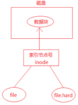

#### 1. Linux常用命令

##### 1.1 目录相关的命令

###### 1.1.1 pwd

格式:pwd [-LP] 打印当前工作目录的名字。

使用pwd命令可以显示当前的工作目录，该命令很简单，直接输入pwd即可，后面不带参数。

> wlkkk@ubuntut:~$ pwd
> /home/deng

###### 1.1.2 cd

cd后面可跟绝对路径，也可以跟相对路径。如果省略目录，则默认切换到当前用户的主目录。
| **命令** | **含义**                                                     |
| :------- | :----------------------------------------------------------- |
| cd       | 切换到当前用户的主目录(/home/用户目录)，用户登陆的时候，默认的目录就是用户的主目录。 |
| cd ~     | 切换到当前用户的主目录(/home/用户目录)                       |
| cd .     | 切换到当前目录                                               |
| cd ..    | 切换到上级目录                                               |
| cd -     | 可进入上一个进入的目录                                       |

###### 1.1.3 mkdir

用法:mkdir [选项]... 目录...

通过mkdir命令可以创建一个新的目录(不能新建普通文件)。参数-p可递归创建目录。

需要注意的是新建目录的名称不能与当前目录中已有的目录或文件同名，并且目录创建者必须对当前目录具有写权限。

###### 1.1.4 rmdir

用法:rmdir [选项]... 目录... 删除指定的空目录。

可使用rmdir命令删除一个目录。必须离开目录，并且目录必须为空目录，不然提示删除失败。

###### 1.1.5 du

du命令用于查看某个目录大小。

用法:

**du [选项] 目录或文件名**

| **选项** | **含义**                                           |
| :------- | :------------------------------------------------- |
| -a       | 递归显示指定目录中各文件和子目录中文件占用的数据块 |
| -s       | 显示指定文件或目录占用的数据块                     |
| -b       | 以字节为单位显示磁盘占用情况                       |
| -h       | 以K，M，G为单位，提高信息的可读性                  |

###### 1.1.6 df

df命令用于检测文件系统的磁盘空间占用和空余情况，可以显示所有文件系统对节点和磁盘块的使用情况。
| **选项** | **含义**                          |
| :------- | :-------------------------------- |
| -a       | 显示所有文件系统的磁盘使用情况    |
| -m       | 以1024字节为单位显示              |
| -h       | 以K，M，G为单位，提高信息的可读性 |

##### 1.2 文件相关的命令

###### 1.2.1 ls

ls是英文单词list的简写，其功能为列出目录的内容，是用户最常用的命令之一，它类似于DOS下的dir命令。

Linux文件或者目录名称最长可以有256个字符，“.”代表当前目录，“..”代表上一级目录，以“.”开头的文件为隐藏文件，需要用 -a 参数才能显示。

**用法:ls [选项]... [文件]...**

ls常用参数:

| **参数** | **含义**                                     |
| :------- | :------------------------------------------- |
| -a       | 显示指定目录下所有子目录与文件，包括隐藏文件 |
| -l       | 以列表方式显示文件的详细信息                 |
| -h       | 配合 -l 以人性化的方式显示文件大小           |

###### 1.2.2 touch

**用法:touch [选项]... 文件...**

1）如果文件不存在, 创建新文件(只能是普通文件，不能是文件夹)

2）如果文件存在, 更新文件时间

###### 1.2.3 cp

cp命令的功能是将给出的文件或目录复制到另一个文件或目录中，相当于DOS下的copy命令 。

常用选项说明:

| 选项 | 含义                                                         |
| :--- | :----------------------------------------------------------- |
| -a   | 该选项通常在复制目录时使用，它保留链接、文件属性，并递归地复制目录，简单而言，保持文件原有属性。 |
| -f   | 删除已经存在的目标文件而不提示                               |
| -i   | 交互式复制，在覆盖目标文件之前将给出提示要求用户确认         |
| -r   | 若给出的源文件是目录文件，则cp将递归复制该目录下的所有子目录和文件，目标文件必须为一个目录名。 |
| -v   | 显示拷贝进度                                                 |

###### 1.2.4 rm

可通过rm删除文件或目录。使用rm命令要小心，因为文件删除后不能恢复。为了防止文件误删，可以在rm后使用-i参数以逐个确认要删除的文件。

常用参数及含义如下表所示:

| **参数** | **含义**                                         |
| :------- | :----------------------------------------------- |
| -i       | 以进行交互式方式执行                             |
| -f       | 强制删除，忽略不存在的文件，无需提示             |
| -r       | 递归地删除目录下的内容，删除文件夹时必须加此参数 |

###### 1.2.5 mv

用户可以使用mv命令来移动文件或目录，也可以给文件或目录重命名。

常用选项说明:

| **选项** | **含义**                                                     |
| :------- | :----------------------------------------------------------- |
| -f       | 禁止交互式操作，如有覆盖也不会给出提示                       |
| -i       | 确认交互方式操作，如果mv操作将导致对已存在的目标文件的覆盖，系统会询问是否重写，要求用户回答以避免误覆盖文件 |
| -v       | 显示移动进度                                                 |

##### 1.3 文件内容查看命令

###### 1.3.1 cat

cat 将文件内容一次性输出到终端。

缺点:终端显示的内容有限，如果文件太长无法全部显示。

###### 1.3.2 more

more命令将文件内容分页显示到终端，但是只能一直向下浏览，不能回退:

相关说明:

| **命令**      | **作用**   |
| :------------ | :--------- |
| 回车          | 显示下一行 |
| 空格          | 显示下一页 |
| q（ctrl + c） | 退出       |
| h             | 获取帮助   |

###### 1.3.3 less

less命令将文件内容分页显示到终端，可以自由上下浏览
| **命令**       | **作用**   |
| :------------- | :--------- |
| 回车(ctrl + n) | 显示下一行 |
| ctrl + p       | 显示上一行 |
| 空格(PageDown) | 显示下一页 |
| PageUp         | 显示上一页 |
| q              | 退出       |
| h              | 获取帮助   |

1.3.4 head

- head命令从文件头部开始查看前 n 行的内容。
- 如果没有指定行数，默认显示前10行内容。

命令格式:

**head –n[行数] 文件名**

###### 1.3.5 tail

- 从文件尾部向上查看最后 n 行的内容
- 使用方式:tail –n[行数] 文件名
- 如果没有指定行数，默认显示最后10行内容

##### 1.4 查找相关命令

###### 1.4.1 find

find命令功能非常强大，通常用来在特定的目录下搜索符合条件的文件，也可以用来搜索特定用户属主的文件。

**按文件名查询:使用参数 -name**

**命令:find + 路径 + -name +“文件名”**

示例:find /home -name “a.txt”

**按文件大小查询:使用参数 -size**

**命令:find + 路径 + -size + 范围**

范围

- 大于:+表示 -- +100k
- 小于:-表示 -- -100k
- 等于: 不需要添加符号 -- 100k

大小
- M 必须大写（10M）
- k 必须小写（20k）

例子: 查询目录为家目录
等于100k的文件: find ~/ -size 100k
大于100k的文件: find ~/ -size +100k
大于50k, 小于100k的文件: find ~/ -size +50k -size -100k

**按文件类型查询:使用参数 -type**

**命令:find + 路径 + -type + 类型**

类型

- 普通文件类型用 **f** 表示而不是-
- d -> 目录
- l -> 符号链接
- b -> 块设备文件
- c -> 字符设备文件
- s -> socket文件，网络套接字
- p -> 管道

###### 1.4.2 grep

Linux系统中grep命令是一种强大的文本搜索工具，grep允许对文本文件进行模式查找。如果找到匹配模式， grep打印包含模式的所有行。

grep一般格式为:

**grep [-选项] ‘搜索内容串’ 文件名**

在grep命令中输入字符串参数时，最好引号或双引号括起来。例如:grep ‘a ’1.txt。

常用选项说明:

| **选项** | **含义**                                 |
| :------- | :--------------------------------------- |
| -v       | 显示不包含匹配文本的所有行（相当于求反） |
| -n       | 显示匹配行及行号                         |
| -i       | 忽略大小写                               |

###### 1.4.3 管道

管道(**|**):一个命令的输出可以通过管道做为另一个命令的输入。

管道我们可以理解现实生活中的管子，管子的一头塞东西进去，另一头取出来，这里“ | ”的左右分为两端，左端塞东西(写)，右端取东西(读)。

> cat /etc/passwd | less

##### 1.5 压缩包管理

###### 1.5.1 tar

计算机中的数据经常需要备份，tar是Unix/Linux中最常用的备份工具，此命令可以把一系列文件归档到一个大文件中，也可以把档案文件解开以恢复数据。

tar使用格式

> tar [选项] 打包文件名 文件

tar命令很特殊，其选项前面可以使用“-”，也可以不使用。

常用参数:

| **参数** | **含义**                                                  |
| :------- | :-------------------------------------------------------- |
| -c       | 生成档案文件，创建打包文件                                |
| -v       | 列出归档解档的详细过程，显示进度                          |
| -f       | 指定档案文件名称，f后面一定是.tar文件，所以必须放选项最后 |
| -t       | 列出档案中包含的文件                                      |
| -x       | 解开档案文件                                              |

注意:除了f需要放在参数的最后，其它参数的顺序任意。

tar -cvf 创建归档文件

tar -xvf 解除归档文件(还原)

tar -tvf 查看归档文件内容

###### 1.5.2 gzip

- tar与gzip命令结合使用实现文件打包、压缩。

- tar只负责打包文件，但不压缩，用gzip压缩tar打包后的文件，其扩展名一般用xxxx.tar.gz。

gzip使用格式如下:

**gzip [选项] 被压缩文件**

常用选项:

| **选项** | **含义**       |
| :------- | :------------- |
| -d       | 解压           |
| -r       | 压缩所有子目录 |

tar这个命令并没有压缩的功能，它只是一个打包的命令，但是在tar命令中增加一个选项(-z)可以调用gzip实现了一个压缩的功能，实行一个先打包后压缩的过程。

**压缩用法:** tar -zcvf 压缩包包名 文件1 文件2 ...

| 参数 | 含义                           |
| :--- | :----------------------------- |
| -z   | 指定压缩包的格式为:file.tar.gz |

**解压用法:** tar -zxvf 压缩包包名

| **参数** | **含义**                       |
| :------- | :----------------------------- |
| -z       | 指定压缩包的格式为:file.tar.gz |

**解压到指定目录:**-C （大写字母“C”）

###### 1.5.3 bzip2

- tar与bzip2命令结合使用实现文件打包、压缩(用法和gzip一样)。
- tar只负责打包文件，但不压缩，用bzip2压缩tar打包后的文件，其扩展名一般用xxxx.tar.bz2。
- 在tar命令中增加一个选项(-j)可以调用bzip2实现了一个压缩的功能，实行一个先打包后压缩的过程。
- 压缩用法:tar jcvf 压缩包包名 文件...(tar jcvf bk.tar.bz2 *.c)
- 解压用法:tar jxvf 压缩包包名 (tar jxvf bk.tar.bz2)

tar -czvf

tar -cjvf

tar -xzvf

tar -xjvf

tar -xvf 万能解压 (gzip bzip2)

###### 1.5.4 zip和unzip

通过zip压缩文件的目标文件不需要指定扩展名，默认扩展名为zip。

- 压缩文件:**zip -r 目标文件(没有扩展名) 源文件**

- 解压文件:**unzip -d 解压后目录文件 压缩文件**

##### 1.6 文件权限管理

###### 1.6.1 chmod

chmod 修改文件权限有两种使用格式:字母法与数字法。

**字母法:** chmod u/g/o/a +/-/= rwx 文件

| **[ u/g/o/a ]** | **含义**                                                  |
| :-------------- | :-------------------------------------------------------- |
| u               | user 表示该文件的所有者                                   |
| g               | group 表示与该文件的所有者属于同一组( group )者，即用户组 |
| o               | other 表示其他以外的人                                    |
| a               | all 表示这三者皆是                                        |

| **[ +-= ]** | **含义** |
| :---------- | :------- |
| +           | 增加权限 |
| -           | 撤销权限 |
| =           | 设定权限 |

| **rwx** | **含义**                                                     |
| :------ | :----------------------------------------------------------- |
| r       | read 表示可读取，对于一个目录，如果没有r权限，那么就意味着不能通过ls查看这个目录内部的内容。 |
| w       | write 表示可写入，对于一个目录，如果没有w权限，那么就意味着不能在目录下创建新的文件。 |
| x       | excute 表示可执行，对于一个目录，如果没有x权限，那么就意味着不能通过cd进入这个目录。 |

**数字法:** “rwx” 这些权限也可以用数字来代替

| rwx  | 含义                          |
| :--- | :---------------------------- |
| r    | 读取权限，数字代号为 "4"      |
| w    | 写入权限，数字代号为 "2"      |
| x    | 执行权限，数字代号为 "1"      |
| -    | 不具任何权限，数字t代号为 "0" |

###### 1.6.2 chown

chown用于修改文件所有者

使用方法:chown 用户名 文件或目录名

###### 1.6.3 chgrp 

chgrp用于修改文件所属组

使用方法:chgrp 用户组名 文件或目录名

##### 1.7 进程管理命令

###### 1.7.1 ps

进程是一个具有一定独立功能的程序，它是操作系统动态执行的基本单元。

ps命令可以查看进程的详细状况，常用选项(选项可以不加“-”)如下:

| **选项** | **含义**                                 |
| :------- | :--------------------------------------- |
| -a       | 显示终端上的所有进程，包括其他用户的进程 |
| -u       | 显示进程的详细状态                       |
| -x       | 显示没有控制终端的进程                   |
| -w       | 显示加宽，以便显示更多的信息             |
| -r       | 只显示正在运行的进程                     |

###### 1.7.2 top

top命令用来动态显示运行中的进程。top命令能够在运行后，在指定的时间间隔更新显示信息。可以在使用top命令时加上-d 来指定显示信息更新的时间间隔。

在top命令执行后，可以按下按键得到对显示的结果进行排序:

| **按键** | **含义**                           |
| :------- | :--------------------------------- |
| M        | 根据内存使用量来排序               |
| P        | 根据CPU占有率来排序                |
| T        | 根据进程运行时间的长短来排序       |
| U        | 可以根据后面输入的用户名来筛选进程 |
| K        | 可以根据后面输入的PID来杀死进程。  |
| q        | 退出                               |
| h        | 获得帮助                           |

###### 1.7.3 kill

kill命令指定进程号的进程，需要配合 ps 使用。

使用格式:

**kill [-signal] pid**

信号值从0到15，其中9为绝对终止，可以处理一般信号无法终止的进程。

###### 1.7.4 killall

通过进程名字杀死进程

##### 1.8 其他命令

###### 1.8.1 tree

tree 以树状形式查看指定目录内容，使用该命令需要安装软件 tree:

> sudo apt install tree

常用选项:

| 选项 | 含义        |
| :--- | :---------- |
| -L n | 查看n层目录 |

###### 1.8.2 ln

ln命令主要用于创建链接文件。Linux链接文件类似于Windows下的快捷方式。

链接文件分为软链接和硬链接:

- 软链接:软链接不占用磁盘空间，源文件删除则软链接失效。
- 硬链接:硬链接只能链接普通文件，不能链接目录。

使用格式:

ln 源文件 链接文件

ln -s 源文件 链接文件

如果没有-s选项代表建立一个硬链接文件，两个文件占用相同大小的硬盘空间，即使删除了源文件，链接文件还是存在，所以-s选项是更常见的形式。

注意:如果软链接文件和源文件不在同一个目录，源文件最好要使用绝对路径，不要使用相对路径。

- 使用硬链接应注意事项

  - 硬链接不能建在目录上

  - 硬连接对绝对路径没有要求

  - 硬连接不能跨文件系统

    硬链接文件和源文件的inode是相同的，文件系统的inode要求唯一，跨文件系统可能会使inode不同, 所以硬链接不能跨文件系统

- 硬链接的本质

  - 硬连接的本质是不同的文件名所在的inode节点是相同的，相同的inode节点指向了相同的数据块，所以他们的文件内容是一样的，文件内容会同步。

    - ls -i 文件名 ------可以查看文件的i节点

    - stat 文件名 ---可以查看i节点信息
    - 如下图, file.hard是file的硬链接, 这个两个文件指向了同一个inode, 同一个inode指向了相同的数据块(文件内容).



- 当新创建了一个文件, 硬链接计数为1

- 给文件创建了一个硬链接后, 硬链接计数加1

- 删除一个硬链接后, 硬链接计数减1

- 如果删除硬链接后, 硬链接计数为0, 则该文件会删除

#### 2.GCC工作流程和常用选项

gcc编译器从拿到一个c源文件到生成一个可执行程序，中间一共经历了四个步骤:


四个步骤并不是gcc独立完成的，而是在内部调用了其他工具，从而完成了整个工作流程:


gcc工作的流程

> wlkkk@ubuntut:~$ ls hello.c
>
> 第一步: 进行预处理
>
> wlkkk@ubuntut:~$ gcc -E 1hello.c -o 1hello.i
>
> 第二步: 生成汇编文件
>
> wlkkk@ubuntut:~$ gcc -S 1hello.i -o 1hello.s
>
> 第三步: 生成目标代码
>
> wlkkk@ubuntut:~$ gcc -c 1hello.s -o 1hello.o
>
> 第四步: 生成可以执行文件
>
> wlkkk@ubuntut:~$ gcc 1hello.o -o 1hello 
>
> 第五步: 执行 
> 
> wlkkk@ubuntut:~$ ./1hello

直接将源文件生成一个可以执行文件

> wlkkk@ubuntut:~$ gcc 1hello.c -o 1hello 
>
> wlkkk@ubuntut:~$ ./1hello

如果不指定输出文件名字, gcc编译器会生成一个默认的可以执行a.out

> wlkkk@ubuntut:~$ gcc 1hello.c
>
> wlkkk@ubuntut:~$ ls 1hello 1hello.c 1hello.i 1hello.o 1hello.s a.out
>
> wlkkk@ubuntut:~$ ./a.out


gcc常用选项

| **选项**       | **作用**                   |
| :------------- | :------------------------- |
| -o file        | 指定生成的输出文件名为file |
| -E             | 只进行预处理               |
| -S(大写)       | 只进行预处理和编译         |
| -c(小写)       | 只进行预处理、编译和汇编   |
| -v / --version | 查看gcc版本号              |
| -g             | 包含调试信息               |
| -On n=0~3      | 编译优化，n越大优化得越多  |
| -Wall          | 提示更多警告信息           |
| -D             | 编译时定义宏               |

显示所有的警告信息

> gcc -Wall test.c

将警告信息当做错误处理

> gcc -Wall -Werror test.c

测试程序(-D选项):

```c
#include <stdio.h>
int main(void)
{
    printf("SIZE: %d\n", SIZE);
    return 0;
}
```

> wlkkk@ubuntut:~$ gcc 2test.c -DSIZE=10
>
> wlkkk@ubuntut:~$ ./a.out
>
> SIZE: 10

#### 3.文件IO

##### 3.1 **系统调用的实现**

答案是软件中断。软件中断和我们常说的中断（硬件中断）不同之处在于，它是通过软件指令触发而并非外设引发的中断，也就是说，又是编程人员开发出的一种异常（该异常为正常的异常）。**操作系统一般是通过软件中断从用户态切换到内核态。**

##### 3.2 系统调用和库函数的区别

Linux 下对文件操作有两种方式:**系统调用（system call）**和**库函数调用（Library functions）**。

库函数由两类函数组成:

1）不需要调用系统调用

不需要切换到内核空间即可完成函数全部功能，并且将结果反馈给应用程序，如strcpy、bzero 等字符串操作函数。

2）需要调用系统调用

需要切换到内核空间，这类函数通过封装系统调用去实现相应功能，如 printf、fread等。

##### 3.3 C库中IO函数工作流程


##### 3.4 虚拟地址空间


##### 3.5 文件描述符

在 Linux 的世界里，一切设备皆文件。我们可以系统调用中 I/O 的函数（I:input，输入；O:output，输出），对文件进行相应的操作（ open()、close()、write() 、read() 等）。

打开现存文件或新建文件时，系统（内核）会返回一个文件描述符，文件描述符用来指定已打开的文件。这个文件描述符相当于这个已打开文件的标号，文件描述符是非负整数，是文件的标识，操作这个文件描述符相当于操作这个描述符所指定的文件。

程序运行起来后（每个进程）都有一张文件描述符的表，标准输入、标准输出、标准错误输出设备文件被打开，对应的文件描述符 0、1、2 记录在表中。程序运行起来后这三个文件描述符是默认打开的。

```
#define STDIN_FILENO  0 //标准输入的文件描述符
#define STDOUT_FILENO 1 //标准输出的文件描述符
#define STDERR_FILENO 2 //标准错误的文件描述符
```

在程序运行起来后打开其他文件时，系统会返回文件描述符表中最小可用的文件描述符，并将此文件描述符记录在表中。


##### 3.6 常用文件IO函数

###### 3.6.1 open

```c
#include <sys/types.h>
#include <sys/stat.h>
#include <fcntl.h>

int open(const char *pathname, int flags);
int open(const char *pathname, int flags, mode_t mode);
功能:
    打开文件，如果文件不存在则可以选择创建。
参数:
    pathname:文件的路径及文件名
    flags:打开文件的行为标志，必选项 O_RDONLY, O_WRONLY, O_RDWR
    mode:这个参数，只有在文件不存在时有效，指新建文件时指定文件的权限
返回值:
    成功:成功返回打开的文件描述符
    失败:-1
```

 **flags详细说明**

必选项:

| **取值** | **含义**               |
| :------- | :--------------------- |
| O_RDONLY | 以只读的方式打开       |
| O_WRONLY | 以只写的方式打开       |
| O_RDWR   | 以可读、可写的方式打开 |

可选项，和必选项按位或起来

| **取值**   | **含义**                                                   |
| :--------- | :--------------------------------------------------------- |
| O_CREAT    | 文件不存在则创建文件，使用此选项时需使用mode说明文件的权限 |
| O_EXCL     | 如果同时指定了O_CREAT，且文件已经存在，则出错              |
| O_TRUNC    | 如果文件存在，则清空文件内容                               |
| O_APPEND   | 写文件时，数据添加到文件末尾                               |
| O_NONBLOCK | 对于设备文件, 以O_NONBLOCK方式打开可以做非阻塞I/O          |

**mode补充说明**

1) 文件最终权限:mode & ~umask
2) shell进程的umask掩码可以用umask命令查看

Ø umask:查看掩码（补码）

Ø umask mode:设置掩码，mode为八进制数

Ø umask -S:查看各组用户的默认操作权限

| **取值** | **八进制** | 含义                                   |
| :------- | :--------- | :------------------------------------- |
| S_IRWXU  | 00700      | 文件所有者的读、写、可执行权限         |
| S_IRUSR  | 00400      | 文件所有者的读权限                     |
| S_IWUSR  | 00200      | 文件所有者的写权限                     |
| S_IXUSR  | 00100      | 文件所有者的可执行权限                 |
| S_IRWXG  | 00070      | 文件所有者同组用户的读、写、可执行权限 |
| S_IRGRP  | 00040      | 文件所有者同组用户的读权限             |
| S_IWGRP  | 00020      | 文件所有者同组用户的写权限             |
| S_IXGRP  | 00010      | 文件所有者同组用户的可执行权限         |
| S_IRWXO  | 00007      | 其他组用户的读、写、可执行权限         |
| S_IROTH  | 00004      | 其他组用户的读权限                     |
| S_IWOTH  | 00002      | 其他组用户的写权限                     |
| S_IXOTH  | 00001      | 其他组用户的可执行权限                 |

###### 3.6.2 close

```c
#include <unistd.h>

int close(int fd);
功能:
    关闭已打开的文件
参数:
    fd : 文件描述符，open()的返回值
返回值:
    成功:0
    失败: -1, 并设置errno
```

需要说明的是，当一个进程终止时，内核对该进程所有尚未关闭的文件描述符调用close关闭，所以即使用户程序不调用close，在终止时内核也会自动关闭它打开的所有文件。

但是对于一个长年累月运行的程序(比如网络服务器)，打开的文件描述符一定要记得关闭,否则随着打开的文件越来越多，会占用大量文件描述符和系统资源。

###### 3.6.3 write

```c
#include <unistd.h>
ssize_t write(int fd, const void *buf, size_t count);
功能:
    把指定数目的数据写到文件（fd）
参数:
    fd :  文件描述符
    buf : 数据首地址
    count : 写入数据的长度（字节）
返回值:
    成功:实际写入数据的字节个数
    失败: - 1
```

######  3.6.4 read

```c
#include <unistd.h>

ssize_t read(int fd, void *buf, size_t count);
功能:
    把指定数目的数据读到内存（缓冲区）
参数:
    fd : 文件描述符
    buf : 内存首地址
    count : 读取的字节个数
返回值:
    成功:实际读取到的字节个数
    失败: - 1
```

######  3.6.5 lseek

```c
#include <sys/types.h>
#include <unistd.h>

off_t lseek(int fd, off_t offset, int whence);
功能:
    改变文件的偏移量
参数:
    fd:文件描述符
    offset:根据whence来移动的位移数（偏移量），可以是正数，也可以负数，如果正数，则相对于whence往右移动，如果是负数，则相对于whence往左移动。如果向前移动的字节数超过了文件开头则出错返回，如果向后移动的字节数超过了文件末尾，再次写入时将增大文件尺寸。

    whence:其取值如下:
        SEEK_SET:从文件开头移动offset个字节
        SEEK_CUR:从当前位置移动offset个字节
        SEEK_END:从文件末尾移动offset个字节
返回值:
    若lseek成功执行, 则返回新的偏移量
    如果失败， 返回-1
```

 所有打开的文件都有一个当前文件偏移量(current file offset)，以下简称为 cfo。cfo 通常是一个非负整数，用于表明文件开始处到文件当前位置的字节数。

读写操作通常开始于 cfo，并且使 cfo 增大，增量为读写的字节数。文件被打开时，cfo 会被初始化为 0，除非使用了 O_APPEND 。

###### 3.6.6 perror和errno

errno是一个全局变量, 当系统调用后若出错会将errno进行设置, perror可以将errno对应的描述信息打印出来.

如:perror("open"); 如果报错的话打印: open:(空格)错误信息

##### 3.7 文件操作相关函数

###### 3.7.1 stat函数

```c
#include <sys/types.h>
#include <sys/stat.h>
#include <unistd.h>

int stat(const char *path, struct stat *buf);
int lstat(const char *pathname, struct stat *buf);
功能:
    获取文件状态信息
    stat和lstat的区别:
        当文件是一个符号链接时，lstat返回的是该符号链接本身的信息；
        而stat返回的是该链接指向的文件的信息。
参数:
    path:文件名
    buf:保存文件信息的结构体
返回值:
    成功: 0
    失败: -1
```

 

struct stat结构体说明:

```c
struct stat {
    dev_t           st_dev;     //文件的设备编号
    ino_t           st_ino;     //节点
    mode_t          st_mode;            //文件的类型和存取的权限
    nlink_t         st_nlink;       //连到该文件的硬连接数目，刚建立的文件值为1
    uid_t           st_uid;     //用户ID
    gid_t           st_gid;     //组ID
    dev_t           st_rdev;        //(设备类型)若此文件为设备文件，则为其设备编号
    off_t           st_size;        //文件字节数(文件大小)
    blksize_t       st_blksize;     //块大小(文件系统的I/O 缓冲区大小)
    blkcnt_t        st_blocks;      //块数
    time_t          st_atime;       //最后一次访问时间
    time_t          st_mtime;       //最后一次修改时间
    time_t          st_ctime;       //最后一次改变时间(指属性)
};
```

st_mode(16位整数)参数说明


文件类型判断应使用宏函数


测试程序:

```c
int main()
{
    struct stat buf;
    stat("a.txt", &buf);

    if (S_ISREG(buf.st_mode))
    {
        printf("%s\n", "这是普通文件");
    }

    return 0;
}
```

######  3.7.2 access

```c
#include <unistd.h>

int access(const char *pathname, int mode);
功能:测试指定文件是否具有某种属性
参数:
    pathname:文件名
    mode:文件权限，4种权限
        R_OK:   是否有读权限
        W_OK:   是否有写权限
        X_OK:   是否有执行权限
        F_OK:   测试文件是否存在
返回值:
    0:有某种权限，或者文件存在
    -1:没有，或文件不存在

access("txt", F_OK);
```

######  3.7.3 chmod

```c
#include <sys/stat.h>

int chmod(const char *pathname, mode_t mode);
功能:修改文件权限
参数:
    filename:文件名
    mode:权限(8进制数)
返回值:
    成功:0
    失败:-1
```

######  3.7.4 chown

```c
#include <unistd.h>

int chown(const char *pathname, uid_t owner, gid_t group);
功能:修改文件所有者和所属组
参数:
    pathname:文件或目录名
    owner:文件所有者id，通过查看 /etc/passwd 得到所有者id
    group:文件所属组id，通过查看 /etc/group 得到用户组id
返回值:
    成功:0
    失败:-1
```

###### 3.7.5 truncate

```c++
#include <unistd.h>
#include <sys/types.h>

int truncate(const char *path, off_t length);
功能:修改文件大小
参数:
    path:文件文件名字
    length:指定的文件大小
        a)比原来小, 删掉后边的部分
        b)比原来大, 向后拓展
返回值:
    成功:0
    失败:-1
```

###### 3.7.6 link

```c++
#include <unistd.h>

int link(const char *oldpath, const char *newpath);
功能:创建一个硬链接
参数:
    oldpath:源文件名字
    newpath:硬链接名字
返回值:
    成功:0
    失败:-1
```

###### 3.7.7 symlink

```c++
#include <unistd.h>

int symlink(const char *target, const char *linkpath);
功能:创建一个软链接
参数:
    target:源文件名字
    linkpath:软链接名字
返回值:
    成功:0
    失败:-1
```

###### 3.7.8 readlink

```c++
#include <unistd.h>

ssize_t readlink(const char *pathname, char *buf, size_t bufsiz);
功能:读软连接对应的文件名，不是读内容(该函数只能读软链接文件)
参数:
    pathname:软连接名
    buf:存放软件对应的文件名
    bufsiz :缓冲区大小(第二个参数存放的最大字节数)
返回值:
    成功:>0，读到buf中的字符个数
    失败:-1
```

###### 3.7.9 unlink

```c++
#include <unistd.h>

int unlink(const char *pathname);
功能:删除一个文件(软硬链接文件)
参数:
    pathname:删除的文件名字
返回值:
    成功:0
    失败:-1
```

###### 3.7.10 rename

```c++
#include <stdio.h>

int rename(const char *oldpath, const char *newpath);
功能:把oldpath的文件名改为newpath
参数:
oldpath:旧文件名
newpath:新文件名
返回值:
成功:0
失败:-1
```

###### 3.7.11 dup

```c++
#include <unistd.h>

int dup(int oldfd);
功能:
    通过 oldfd 复制出一个新的文件描述符，新的文件描述符是调用进程文件描述符表中最小可用的文件描述符，最终 oldfd 和新的文件描述符都指向同一个文件。
参数:
    oldfd : 需要复制的文件描述符 oldfd
返回值:
        成功:新文件描述符
        失败: -1
```

###### 3.7.12 dup2

```c++
#include <unistd.h>

int dup2(int oldfd, int newfd);
功能:
    通过 oldfd 复制出一个新的文件描述符 newfd，如果成功，newfd 和函数返回值是同一个返回值，最终 oldfd 和新的文件描述符 newfd 都指向同一个文件。
参数:
    oldfd : 需要复制的文件描述符
    newfd : 新的文件描述符，这个描述符可以人为指定一个合法数字（0 - 1023），如果指定的数字已经被占用（和某个文件有关联），此函数会自动关闭 close() 断开这个数字和某个文件的关联，再来使用这个合法数字。
返回值:
    成功:返回 newfd
    失败:返回 -1
```

###### 3.7.13 fcnlt

```c++
#include <unistd.h>
#include <fcntl.h>

int fcntl(int fd, int cmd, ... /* arg */);
功能:改变已打开的文件性质，fcntl针对描述符提供控制。
参数:
    fd:操作的文件描述符
    cmd:操作方式
    arg:针对cmd的值，fcntl能够接受第三个参数int arg。
返回值:
    成功:返回某个其他值
    失败:-1
```

> fcntl函数有5种功能:
>
> 1) 复制一个现有的描述符（cmd=F_DUPFD）
> 2) 获得／设置文件描述符标记(cmd=F_GETFD或F_SETFD)
> 3) 获得／设置文件状态标记(cmd=F_GETFL或F_SETFL)
> 4) 获得／设置异步I/O所有权(cmd=F_GETOWN或F_SETOWN)
> 5) 获得／设置记录锁(cmd=F_GETLK, F_SETLK或F_SETLKW)

```c++
// 等价于dup()
int new_fd = fcntl(fd, F_DUPFD, 0);

// 获取文件状态标志
int flag = fcntl(fd, F_GETFL, 0);
switch (flag & O_ACCMODE)
{
case O_RDONLY:
    printf("read only\n");
    break;
case O_WRONLY:
    printf("write only\n");
    break;
case O_RDWR:
    printf("read and write\n");
    break;
default:
    break;
}

if (flag & O_APPEND)
{
    printf("append\n");
}
flag |= O_APPEND; // 追加flag
fcntl(fd, F_SETFL, flag); //设置文件状态标记
```

##### 3.8 目录相关操作

###### 3.8.1 getcwd

```c++
#include <unistd.h>

char *getcwd(char *buf, size_t size);
功能:获取当前进程的工作目录
参数:
    buf : 缓冲区，存储当前的工作目录
    size : 缓冲区大小
返回值:
    成功:buf中保存当前进程工作目录位置
    失败: NULL
```

###### 3.8.2 chdir

```c++
#include <unistd.h>

int chdir(const char *path);
功能:修改当前进程(应用程序)的路径
参数:
    path:切换的路径
返回值:
    成功:0
    失败:-1
```

###### 3.8.3 opendir

```c++
#include <sys/types.h>
#include <dirent.h>

DIR *opendir(const char *name);
功能:打开一个目录
参数:
    name:目录名
返回值:
    成功:返回指向该目录结构体指针
    失败: NULL
```

###### 3.8.4 closedir

```c++
#include <sys/types.h>
#include <dirent.h>

int closedir(DIR *dirp);
功能:关闭目录
参数:
    dirp:opendir返回的指针
返回值:
    成功:0
    失败:-1
```

###### 3.8.5 readdir

```c++
#include <dirent.h>

struct dirent *readdir(DIR *dirp);
功能:读取目录
参数:
    dirp:opendir的返回值
返回值:
    成功:目录结构体指针
    失败:NULL
```

相关结构体说明:

```
struct dirent
{
    ino_t d_ino;                  // 此目录进入点的inode
    off_t d_off;                    // 目录文件开头至此目录进入点的位移
    signed short int d_reclen;      // d_name 的长度, 不包含NULL 字符
    unsigned char d_type;           // d_type 所指的文件类型 
    char d_name[256];               // 文件名
};
```

d_type文件类型说明:

| **取值**   | **含义** |
| :--------- | :------- |
| DT_BLK     | 块设备   |
| DT_CHR     | 字符设备 |
| DT_DIR     | 目录     |
| DT_LNK     | 软链接   |
| DT_FIFO    | 管道     |
| DT_REG     | 普通文件 |
| DT_SOCK    | 套接字   |
| DT_UNKNOWN | 未知     |

#### 4.进程控制

##### 4.1 进程控制块PCB

进程运行时，内核为进程每个进程分配一个PCB（进程控制块），维护进程相关的信息，Linux内核的进程控制块是task_struct结构体。

其内部成员有很多，我们掌握以下部分即可:

- 进程id。系统中每个进程有唯一的id，在C语言中用pid_t类型表示，其实就是一个非负整数。
- 进程的状态，有就绪、运行、挂起、停止等状态。
- 进程切换时需要保存和恢复的一些CPU寄存器。
- 描述虚拟地址空间的信息。
- 描述控制终端的信息。
- 当前工作目录（Current Working Directory）。
- umask掩码。
- 文件描述符表，包含很多指向file结构体的指针。
- 和信号相关的信息。
- 用户id和组id。
- 会话（Session）和进程组。

##### 4.2 进程的状态

进程状态反映进程执行过程的变化。这些状态随着进程的执行和外界条件的变化而转换。

在三态模型中，进程状态分为三个基本状态，即**运行态，就绪态，阻塞态**。

在五态模型中，进程分为**新建态、终止态，运行态，就绪态，阻塞态**。


stat中的参数意义如下:

| **参数** | **含义**                               |
| :------- | :------------------------------------- |
| D        | 不可中断 Uninterruptible（usually IO） |
| R        | 正在运行，或在队列中的进程             |
| S(大写)  | 处于休眠状态                           |
| T        | 停止或被追踪                           |
| Z        | 僵尸进程                               |
| W        | 进入内存交换（从内核2.6开始无效）      |
| X        | 死掉的进程                             |
| <        | 高优先级                               |
| N        | 低优先级                               |
| s        | 包含子进程                             |
| +        | 位于前台的进程组                       |

##### 4.3 进程号和相关函数

每个进程都由一个进程号来标识，其类型为 pid_t（整型），进程号的范围:0～32

接下来，再给大家介绍三个不同的进程号。

**进程号（PID）**:

标识进程的一个非负整型数。

**父进程号（PPID）**:

任何进程（ 除 init 进程）都是由另一个进程创建，该进程称为被创建进程的父进程，对应的进程号称为父进程号（PPID）。如，A 进程创建了 B 进程，A 的进程号就是 B 进程的父进程号。

**进程组号（PGID）**:

进程组是一个或多个进程的集合。他们之间相互关联，进程组可以接收同一终端的各种信号，关联的进程有一个进程组号（PGID） 。这个过程有点类似于 QQ 群，组相当于 QQ 群，各个进程相当于各个好友，把各个好友都拉入这个 QQ 群里，主要是方便管理，特别是通知某些事时，只要在群里吼一声，所有人都收到，简单粗暴。但是，这个进程组号和 QQ 群号是有点区别的，默认的情况下，当前的进程号会当做当前的进程组号。

###### 4.3.1 getpid

```c++
#include <sys/types.h>
#include <unistd.h>

pid_t getpid(void);
功能:
    获取本进程号（PID）
参数:
    无
返回值:
    本进程号
```

###### 4.3.2 getppid

```c++
#include <sys/types.h>
#include <unistd.h>

pid_t getppid(void);
功能:
    获取调用此函数的进程的父进程号（PPID）
参数:
    无
返回值:
    调用此函数的进程的父进程号（PPID）
```

###### 4.3.3 getpgid

```c++
#include <sys/types.h>
#include <unistd.h>

pid_t getpgid(pid_t pid);
功能:
    获取进程组号（PGID）
参数:
    pid:进程号
返回值:
    参数为 0 时返回当前进程组号，否则返回参数指定的进程的进程组号
```

##### 4.4 进程的创建 fork

系统允许一个进程创建新进程，新进程即为子进程，子进程还可以创建新的子进程，形成进程树结构模型。

```c++
#include <sys/types.h>
#include <unistd.h>

pid_t fork(void);
功能:
    用于从一个已存在的进程中创建一个新进程，新进程称为子进程，原进程称为父进程。
参数:
    无
返回值:
    成功:子进程中返回 0，父进程中返回子进程 ID。pid_t，为整型。
    失败:返回-1。
    失败的两个主要原因是:
        1）当前的进程数已经达到了系统规定的上限，这时 errno 的值被设置为 EAGAIN。
        2）系统内存不足，这时 errno 的值被设置为 ENOMEM。
```

使用 fork() 函数得到的子进程是父进程的一个复制品，它从父进程处继承了整个进程的地址空间:包括进程上下文（进程执行活动全过程的静态描述）、进程堆栈、打开的文件描述符、信号控制设定、进程优先级、进程组号等。

子进程所独有的只有它的进程号，计时器等（只有小量信息）。因此，使用 fork() 函数的代价是很大的。


简单来说， 一个进程调用 fork() 函数后，系统先给新的进程分配资源，例如存储数据和代码的空间。然后把原来的进程的所有值都复制到新的新进程中，只有少数值与原来的进程的值不同。相当于克隆了一个自己。

实际上，更准确来说，Linux 的 fork() 使用是通过写时拷贝 (copy- on-write) 实现。写时拷贝是一种可以推迟甚至避免拷贝数据的技术。内核此时并不复制整个进程的地址空间，而是让父子进程共享同一个地址空间。只用在需要写入的时候才会复制地址空间，从而使各个进行拥有各自的地址空间。也就是说，资源的复制是在需要写入的时候才会进行，在此之前，只有以只读方式共享。

注意:fork之后父子进程共享文件，fork产生的子进程与父进程相同的文件文件描述符指向相同的文件表，引用计数增加，共享文件文件偏移指针。

##### 4.5 进程退出函数

`exit()` 和 `_exit()` 函数功能和用法是一样的，无非时所包含的头文件不一样，还有的区别就是:exit()属于标准库函数，`_exit()`属于系统调用函数。

```c++
#include <stdlib.h>
void exit(int status);

#include <unistd.h>
void _exit(int status);
功能:
    结束调用此函数的进程。
参数:
    status:返回给父进程的参数（低 8 位有效），至于这个参数是多少根据需要来填写。
返回值:
    无
```

##### 4.6 等待子进程退出函数

###### 4.6.1 wait

```c++
#include <sys/types.h>
#include <sys/wait.h>

pid_t wait(int *status);
功能:
    等待任意一个子进程结束，如果任意一个子进程结束了，此函数会回收该子进程的资源。
参数:
    status : 进程退出时的状态信息。
返回值:
    成功:已经结束子进程的进程号
    失败: -1
```

调用 wait() 函数的进程会挂起（阻塞），直到它的一个子进程退出或收到一个不能被忽视的信号时才被唤醒（相当于继续往下执行）。

若调用进程没有子进程，该函数立即返回；若它的子进程已经结束，该函数同样会立即返回，并且会回收那个早已结束进程的资源。

所以，wait()函数的主要功能为回收已经结束子进程的资源。

如果参数 status 的值不是 NULL，wait() 就会把子进程退出时的状态取出并存入其中，这是一个整数值（int），指出了子进程是正常退出还是被非正常结束的。

这个退出信息在一个 int 中包含了多个字段，直接使用这个值是没有意义的，我们需要用宏定义取出其中的每个字段。

**宏函数可分为如下三组:**

1) WIFEXITED(status)

​		为非0 → 进程正常结束

​		WEXITSTATUS(status)

​		如上宏为真，使用此宏 → 获取进程退出状态 (exit的参数)

2) WIFSIGNALED(status)

​		为非0 → 进程异常终止

​		WTERMSIG(status)

​		如上宏为真，使用此宏 → 取得使进程终止的那个信号的编号。

3) WIFSTOPPED(status)

​		为非0 → 进程处于暂停状态

​		WSTOPSIG(status)

​		如上宏为真，使用此宏 → 取得使进程暂停的那个信号的编号。

​		WIFCONTINUED(status)

​		为真 → 进程暂停后已经继续运行

###### 4.6.2 waitpid

```c++
#include <sys/types.h>
#include <sys/wait.h>

pid_t waitpid(pid_t pid, int *status, int options);
功能:
    等待子进程终止，如果子进程终止了，此函数会回收子进程的资源。

参数:
    pid : 参数 pid 的值有以下几种类型:
      pid > 0  等待进程 ID 等于 pid 的子进程。
      pid = 0  等待同一个进程组中的任何子进程，如果子进程已经加入了别的进程组，waitpid 不会等待它。
      pid = -1 等待任一子进程，此时 waitpid 和 wait 作用一样。
      pid < -1 等待指定进程组中的任何子进程，这个进程组的 ID 等于 pid 的绝对值。

    status : 进程退出时的状态信息。和 wait() 用法一样。

    options : options 提供了一些额外的选项来控制 waitpid()。
            0:同 wait()，阻塞父进程，等待子进程退出。
            WNOHANG:没有任何已经结束的子进程，则立即返回。
            WUNTRACED:如果子进程暂停了则此函数马上返回，并且不予以理会子进程的结束状态。（由于涉及到一些跟踪调试方面的知识，加之极少用到）
                 
返回值:
    waitpid() 的返回值比 wait() 稍微复杂一些，一共有 3 种情况:
        1) 当正常返回的时候，waitpid() 返回收集到的已经回收子进程的进程号；
        2) 如果设置了选项 WNOHANG，而调用中 waitpid() 发现没有已退出的子进程可等待，则返回 0；
        3) 如果调用中出错，则返回-1，这时 errno 会被设置成相应的值以指示错误所在，如:当 pid 所对应的子进程不存在，或此进程存在，但不是调用进程的子进程，waitpid() 就会出错返回，这时 errno 被设置为 ECHILD；
```

##### 4.7 孤儿进程

父进程运行结束，但子进程还在运行（未运行结束）的子进程就称为孤儿进程（Orphan Process）。

每当出现一个孤儿进程的时候，内核就把孤儿进程的父进程设置为 init ，而 init 进程会循环地 wait() 它的已经退出的子进程。这样，当一个孤儿进程凄凉地结束了其生命周期的时候，init 进程就会代表党和政府出面处理它的一切善后工作。

因此孤儿进程并不会有什么危害。

##### 4.8 僵尸进程

进程终止，父进程尚未回收，子进程残留资源（PCB）存放于内核中，变成僵尸（Zombie）进程。

这样就会导致一个问题，如果进程不调用wait() 或 waitpid() 的话， 那么保留的那段信息就不会释放，其进程号就会一直被占用，但是系统所能使用的进程号是有限的，如果大量的产生僵尸进程，将因为没有可用的进程号而导致系统不能产生新的进程，此即为僵尸进程的危害，应当避免。

##### 4.9 进程替换

在 Windows 平台下，我们可以通过双击运行可执行程序，让这个可执行程序成为一个进程；而在 Linux 平台，我们可以通过 ./ 运行，让一个可执行程序成为一个进程。

但是，如果我们本来就运行着一个程序（进程），我们如何在这个进程内部启动一个外部程序，由内核将这个外部程序读入内存，使其执行起来成为一个进程呢？这里我们通过 exec 函数族实现。

exec 函数族，顾名思义，就是一簇函数，在 Linux 中，并不存在 exec() 函数，exec 指的是一组函数，一共有 6 个:

```c
#include <unistd.h>
extern char **environ;

int execl(const char *path, const char *arg, .../* (char  *) NULL */);
int execlp(const char *file, const char *arg, ... /* (char  *) NULL */);
int execle(const char *path, const char *arg, .../*, (char *) NULL, char * const envp[] */);
int execv(const char *path, char *const argv[]);
int execvp(const char *file, char *const argv[]);
int execvpe(const char *file, char *const argv[], char *const envp[]);

int execve(const char *filename, char *const argv[], char *const envp[]);
```

其中只有 execve() 是真正意义上的系统调用，其它都是在此基础上经过包装的库函数。

exec 函数族的作用是根据指定的文件名或目录名找到可执行文件，并用它来取代调用进程的内容，换句话说，就是在调用进程内部执行一个可执行文件。

进程调用一种 exec 函数时，该进程完全由新程序替换，而新程序则从其 main 函数开始执行。因为调用 exec 并不创建新进程，所以前后的进程 ID （当然还有父进程号、进程组号、当前工作目录……）并未改变。exec 只是用另一个新程序替换了当前进程的正文、数据、堆和栈段（进程替换）。


**exec 函数族使用说明**

exec 函数族的 6 个函数看起来似乎很复杂，但实际上无论是作用还是用法都非常相似，只有很微小的差别。


补充说明:

| 名称           | 含义                                     |
| :------------- | :--------------------------------------- |
| l(list)        | 参数地址列表，以空指针结尾               |
| v(vector)      | 存有各参数地址的指针数组的地址           |
| p(path)        | 按 PATH 环境变量指定的目录搜索可执行文件 |
| e(environment) | 存有环境变量字符串地址的指针数组的地址   |

exec 函数族与一般的函数不同，exec 函数族中的函数执行成功后不会返回，而且，exec 函数族下面的代码执行不到。只有调用失败了，它们才会返回 -1，失败后从原程序的调用点接着往下执行。

#### 5.进程间通信

##### 5.1 匿名管道

###### 5.1.1 概述

管道也叫无名管道，它是是 UNIX 系统 IPC（进程间通信） 的最古老形式，所有的 UNIX 系统都支持这种通信机制。

**管道有如下特点:**

1) 半双工，数据在同一时刻只能在一个方向上流动。
2) 数据只能从管道的一端写入，从另一端读出。
3) 写入管道中的数据遵循先入先出的规则。
4) 管道所传送的数据是无格式的，这要求管道的读出方与写入方必须事先约定好数据的格式，如多少字节算一个消息等。
5) 管道不是普通的文件，不属于某个文件系统，其只存在于**内存**中。
6) 管道在内存中对应一个缓冲区。不同的系统其大小不一定相同。
7) 从管道读数据是一次性操作，数据一旦被读走，它就从管道中被抛弃，释放空间以便写更多的数据。
8) 管道没有名字，只能在具有公共祖先的进程（父进程与子进程，或者两个兄弟进程，具有亲缘关系）之间使用。

对于管道特点的理解，我们可以类比现实生活中管子，管子的一端塞东西，管子的另一端取东西。

管道是一种特殊类型的文件，在应用层体现为两个打开的文件描述符。


###### 5.1.2 pipe

```c++
#include <unistd.h>

int pipe(int pipefd[2]);
功能:创建无名管道。

参数:
    pipefd : 为 int 型数组的首地址，其存放了管道的文件描述符 pipefd[0]、pipefd[1]。
    
    当一个管道建立时，它会创建两个文件描述符 fd[0] 和 fd[1]。其中 fd[0] 固定用于读管道，而 fd[1] 固定用于写管道。一般文件 I/O的函数都可以用来操作管道(lseek() 除外)。

返回值:
    成功:0
    失败:-1
```

代码:

```c++
int main()
{
    int fd_pipe[2] = { 0 };
    pid_t pid;

    if (pipe(fd_pipe) < 0)
    {// 创建管道
        perror("pipe");
    }

    pid = fork(); // 创建进程
    if (pid == 0)
    { // 子进程
        char buf[] = "I am mike";
        // 往管道写端写数据
        write(fd_pipe[1], buf, strlen(buf));

        _exit(0);
    }
    else if (pid > 0)
    {// 父进程
        wait(NULL); // 等待子进程结束，回收其资源
        char str[50] = { 0 };

        // 从管道里读数据
        read(fd_pipe[0], str, sizeof(str));

        printf("str=[%s]\n", str); // 打印数据
    }

    return 0;
}
```

###### 5.1.3 管道的读写行为特点

- 读操作

  - 有数据
    - read正常读，返回读出的字节数

  - 无数据

    - 写端全部关闭

      read解除阻塞，返回0, 相当于读文件读到了尾部

    - 没有全部关闭

      read阻塞

- 写操作

  - 读端全部关闭

    管道破裂，进程终止, 内核给当前进程发SIGPIPE信号

  - 读端没全部关闭

    - 缓冲区写满了

      write阻塞

    - 缓冲区没有满

      继续write

###### 5.1.4 设置为非阻塞的方法

```c++
//获取原来的flags
int flags = fcntl(fd[0], F_GETFL);
// 设置新的flags
flag |= O_NONBLOCK;
// flags = flags | O_NONBLOCK;
fcntl(fd[0], F_SETFL, flags);
```

结论: 如果写端没有关闭，读端设置为非阻塞， 如果没有数据，直接返回-1。

###### 5.1.5 查看管道缓冲区

- 命令

  ulimit -a

- 函数 

  ```c++
  #include <unistd.h>
  
  long fpathconf(int fd, int name);
  功能:该函数可以通过name参数查看不同的属性值
  参数:
      fd:文件描述符
      name:
          _PC_PIPE_BUF，查看管道缓冲区大小
          _PC_NAME_MAX，文件名字字节数的上限
  返回值:
      成功:根据name返回的值的意义也不同。
      失败: -1
  ```

##### 5.2 有名管道

管道，由于没有名字，只能用于亲缘关系的进程间通信。为了克服这个缺点，提出了命名管道（FIFO），也叫有名管道、FIFO文件。

命名管道（FIFO）不同于无名管道之处在于它提供了一个路径名与之关联，以 FIFO 的文件形式存在于文件系统中，这样，即使与 FIFO 的创建进程不存在亲缘关系的进程，只要可以访问该路径，就能够彼此通过 FIFO 相互通信，因此，通过 FIFO 不相关的进程也能交换数据。

 命名管道（FIFO)和无名管道（pipe）有一些特点是相同的，不一样的地方在于:

1) FIFO 在文件系统中作为一个特殊的文件而存在，但 FIFO 中的内容却存放在**内存**中。
2) 当使用 FIFO 的进程退出后，FIFO 文件将继续保存在文件系统中以便以后使用。
3) FIFO 有名字，不相关的进程可以通过打开命名管道进行通信。

###### 5.2.1 创建有名管道

- 通过命令

  mkfifo

  **命令格式: mkfifo 管道名**

- 通过函数

  ```c++
  #include <sys/types.h>
  #include <sys/stat.h>
  
  int mkfifo(const char *pathname, mode_t mode);
  功能:
      命名管道的创建。
  参数:
      pathname : 普通的路径名，也就是创建后 FIFO 的名字。
      mode : 文件的权限，与打开普通文件的 open() 函数中的 mode 参数相同。(0666)
  返回值:
      成功:0   状态码
      失败:如果文件已经存在，则会出错且返回 -1。
  ```

###### 5.2.2 有名管道读写操作

一旦使用mkfifo创建了一个FIFO，就可以使用open打开它，常见的文件I/O函数都可用于fifo。如:close、read、write、unlink等。

FIFO严格遵循先进先出（first in first out），对管道及FIFO的读总是从开始处返回数据，对它们的写则把数据添加到末尾。**它们不支持诸如lseek()等文件定位操作。**

```c++
//进行1，写操作
int fd = open("my_fifo", O_WRONLY);  

char send[100] = "Hello Mike";
write(fd, send, strlen(send));

//进程2，读操作
int fd = open("my_fifo", O_RDONLY);//等着只写  

char recv[100] = { 0 };
//读数据，命名管道没数据时会阻塞，有数据时就取出来  
read(fd, recv, sizeof(recv));
printf("read from my_fifo buf=[%s]\n", recv);
```

###### 5.2.3 有名管道注意事项

1. 一个为只读而打开一个管道的进程会阻塞直到另外一个进程为只写打开该管道。
2. 一个为只写而打开一个管道的进程会阻塞直到另外一个进程为只读打开该管道

**读管道:**

- 管道中有数据:read返回实际读到的字节数。

- 管道中无数据:
  - 管道写端被全部关闭，read返回0 (相当于读到文件结尾)
  - 写端没有全部被关闭，read阻塞等待

**写管道:**

- 管道读端全部被关闭:进程异常终止(也可使用捕捉SIGPIPE信号，使进程终止)

- 管道读端没有全部关闭:
  - 管道已满，write阻塞。
  - 管道未满，write将数据写入，并返回实际写入的字节数。

##### 5.3 共享存储映射

###### 5.3.1 概述

存储映射I/O (Memory-mapped I/O) 使一个磁盘文件与存储空间中的一个缓冲区相映射。


于是当从缓冲区中取数据，就相当于读文件中的相应字节。于此类似，将数据存入缓冲区，则相应的字节就自动写入文件。这样，就可在不适用read和write函数的情况下，使用地址（指针）完成I/O操作。

共享内存可以说是最有用的进程间通信方式，也是最快的IPC形式, 因为进程可以直接读写内存，而不需要任何数据的拷贝。

###### 5.3.2 存储映射函数

1. mmap

   ```c++
   #include <sys/mman.h>
   
   void *mmap(void *addr, size_t length, int prot, int flags, int fd, off_t offset);
   功能:
       一个文件或者其它对象映射进内存
   参数:
       addr :  指定映射的起始地址, 通常设为NULL, 由系统指定
       length:映射到内存的文件长度
       prot:  映射区的保护方式, 最常用的 :
           a) 读:PROT_READ
           b) 写:PROT_WRITE
           c) 读写:PROT_READ | PROT_WRITE
       flags:  映射区的特性, 可以是
           a) MAP_SHARED : 写入映射区的数据会复制回文件, 且允许其他映射该文件的进程共享。
           b) MAP_PRIVATE : 对映射区的写入操作会产生一个映射区的复制(copy - on - write), 对此区域所做的修改不会写回原文件。
       fd:由open返回的文件描述符, 代表要映射的文件。
       offset:以文件开始处的偏移量, 必须是4k的整数倍, 通常为0, 表示从文件头开始映射
   返回值:
       成功:返回创建的映射区首地址
       失败:MAP_FAILED宏
   ```

   **关于mmap函数的使用总结:**

   1) 第一个参数写成NULL
   2) 第二个参数要映射的文件大小 > 0
   3) 第三个参数:PROT_READ 、PROT_WRITE
   4) 第四个参数:MAP_SHARED 或者 MAP_PRIVATE
   5) 第五个参数:打开的文件对应的文件描述符
   6) 第六个参数:4k的整数倍，通常为0

2. munmap

   ```c++
   #include <sys/mman.h>
   
   int munmap(void *addr, size_t length);
   功能:
       释放内存映射区
   参数:
       addr:使用mmap函数创建的映射区的首地址
       length:映射区的大小
   返回值:
       成功:0
       失败:-1
   ```

###### 5.3.3 注意事项

1) 创建映射区的过程中，隐含着一次对映射文件的读操作。
2) 当MAP_SHARED时，要求:映射区的权限应 <=文件打开的权限(出于对映射区的保护)。而MAP_PRIVATE则无所谓，因为mmap中的权限是对内存的限制。
3) 映射区的释放与文件关闭无关。只要映射建立成功，文件可以立即关闭。
4) 特别注意，当映射文件大小为0时，不能创建映射区。所以，用于映射的文件必须要有实际大小。mmap使用时常常会出现总线错误，通常是由于共享文件存储空间大小引起的。
5) munmap传入的地址一定是mmap的返回地址。坚决杜绝指针++操作。
6) 如果文件偏移量必须为4K的整数倍。
7) mmap创建映射区出错概率非常高，一定要检查返回值，确保映射区建立成功再进行后续操作。

###### 5.3.4 共享映射代码

```c++
int fd = open("xxx.txt", O_RDWR); //读写文件
int len = lseek(fd, 0, SEEK_END);   //获取文件大小

//一个文件映射到内存，ptr指向此内存
void * ptr = mmap(NULL, len, PROT_READ | PROT_WRITE, MAP_SHARED, fd, 0);
if (ptr == MAP_FAILED)
{
    perror("mmap error");
    exit(1);
}

close(fd); //关闭文件

char buf[4096];
printf("buf = %s\n", (char*)ptr); // 从内存中读数据，等价于从文件中读取内容

strcpy((char*)ptr, "this is a test");//写内容

int ret = munmap(ptr, len);
if (ret == -1)
{
    perror("munmap error");
    exit(1);
}
```

###### 5.3.5 共享映射实现父子进程通信

```c++
int fd = open("xxx.txt", O_RDWR);// 打开一个文件
int len = lseek(fd, 0, SEEK_END);//获取文件大小

// 创建内存映射区
void *ptr = mmap(NULL, len, PROT_READ | PROT_WRITE, MAP_SHARED, fd, 0);
if (ptr == MAP_FAILED)
{
    perror("mmap error");
    exit(1);
}
close(fd); //关闭文件

// 创建子进程
pid_t pid = fork();
if (pid == 0) //子进程
{
    sleep(1); //演示，保证父进程先执行

    // 读数据
    printf("%s\n", (char*)ptr);
}
else if (pid > 0) //父进程
{
    // 写数据
    strcpy((char*)ptr, "i am u father!!");

    // 回收子进程资源
    wait(NULL);
}

// 释放内存映射区
int ret = munmap(ptr, len);
if (ret == -1)
{
    perror("munmap error");
    exit(1);
}
```

###### 5.3.6 匿名映射实现父子进程通信

通过使用我们发现，使用映射区来完成文件读写操作十分方便，父子进程间通信也较容易。但缺陷是，每次创建映射区一定要依赖一个文件才能实现。

通常为了建立映射区要open一个temp文件，创建好了再unlink、close掉，比较麻烦。 可以直接使用匿名映射来代替。

其实Linux系统给我们提供了创建匿名映射区的方法，无需依赖一个文件即可创建映射区。同样需要借助标志位参数flags来指定。

使用**MAP_ANONYMOUS (或MAP_ANON)**。

```
int *p = mmap(NULL, 4, PROT_READ|PROT_WRITE, MAP_SHARED|MAP_ANONYMOUS, -1, 0);
```

- 4"随意举例，该位置表示映射区大小，可依实际需要填写。
- MAP_ANONYMOUS和MAP_ANON这两个宏是Linux操作系统特有的宏。在类Unix系统中如无该宏定义，可使用如下两步来完成匿名映射区的建立。

程序示例:

```c++
// 创建匿名内存映射区
int len = 4096;
void *ptr = mmap(NULL, len, PROT_READ | PROT_WRITE, MAP_SHARED | MAP_ANON, -1, 0);
if (ptr == MAP_FAILED)
{
    perror("mmap error");
    exit(1);
}

// 创建子进程
pid_t pid = fork();
if (pid > 0) //父进程
{
    // 写数据
    strcpy((char*)ptr, "hello mike!!");
    // 回收
    wait(NULL);
}
else if (pid == 0)//子进程
{
    sleep(1);
    // 读数据
    printf("%s\n", (char*)ptr);
}

// 释放内存映射区
int ret = munmap(ptr, len);
if (ret == -1)
{
    perror("munmap error");
    exit(1);
}
```

#### 6.信号

##### 6.1 信号概述

信号是 Linux 进程间通信的最古老的方式。信号是软件中断，它是在软件层次上对中断机制的一种模拟，是一种异步通信的方式 。信号可以导致一个正在运行的进程被另一个正在运行的异步进程中断，转而处理某一个突发事件。

**信号的特点**

- 简单
- 不能携带大量信息
- 满足某个特设条件才发送

##### 6.2 信号的编号

###### 6.2.1 信号编号:

Unix早期版本就提供了信号机制，但不可靠，信号可能丢失。Berkeley 和 AT&T都对信号模型做了更改，增加了可靠信号机制。但彼此不兼容。POSIX.1对可靠信号例程进行了标准化。

Linux 可使用命令:kill -l（"l" 为字母），查看相应的信号。


不存在编号为0的信号。其中1-31号信号称之为常规信号（也叫普通信号或标准信号），34-64称之为实时信号，驱动编程与硬件相关。名字上区别不大。而前32个名字各不相同。

###### 6.2.2 Linux常规信号一览表 

| **编号** | **信号**             | **对应事件**                                                 | **默认动作**               |
| :------- | :------------------- | :----------------------------------------------------------- | :------------------------- |
| 1        | SIGHUP               | 用户退出shell时，由该shell启动的所有进程将收到这个信号       | 终止进程                   |
| 2        | **SIGINT**           | 当用户按下了**<Ctrl+C>**组合键时，用户终端向正在运行中的由该终端启动的程序发出此信号 | 终止进程                   |
| 3        | **SIGQUIT**          | 用户按下**<ctrl+\>**组合键时产生该信号，用户终端向正在运行中的由该终端启动的程序发出些信号 | 终止进程                   |
| 4        | SIGILL               | CPU检测到某进程执行了非法指令                                | 终止进程并产生core文件     |
| 5        | SIGTRAP              | 该信号由断点指令或其他 trap指令产生                          | 终止进程并产生core文件     |
| 6        | SIGABRT              | 调用abort函数时产生该信号                                    | 终止进程并产生core文件     |
| 7        | SIGBUS               | 非法访问内存地址，包括内存对齐出错                           | 终止进程并产生core文件     |
| 8        | SIGFPE               | 在发生致命的运算错误时发出。不仅包括浮点运算错误，还包括溢出及除数为0等所有的算法错误 | 终止进程并产生core文件     |
| 9        | SIGKILL              | 无条件终止进程。本信号不能被忽略，处理和阻塞                 | 终止进程，可以杀死任何进程 |
| 10       | SIGUSE1              | 用户定义的信号。即程序员可以在程序中定义并使用该信号         | 终止进程                   |
| 11       | **SIGSEGV**          | 指示进程进行了无效内存访问(段错误)                           | 终止进程并产生core文件     |
| 12       | SIGUSR2              | 另外一个用户自定义信号，程序员可以在程序中定义并使用该信号   | 终止进程                   |
| 13       | **SIGPIPE**          | Broken pipe向一个没有读端的管道写数据                        | 终止进程                   |
| 14       | SIGALRM              | 定时器超时，超时的时间 由系统调用alarm设置                   | 终止进程                   |
| 15       | SIGTERM              | 程序结束信号，与SIGKILL不同的是，该信号可以被阻塞和终止。通常用来要示程序正常退出。执行shell命令Kill时，缺省产生这个信号 | 终止进程                   |
| 16       | SIGSTKFLT            | Linux早期版本出现的信号，现仍保留向后兼容                    | 终止进程                   |
| 17       | **SIGCHLD**          | 子进程结束时，父进程会收到这个信号                           | 忽略这个信号               |
| 18       | SIGCONT              | 如果进程已停止，则使其继续运行                               | 继续/忽略                  |
| 19       | SIGSTOP              | 停止进程的执行。信号不能被忽略，处理和阻塞                   | 为终止进程                 |
| 20       | SIGTSTP              | 停止终端交互进程的运行。按下<ctrl+z>组合键时发出这个信号     | 暂停进程                   |
| 21       | SIGTTIN              | 后台进程读终端控制台                                         | 暂停进程                   |
| 22       | SIGTTOU              | 该信号类似于SIGTTIN，在后台进程要向终端输出数据时发生        | 暂停进程                   |
| 23       | SIGURG               | 套接字上有紧急数据时，向当前正在运行的进程发出些信号，报告有紧急数据到达。如网络带外数据到达 | 忽略该信号                 |
| 24       | SIGXCPU              | 进程执行时间超过了分配给该进程的CPU时间 ，系统产生该信号并发送给该进程 | 终止进程                   |
| 25       | SIGXFSZ              | 超过文件的最大长度设置                                       | 终止进程                   |
| 26       | SIGVTALRM            | 虚拟时钟超时时产生该信号。类似于SIGALRM，但是该信号只计算该进程占用CPU的使用时间 | 终止进程                   |
| 27       | SGIPROF              | 类似于SIGVTALRM，它不公包括该进程占用CPU时间还包括执行系统调用时间 | 终止进程                   |
| 28       | SIGWINCH             | 窗口变化大小时发出                                           | 忽略该信号                 |
| 29       | SIGIO                | 此信号向进程指示发出了一个异步IO事件                         | 忽略该信号                 |
| 30       | SIGPWR               | 关机                                                         | 终止进程                   |
| 31       | SIGSYS               | 无效的系统调用                                               | 终止进程并产生core文件     |
| 34~64    | SIGRTMIN ～ SIGRTMAX | LINUX的实时信号，它们没有固定的含义（可以由用户自定义）      | 终止进程                   |

###### 6.3 信号四要素

每个信号必备4要素，分别是:

- 编号
- 名称
- 事件
- 默认处理动作

##### 6.4 信号的状态

1. **产生**
   1. 当用户按某些终端键时，将产生信号。
   2. 硬件异常将产生信号。
   3. 软件异常将产生信号。
   4.  调用系统函数(如:kill、raise、abort)将发送信号。
   5. 运行 kill /killall命令将发送信号。
2. **未决状态:没有被处理**
3. **递达状态:信号被处理了**

##### 6.5 阻塞信号集和未决信号集

信号的实现手段导致信号有很强的延时性，但对于用户来说，时间非常短，不易察觉。

Linux内核的进程控制块PCB是一个结构体，task_struct, 除了包含进程id，状态，工作目录，用户id，组id，文件描述符表，还包含了信号相关的信息，主要指**阻塞信号集和未决信号集**。

**阻塞信号集(信号屏蔽字)**

将某些信号加入集合，对他们设置屏蔽，当屏蔽x信号后，再收到该信号，该信号的处理将推后(处理发生在解除屏蔽后)。

**未决信号集**

信号产生，未决信号集中描述该信号的位立刻翻转为1，表示信号处于未决状态。当信号被处理对应位翻转回为0。这一时刻往往非常短暂。

信号产生后由于某些原因(主要是阻塞)不能抵达。这类信号的集合称之为未决信号集。在屏蔽解除前，信号一直处于未决状态。

##### 6.6 信号产生函数

###### 6.6.1 kill

```c++
#include <sys/types.h>
#include <signal.h>

int kill(pid_t pid, int sig);
功能:给指定进程发送指定信号(不一定杀死)

参数:
    pid : 取值有 4 种情况 :
        pid > 0:  将信号传送给进程 ID 为pid的进程。
        pid = 0 :  将信号传送给当前进程所在进程组中的所有进程。
        pid = -1 : 将信号传送给系统内所有的进程。
        pid < -1 : 将信号传给指定进程组的所有进程。这个进程组号等于 pid 的绝对值。
    sig : 信号的编号，这里可以填数字编号，也可以填信号的宏定义，可以通过命令 kill - l("l" 为字母)进行相应查看。不推荐直接使用数字，应使用宏名，因为不同操作系统信号编号可能不同，但名称一致。

返回值:
    成功:0
    失败:-1
```

super用户(root)可以发送信号给任意用户，普通用户是不能向系统用户发送信号的。

kill -9 (root用户的pid) 是不可以的。同样，普通用户也不能向其他普通用户发送信号，终止其进程。 只能向自己创建的进程发送信号。

普通用户基本规则是:发送者实际或有效用户ID == 接收者实际或有效用户ID.

```c++
int main()
{
    pid_t pid = fork();
    if (pid == 0)
    {//子进程
        int i = 0;
        for (i = 0; i<5; i++)
        {
            printf("in son process\n");
            sleep(1);
        }
    }
    else
    {//父进程
        printf("in father process\n");
        sleep(2);
        printf("kill sub process now \n");
        kill(pid, SIGINT);
    }

    return 0;
}
```

###### 6.6.2 raise

```c++
#include <signal.h>

int raise(int sig);
功能:给当前进程发送指定信号(自己给自己发)，等价于 kill(getpid(), sig)
参数:
    sig:信号编号
返回值:
    成功:0
    失败:非0值
```

###### 6.6.3 abort

```c++
#include <stdlib.h>

void abort(void);
功能:给自己发送异常终止信号 6) SIGABRT，并产生core文件，等价于kill(getpid(), SIGABRT);

参数:无

返回值:无
```

###### 6.6.4 alarm 闹钟

```c++
#include <unistd.h>

unsigned int alarm(unsigned int seconds);
功能:
    设置定时器(闹钟)。在指定seconds后，内核会给当前进程发送14）SIGALRM信号。进程收到该信号，默认动作终止。每个进程都有且只有唯一的一个定时器。
    取消定时器alarm(0)，返回旧闹钟余下秒数。
参数:
    seconds:指定的时间，以秒为单位
返回值:
    返回0或剩余的秒数
```

定时，与进程状态无关(自然定时法)！就绪、运行、挂起(阻塞、暂停)、终止、僵尸……无论进程处于何种状态，alarm都计时。

```c++
int main()
{
    int seconds = 0;

    seconds = alarm(5);
    printf("seconds = %d\n", seconds);

    sleep(2);
    seconds = alarm(5);
    printf("seconds = %d\n", seconds);

    while (1);
    return 0;
}
```

###### 6.6.5 setitimer 定时器

```c++
#include <sys/time.h>

int setitimer(int which,  const struct itimerval *new_value, struct itimerval *old_value);
功能:
    设置定时器(闹钟)。 可代替alarm函数。精度微秒us，可以实现周期定时。
参数:
    which:指定定时方式
        a) 自然定时:ITIMER_REAL → 14）SIGALRM计算自然时间
        b) 虚拟空间计时(用户空间):ITIMER_VIRTUAL → 26）SIGVTALRM  只计算进程占用cpu的时间
        c) 运行时计时(用户 + 内核):ITIMER_PROF → 27）SIGPROF计算占用cpu及执行系统调用的时间
    new_value:struct itimerval, 负责设定timeout时间
        struct itimerval {
            struct timerval it_interval; // 闹钟触发周期
            struct timerval it_value;    // 闹钟触发时间
        };
        struct timeval {
            long tv_sec;            // 秒
            long tv_usec;           // 微秒
        }
        itimerval.it_value: 设定第一次执行function所延迟的秒数 
        itimerval.it_interval:  设定以后每几秒执行function

    old_value: 存放旧的timeout值，一般指定为NULL
返回值:
    成功:0
    失败:-1
```

代码:

```c++
void myfunc(int sig)
{
    printf("hello\n");
}

int main()
{
    struct itimerval new_value;

    //定时周期
    new_value.it_interval.tv_sec = 1;
    new_value.it_interval.tv_usec = 0;

    //第一次触发的时间
    new_value.it_value.tv_sec = 2;
    new_value.it_value.tv_usec = 0;

    signal(SIGALRM, myfunc); //信号处理
    setitimer(ITIMER_REAL, &new_value, NULL); //定时器设置

    while (1);

    return 0;
}
```

##### 6.7 信号集

###### 6.7.1 信号集概述

在PCB中有两个非常重要的信号集。一个称之为“阻塞信号集”，另一个称之为“未决信号集”。

这两个信号集都是内核使用**位图机制**来实现的。但操作系统不允许我们直接对其进行位操作。而需自定义另外一个集合，借助信号集操作函数来对PCB中的这两个信号集进行修改。


###### 6.7.2 自定义信号集

为了方便对多个信号进行处理，一个用户进程常常需要对多个信号做出处理，在 Linux 系统中引入了信号集（信号的集合）。

这个信号集有点类似于我们的 QQ 群，一个个的信号相当于 QQ 群里的一个个好友。

信号集是一个能表示多个信号的数据类型，sigset_t set，set即一个信号集。既然是一个集合，就需要对集合进行添加/删除等操作。

相关函数说明如下:

```c++
#include <signal.h>  

int sigemptyset(sigset_t *set);       //将set集合置空
int sigfillset(sigset_t *set)；          //将所有信号加入set集合
int sigaddset(sigset_t *set, int signo);  //将signo信号加入到set集合
int sigdelset(sigset_t *set, int signo);   //从set集合中移除signo信号
int sigismember(const sigset_t *set, int signo); //判断信号是否存在
```

除sigismember外，其余操作函数中的set均为传出参数。sigset_t类型的本质是位图。但不应该直接使用位操作，而应该使用上述函数，保证跨系统操作有效。

代码:

```c++
int main()
{
    sigset_t set;   // 定义一个信号集变量
    int ret = 0;

    sigemptyset(&set); // 清空信号集的内容

    // 判断 SIGINT 是否在信号集 set 里
    // 在返回 1， 不在返回 0
    ret = sigismember(&set, SIGINT);
    if (ret == 0)
    {
        printf("SIGINT is not a member of set \nret = %d\n", ret);
    }

    sigaddset(&set, SIGINT); // 把 SIGINT 添加到信号集 set
    sigaddset(&set, SIGQUIT);// 把 SIGQUIT 添加到信号集 set

    // 判断 SIGINT 是否在信号集 set 里
    // 在返回 1， 不在返回 0
    ret = sigismember(&set, SIGINT);
    if (ret == 1)
    {
        printf("SIGINT is a member of set \nret = %d\n", ret);
    }

    sigdelset(&set, SIGQUIT); // 把 SIGQUIT 从信号集 set 移除

    // 判断 SIGQUIT 是否在信号集 set 里
    // 在返回 1， 不在返回 0
    ret = sigismember(&set, SIGQUIT);
    if (ret == 0)
    {
        printf("SIGQUIT is not a member of set \nret = %d\n", ret);
    }

    return 0;
}
```

###### 6.7.3 sigprocmask

信号阻塞集也称信号屏蔽集、信号掩码。每个进程都有一个阻塞集，创建子进程时子进程将继承父进程的阻塞集。信号阻塞集用来描述哪些信号递送到该进程的时候被阻塞（在信号发生时记住它，直到进程准备好时再将信号通知进程）。

所谓阻塞并不是禁止传送信号, 而是暂缓信号的传送。若将被阻塞的信号从信号阻塞集中删除，且对应的信号在被阻塞时发生了，进程将会收到相应的信号。

我们可以通过 sigprocmask() 修改当前的信号掩码来改变信号的阻塞情况。

```c++
#include <signal.h>

int sigprocmask(int how, const sigset_t *set, sigset_t *oldset);
功能:
    检查或修改信号阻塞集，根据 how 指定的方法对进程的阻塞集合进行修改，新的信号阻塞集由 set 指定，而原先的信号阻塞集合由 oldset 保存。

参数:
    how : 信号阻塞集合的修改方法，有 3 种情况:
        SIG_BLOCK:向信号阻塞集合中添加 set 信号集，新的信号掩码是set和旧信号掩码的并集。相当于 mask = mask|set。
        SIG_UNBLOCK:从信号阻塞集合中删除 set 信号集，从当前信号掩码中去除 set 中的信号。相当于 mask = mask & ~ set。
        SIG_SETMASK:将信号阻塞集合设为 set 信号集，相当于原来信号阻塞集的内容清空，然后按照 set 中的信号重新设置信号阻塞集。相当于mask = set。
    set : 要操作的信号集地址。
        若 set 为 NULL，则不改变信号阻塞集合，函数只把当前信号阻塞集合保存到 oldset 中。
    oldset : 保存原先信号阻塞集地址

返回值:
    成功:0，
    失败:-1，失败时错误代码只可能是 EINVAL，表示参数 how 不合法。
```

###### 6.7.4 sigpending

```c++
#include <signal.h>

int sigpending(sigset_t *set);
功能:读取当前进程的未决信号集
参数:
    set:未决信号集
返回值:
    成功:0
    失败:-1
```

代码:

```c++
int main()
{
    // 自定义信号集
    sigset_t myset, old;
    sigemptyset(&myset);// 清空　－》　０

    // 添加要阻塞的信号
    sigaddset(&myset, SIGINT);
    sigaddset(&myset, SIGQUIT);
    sigaddset(&myset, SIGKILL);

    // 自定义信号集设置到内核中的阻塞信号集
    sigprocmask(SIG_BLOCK, &myset, &old);

    sigset_t pend;
    int i = 0;
    while (1)
    {
        // 读内核中的未决信号集的状态
        sigpending(&pend);
        for (int i = 1; i<32; ++i)
        {
            if (sigismember(&pend, i))
            {
                printf("1");
            }
            else if (sigismember(&pend, i) == 0)
            {
                printf("0");
            }
        }
        printf("\n");
        sleep(1);
        i++;

        // 10s之后解除阻塞
        if (i > 10)
        {
            // sigprocmask(SIG_UNBLOCK, &myset, NULL);
            sigprocmask(SIG_SETMASK, &old, NULL);
        }
    }

    return 0;
}
```

##### 6.8 信号捕捉

###### 6.8.1 信号处理方式

一个进程收到一个信号的时候，可以用如下方法进行处理:

- 执行系统默认动作

​		对大多数信号来说，系统默认动作是用来终止该进程。

- 忽略此信号(丢弃)

​		接收到此信号后没有任何动作。

- 执行自定义信号处理函数(捕获)

​		用用户定义的信号处理函数处理该信号。

【注意】:SIGKILL 和 SIGSTOP 不能更改信号的处理方式，因为它们向用户提供了一种使进程终止的可靠方法。


###### 6.8.2 signal

```c++
#include <signal.h>

typedef void(*sighandler_t)(int);
sighandler_t signal(int signum, sighandler_t handler);
功能:
    注册信号处理函数（不可用于 SIGKILL、SIGSTOP 信号），即确定收到信号后处理函数的入口地址。此函数不会阻塞。

参数:
    signum:信号的编号，这里可以填数字编号，也可以填信号的宏定义，可以通过命令 kill - l("l" 为字母)进行相应查看。
    handler : 取值有 3 种情况:
          SIG_IGN:忽略该信号
          SIG_DFL:执行系统默认动作
          信号处理函数名:自定义信号处理函数，如:func
          回调函数的定义如下:
            void func(int signo)
            {
                // signo 为触发的信号，为 signal() 第一个参数的值
            }

返回值:
    成功:第一次返回 NULL，下一次返回此信号上一次注册的信号处理函数的地址。如果需要使用此返回值，必须在前面先声明此函数指针的类型。
    失败:返回 SIG_ERR
```

该函数由ANSI定义，由于历史原因在不同版本的Unix和不同版本的Linux中可能有不同的行为。因此应该尽量避免使用它，取而代之使用sigaction函数。

代码:

```c++
// 信号处理函数
void signal_handler(int signo)
{
    if (signo == SIGINT)
    {
        printf("recv SIGINT\n");
    }
    else if (signo == SIGQUIT)
    {
        printf("recv SIGQUIT\n");
    }
}

int main()
{
    printf("wait for SIGINT OR SIGQUIT\n");

    /* SIGINT: Ctrl+c ; SIGQUIT: Ctrl+\ */
    // 信号注册函数
    signal(SIGINT, signal_handler);
    signal(SIGQUIT, signal_handler);

    while (1); //不让程序结束

    return 0;
}
```

###### 6.8.3 sigaction

```c++
#include <signal.h>

int sigaction(int signum, const struct sigaction *act, struct sigaction *oldact);
功能:
    检查或修改指定信号的设置（或同时执行这两种操作）。

参数:
    signum:要操作的信号。
    act:   要设置的对信号的新处理方式（传入参数）。
    oldact:原来对信号的处理方式（传出参数）。

    如果 act 指针非空，则要改变指定信号的处理方式（设置），如果 oldact 指针非空，则系统将此前指定信号的处理方式存入 oldact。

返回值:
    成功:0
    失败:-1
```

**struct sigaction结构体:**

```c
struct sigaction {
    void(*sa_handler)(int); //旧的信号处理函数指针
    void(*sa_sigaction)(int, siginfo_t *, void *); //新的信号处理函数指针
    sigset_t   sa_mask;      //信号阻塞集
    int        sa_flags;     //信号处理的方式
    void(*sa_restorer)(void); //已弃用
};
```

- sa_handler、sa_sigaction:信号处理函数指针，和 signal() 里的函数指针用法一样，应根据情况给sa_sigaction、sa_handler 两者之一赋值，其取值如下:

  - SIG_IGN:忽略该信号

  - SIG_DFL:执行系统默认动作

  - 处理函数名:自定义信号处理函数

- sa_mask:信号阻塞集，在信号处理函数执行过程中，临时屏蔽指定的信号。

- sa_flags:用于指定信号处理的行为，通常设置为0，表使用默认属性。它可以是一下值的“按位或”组合:

  - SA_RESTART:使被信号打断的系统调用自动重新发起（已经废弃）

  - SA_NOCLDSTOP:使父进程在它的子进程暂停或继续运行时不会收到 SIGCHLD 信号。

  - SA_NOCLDWAIT:使父进程在它的子进程退出时不会收到 SIGCHLD 信号，这时子进程如果退出也不会成为僵尸进程。

- SA_NODEFER:使对信号的屏蔽无效，即在信号处理函数执行期间仍能发出这个信号。

- SA_RESETHAND:信号处理之后重新设置为默认的处理方式。

- SA_SIGINFO:使用 sa_sigaction 成员而不是 sa_handler 作为信号处理函数。

**信号处理函数:**

```c++
void(*sa_sigaction)(int signum, siginfo_t *info, void *context);
参数说明:
    signum:信号的编号。
    info:记录信号发送进程信息的结构体。
    context:可以赋给指向 ucontext_t 类型的一个对象的指针，以引用在传递信号时被中断的接收进程或线程的上下文。
```

示例程序:

```c
void myfunc(int sig)
{
    printf("hello signal: %d\n", sig);
    sleep(5);
    printf("wake up .....\n");
}

int main()
{
    // 注册信号捕捉函数
    struct sigaction act;
    act.sa_flags = 0;
    act.sa_handler = myfunc;
    // 设置临时屏蔽的信号
    sigemptyset(&act.sa_mask);  // 清空
    // ctrl + 反斜杠
    sigaddset(&act.sa_mask, SIGQUIT);

    sigaction(SIGINT, &act, NULL); //注册信号

    while (1);

    return 0;
}
```

###### 6.8.4 sigqueue

```c++
#include <signal.h>

int sigqueue(pid_t pid, int sig, const union sigval value);
功能:
    给指定进程发送信号。
参数:
    pid : 进程号。
    sig : 信号的编号。
    value : 通过信号传递的参数。
        union sigval 类型如下:
            union sigval
            {
                int   sival_int;
                void *sival_ptr;
            };
返回值:
    成功:0
    失败:-1
```

向指定进程发送指定信号的同时，携带数据。但如传地址，需注意，不同进程之间虚拟地址空间各自独立，将当前进程地址传递给另一进程没有实际意义。

下面我们做这么一个例子，一个进程在发送信号，一个进程在接收信号的发送。

发送信号示例代码如下:

```c++
/*******************************************************
*功能:     发 SIGINT 信号及信号携带的值给指定的进程
*参数:        argv[1]:进程号 argv[2]:待发送的值（默认为100）
*返回值:   0
********************************************************/
int main()
{
    if (argc >= 2)
    {
        pid_t pid, pid_self;
        union sigval tmp;

        pid = atoi(argv[1]); // 进程号
        if (argc >= 3)
        {
            tmp.sival_int = atoi(argv[2]);
        }
        else
        {
            tmp.sival_int = 100;
        }

        // 给进程 pid，发送 SIGINT 信号，并把 tmp 传递过去
        sigqueue(pid, SIGINT, tmp);

        pid_self = getpid(); // 进程号
        printf("pid = %d, pid_self = %d\n", pid, pid_self);
    }

    return 0;
}
```

接收信号示例代码如下:

```c
// 信号处理回调函数
void signal_handler(int signum, siginfo_t *info, void *ptr)
{
    printf("signum = %d\n", signum); // 信号编号
    printf("info->si_pid = %d\n", info->si_pid); // 对方的进程号
    printf("info->si_sigval = %d\n", info->si_value.sival_int); // 对方传递过来的信息
}

int main()
{
    struct sigaction act, oact;

    act.sa_sigaction = signal_handler; //指定信号处理回调函数
    sigemptyset(&act.sa_mask); // 阻塞集为空
    act.sa_flags = SA_SIGINFO; // 指定调用 signal_handler

    // 注册信号 SIGINT
    sigaction(SIGINT, &act, &oact);

    while (1)
    {
        printf("pid is %d\n", getpid()); // 进程号

        pause(); // 捕获信号，此函数会阻塞
    }

    return 0;
}

```

##### 6.9 SIGCHLD

###### 6.9.1 SIGCHLD信号产生的条件

- 子进程终止时
- 子进程接收到SIGSTOP信号停止时
- 子进程处在停止态，接受到SIGCONT后唤醒时

###### 6.9.2 如何避免僵尸进程

1. 最简单的方法，父进程通过 wait() 和 waitpid() 等函数等待子进程结束，但是，这会导致父进程挂起。
2. 如果父进程要处理的事情很多，不能够挂起，通过 signal() 函数人为处理信号 SIGCHLD ， 只要有子进程退出自动调用指定好的回调函数，因为子进程结束后， 父进程会收到该信号 SIGCHLD ，可以在其回调函数里调用 wait() 或 waitpid() 回收。

示例程序:

```c
void sig_child(int signo)
{
    pid_t  pid;

    //处理僵尸进程, -1 代表等待任意一个子进程, WNOHANG代表不阻塞
    while ((pid = waitpid(-1, NULL, WNOHANG)) > 0)
    {
        printf("child %d terminated.\n", pid);
    }
}

int main()
{
    pid_t pid;

    // 创建捕捉子进程退出信号
    // 只要子进程退出，触发SIGCHLD，自动调用sig_child()
    signal(SIGCHLD, sig_child);

    pid = fork();   // 创建进程
    if (pid < 0)
    { // 出错
        perror("fork error:");
        exit(1);
    }
    else if (pid == 0)
    { // 子进程
        printf("I am child process,pid id %d.I am exiting.\n", getpid());
        exit(0);
    }
    else if (pid > 0)
    { // 父进程
        sleep(2);   // 保证子进程先运行
        printf("I am father, i am exited\n\n");
        system("ps -ef | grep defunct"); // 查看有没有僵尸进程
    }

    return 0;
}

```

3. 如果父进程不关心子进程什么时候结束，那么可以用signal（SIGCHLD, SIG_IGN）通知内核，自己对子进程的结束不感兴趣，父进程忽略此信号，那么子进程结束后，内核会回收， 并不再给父进程发送信号。

示例程序:

```c
int main()
{
    pid_t pid;

    // 忽略子进程退出信号的信号
    // 那么子进程结束后，内核会回收， 并不再给父进程发送信号
    signal(SIGCHLD, SIG_IGN);

    pid = fork();   // 创建进程

    if (pid < 0)
    { // 出错
        perror("fork error:");
        exit(1);
    }
    else if (pid == 0)
    { // 子进程
        printf("I am child process,pid id %d.I am exiting.\n", getpid());
        exit(0);

    }
    else if (pid > 0)
    { // 父进程
        sleep(2);   // 保证子进程先运行
        printf("I am father, i am exited\n\n");
        system("ps -ef | grep defunct"); // 查看有没有僵尸进程
    }

    return 0;
}
```

#### 7.守护进程

##### 7.1守护进程介绍

守护进程（Daemon Process），也就是通常说的 Daemon 进程（精灵进程），是 Linux 中的后台服务进程。它是一个生存期较长的进程，通常独立于控制终端并且周期性地执行某种任务或等待处理某些发生的事件。一般采用以d结尾的名字。

守护进程是个特殊的孤儿进程，这种进程脱离终端，为什么要脱离终端呢？之所以脱离于终端是为了避免进程被任何终端所产生的信息所打断，其在执行过程中的信息也不在任何终端上显示。由于在 Linux 中，每一个系统与用户进行交流的界面称为终端，每一个从此终端开始运行的进程都会依附于这个终端，这个终端就称为这些进程的控制终端，当控制终端被关闭时，相应的进程都会自动关闭。

Linux 的大多数服务器就是用守护进程实现的。比如，Internet 服务器 inetd，Web 服务器 httpd 等。

##### 7.2 守护进程模型

1. 创建子进程，父进程退出(必须)
   - 所有工作在子进程中进行形式上脱离了控制终端

2. 在子进程中创建新会话(必须)

   - setsid()函数

   - 使子进程完全独立出来，脱离控制

3. 改变当前目录为根目录(不是必须)

   - chdir()函数

   - 防止占用可卸载的文件系统

   - 也可以换成其它路径

4. 重设文件权限掩码(不是必须)

   - umask()函数

   - 防止继承的文件创建屏蔽字拒绝某些权限

   - 增加守护进程灵活性

5. 关闭文件描述符(不是必须)
   - 继承的打开文件不会用到，浪费系统资源，无法卸载

6. 开始执行守护进程核心工作(必须)
7. 守护进程退出处理程序模型

##### 7.3 守护进程参考代码

写一个守护进程, 每隔2s获取一次系统时间, 将这个时间写入到磁盘文件:

```c++
/*
* time_t rawtime;
* time ( &rawtime  ); --- 获取时间，以秒计，从1970年1月一日起算，存于rawtime
* localtime ( &rawtime  ); //转为当地时间，tm 时间结构
* asctime() // 转为标准ASCII时间格式:
*/
void write_time(int num)
{
    time_t rawtime;
    struct tm * timeinfo;
    // 获取时间
    time(&rawtime);
#if 0
    // 转为本地时间
    timeinfo = localtime(&rawtime);
    // 转为标准ASCII时间格式
    char *cur = asctime(timeinfo);
#else
    char* cur = ctime(&rawtime);
#endif

    // 将得到的时间写入文件中
    int fd = open("/home/edu/timelog.txt", O_RDWR | O_CREAT | O_APPEND, 0664);
    if (fd == -1)
    {
        perror("open error");
        exit(1);
    }
    // 写文件
    int ret = write(fd, cur, strlen(cur) + 1);
    if (ret == -1)
    {
        perror("write error");
        exit(1);
    }
    // 关闭文件
    close(fd);
}

int main(int argc, const char* argv[])
{
    pid_t pid = fork();
    if (pid == -1)
    {
        perror("fork error");
        exit(1);
    }

    if (pid > 0)
    {
        // 父进程退出
        exit(1);
    }
    else if (pid == 0)
    {
        // 子进程
        // 提升为会长，同时也是新进程组的组长
        setsid();

        // 更改进程的执行目录
        chdir("/home/edu");

        // 更改掩码
        umask(0022);

        // 关闭文件描述符
        close(STDIN_FILENO);
        close(STDOUT_FILENO);
        close(STDERR_FILENO);

        // 注册信号捕捉函数
        //先注册，再定时
        struct sigaction sigact;
        sigact.sa_flags = 0;
        sigemptyset(&sigact.sa_mask);
        sigact.sa_handler = write_time;
        sigaction(SIGALRM, &sigact, NULL);

        // 设置定时器
        struct itimerval act;
        // 定时周期
        act.it_interval.tv_sec = 2;
        act.it_interval.tv_usec = 0;
        // 设置第一次触发定时器时间
        act.it_value.tv_sec = 2;
        act.it_value.tv_usec = 0;
        // 开始计时
        setitimer(ITIMER_REAL, &act, NULL);

        // 防止子进程退出
        while (1);
    }

    return 0;
}
```

#### 8.线程

##### 8.1 线程概念

在许多经典的操作系统教科书中，总是把进程定义为程序的执行实例，它并不执行什么, 只是维护应用程序所需的各种资源，而线程则是真正的执行实体。

所以，线程是轻量级的进程（LWP:light weight process），在Linux环境下线程的本质仍是进程。

为了让进程完成一定的工作，进程必须至少包含一个线程。


进程，直观点说，保存在硬盘上的程序运行以后，会在内存空间里形成一个独立的内存体，这个内存体有自己的地址空间，有自己的堆，上级挂靠单位是操作系统。操作系统会以进程为单位，分配系统资源，所以我们也说，**进程是CPU分配资源的最小单位**。

线程存在与进程当中(进程可以认为是线程的容器)，是操作系统调度执行的最小单位。说通俗点，线程就是干活的。

进程是具有一定独立功能的程序关于某个数据集合上的一次运行活动，进程是系统进行资源分配和调度的一个独立单位。

线程是进程的一个实体，是 CPU 调度和分派的基本单位，它是比进程更小的能独立运行的基本单位。线程自己基本上不拥有系统资源，只拥有一点在运行中必不可少的资源（如程序计数器，一组寄存器和栈），但是它可与同属一个进程的其他的线程共享进程所拥有的全部资源。

如果说进程是一个资源管家，负责从主人那里要资源的话，那么线程就是干活的苦力。一个管家必须完成一项工作，就需要最少一个苦力，也就是说，一个进程最少包含一个线程，也可以包含多个线程。苦力要干活，就需要依托于管家，所以说一个线程，必须属于某一个进程。

进程有自己的地址空间，线程使用进程的地址空间，也就是说，进程里的资源，线程都是有权访问的，比如说堆啊，栈啊，静态存储区什么的。

> 进程是操作系统分配资源的最小单位
>
> 线程是操作系统调度的最小单位

##### 8.2 线程的特点

类Unix系统中，早期是没有“线程”概念的，80年代才引入，借助进程机制实现出了线程的概念。

因此在这类系统中，进程和线程关系密切:

1) 线程是轻量级进程(light-weight process)，也有PCB，创建线程使用的底层函数和进程一样，都是clone
2) 从内核里看进程和线程是一样的，都有各自不同的PCB.
3) 进程可以蜕变成线程
4) 在linux下，线程最是小的执行单位；进程是最小的分配资源单位


查看指定进程的LWP号:

> ps  -Lf  pid

实际上，无论是创建进程的fork，还是创建线程的pthread_create，底层实现都是调用同一个内核函数 clone 。

- 如果复制对方的地址空间，那么就产出一个“进程”；

- 如果共享对方的地址空间，就产生一个“线程”。

Linux内核是不区分进程和线程的, 只在用户层面上进行区分。所以，线程所有操作函数 pthread_* 是库函数，而非系统调用。

##### 8.3 线程共享资源

1. 文件描述符表
2. 每种信号的处理方式
3. 当前工作目录
4. 用户ID和组ID
5. 内存地址空间 (.text/.data/.bss/heap/共享库)

##### 8.4 线程非共享资源

1. 线程id
2. 处理器现场和栈指针(内核栈)
3. 独立的栈空间(用户空间栈)
4. errno变量
5. 信号屏蔽字
6. 调度优先级

##### 8.5 线程的优缺点

**优点:**

- 提高程序并发性

- 开销小
- 数据通信、共享数据方便

**缺点:**

- 库函数，不稳定
- 调试、编写困难、gdb不支持
- 对信号支持不好

优点相对突出，缺点均不是硬伤。Linux下由于实现方法导致进程、线程差别不是很大。

#### 9.线程常用操作

##### 9.1 线程号

就像每个进程都有一个进程号一样，每个线程也有一个线程号。进程号在整个系统中是唯一的，但线程号不同，线程号只在它所属的进程环境中有效。

进程号用 pid_t 数据类型表示，是一个非负整数。线程号则用 pthread_t 数据类型来表示，Linux 使用无符号长整数表示。

有的系统在实现pthread_t 的时候，用一个结构体来表示，所以在可移植的操作系统实现不能把它做为整数处理。

###### 9.1.1 pthread_self

```c++
#include <pthread.h>

pthread_t pthread_self(void);
功能:
    获取线程号。
参数:
    无
返回值:
    调用线程的线程 ID 。
```

###### 9.1.2 pthread_equal

```c++
int pthread_equal(pthread_t t1, pthread_t t2);
功能:
    判断线程号 t1 和 t2 是否相等。为了方便移植，尽量使用函数来比较线程 ID。
参数:
    t1，t2:待判断的线程号。
返回值:
    相等:  非 0
    不相等:0
```

###### 9.1.3 参考程序

```c++
int main()
{
    pthread_t thread_id;

    thread_id = pthread_self(); // 返回调用线程的线程ID
    printf("Thread ID = %lu \n", thread_id);

    if (0 != pthread_equal(thread_id, pthread_self()))
    {
        printf("Equal!\n");
    }
    else
    {
        printf("Not equal!\n");
    }

    return 0;
}
```

> 线程函数的程序在 pthread 库中，故链接时要加上参数 -lpthread。

##### 9.2 线程的创建-pthread_create

```c++
#include <pthread.h>

int pthread_create(pthread_t *thread,
            const pthread_attr_t *attr,
            void *(*start_routine)(void *),
            void *arg );
功能:
    创建一个线程。
参数:
    thread:线程标识符地址。
    attr:线程属性结构体地址，通常设置为 NULL。
    start_routine:线程函数的入口地址。
    arg:传给线程函数的参数。
返回值:
    成功:0
    失败:非 0
```

在一个线程中调用pthread_create()创建新的线程后，当前线程从pthread_create()返回继续往下执行，而新的线程所执行的代码由我们传给pthread_create的函数指针start_routine决定。

由于pthread_create的错误码不保存在errno中，因此不能直接用perror()打印错误信息，可以先用strerror()把错误码转换成错误信息再打印。

代码:

```c++
// 回调函数
void *thread_fun(void * arg)
{
    sleep(1);
    int num = *((int *)arg);
    printf("int the new thread: num = %d\n", num);

    return NULL;
}

int main()
{
    pthread_t tid;
    int test = 100;

    // 返回错误号
    int ret = pthread_create(&tid, NULL, thread_fun, (void *)&test);
    if (ret != 0)
    {
        printf("error number: %d\n", ret);
        // 根据错误号打印错误信息
        printf("error information: %s\n", strerror(ret));
    }

    while (1);

    return 0;
}
```

##### 9.3 线程资源回收-pthread_join

```c++
#include <pthread.h>

int pthread_join(pthread_t thread, void **retval);
功能:
    等待线程结束（此函数会阻塞），并回收线程资源，类似进程的 wait() 函数。如果线程已经结束，那么该函数会立即返回。
参数:
    thread:被等待的线程号。
    retval:用来存储线程退出状态的指针的地址。
返回值:
    成功:0
    失败:非 0
```

参考程序:

```c
void *thead(void *arg)
{
    static int num = 123; //静态变量

    printf("after 2 seceonds, thread will return\n");
    sleep(2);

    return &num;
}

int main()
{
    pthread_t tid;
    int ret = 0;
    void *value = NULL;

    // 创建线程
    pthread_create(&tid, NULL, thead, NULL);


    // 等待线程号为 tid 的线程，如果此线程结束就回收其资源
    // &value保存线程退出的返回值
    pthread_join(tid, &value);

    printf("value = %d\n", *((int *)value));

    return 0;
}
```

调用该函数的线程将挂起等待，直到id为thread的线程终止。thread线程以不同的方法终止，通过pthread_join得到的终止状态是不同的，总结如下:

1. 如果thread线程通过return返回，retval所指向的单元里存放的是thread线程函数的返回值。
2. 如果thread线程被别的线程调用pthread_cancel异常终止掉，retval所指向的单元里存放的是常数PTHREAD_CANCELED。
3. 如果thread线程是自己调用pthread_exit终止的，retval所指向的单元存放的是传给pthread_exit的参数。

##### 9.4 线程分离-pthread_detach

一般情况下，线程终止后，其终止状态一直保留到其它线程调用pthread_join获取它的状态为止。但是线程也可以被置为detach状态，这样的线程一旦终止就立刻回收它占用的所有资源，而不保留终止状态。

不能对一个已经处于detach状态的线程调用pthread_join，这样的调用将返回EINVAL错误。也就是说，如果已经对一个线程调用了pthread_detach就不能再调用pthread_join了。

```c++
#include <pthread.h>

int pthread_detach(pthread_t thread);
功能:
    使调用线程与当前进程分离，分离后不代表此线程不依赖与当前进程，线程分离的目的是将线程资源的回收工作交由系统自动来完成，也就是说当被分离的线程结束之后，系统会自动回收它的资源。所以，此函数不会阻塞。
参数:
    thread:线程号。
返回值:
    成功:0
    失败:非0
```

##### 9.5 线程退出-pthread_exit

在进程中我们可以调用exit函数或_exit函数来结束进程，在一个线程中我们可以通过以下三种在不终止整个进程的情况下停止它的控制流。

- 线程从执行函数中返回。
- 线程调用pthread_exit退出线程。
- 线程可以被同一进程中的其它线程取消。

```c++
#include <pthread.h>

void pthread_exit(void *retval);
功能:
    退出调用线程。一个进程中的多个线程是共享该进程的数据段，因此，通常线程退出后所占用的资源并不会释放。
参数:
    retval:存储线程退出状态的指针。
返回值:无
```

参考程序:

```c++
void *thread(void *arg)
{
    static int num = 123; //静态变量
    int i = 0;
    while (1)
    {
        printf("I am runing\n");
        sleep(1);
        i++;
        if (i == 3)
        {
            pthread_exit((void *)&num);
            // return &num;
        }
    }

    return NULL;
}

int main(int argc, char *argv[])
{
    int ret = 0;
    pthread_t tid;
    void *value = NULL;

    pthread_create(&tid, NULL, thread, NULL);


    pthread_join(tid, &value);
    printf("value = %d\n", *(int *)value);

    return 0;
}
```

##### 9.6 线程取消-pthread_cancel

```c++
#include <pthread.h>

int pthread_cancel(pthread_t thread);
功能:
    杀死(取消)线程
参数:
    thread : 目标线程ID。
返回值:
    成功:0
    失败:出错编号
```

> 注意:线程的取消并不是实时的，而又一定的延时。需要等待线程到达某个取消点(检查点)。
>
> 类似于玩游戏存档，必须到达指定的场所(存档点，如:客栈、仓库、城里等)才能存储进度。
>
> 杀死线程也不是立刻就能完成，必须要到达取消点。
>
> 取消点:是线程检查是否被取消，并按请求进行动作的一个位置。通常是一些系统调用creat，open，pause，close，read，write..... 执行命令**man 7 pthreads**可以查看具备这些取消点的系统调用列表。
>
> 可粗略认为一个系统调用(进入内核)即为一个取消点。

参考程序:

```c
void *thread_cancel(void *arg)
{
    while (1)
    {
        pthread_testcancel(); //设置取消点
    }
    return NULL;
}

int main()
{
    pthread_t tid;
    pthread_create(&tid, NULL, thread_cancel, NULL); //创建线程

    sleep(3);                   //3秒后
    pthread_cancel(tid); //取消tid线程

    pthread_join(tid, NULL);

    return 0;
}
```

#### 10.线程属性

##### 10.1 概述

Linux下线程的属性是可以根据实际项目需要，进行设置，之前我们讨论的线程都是采用线程的默认属性，默认属性已经可以解决绝大多数开发时遇到的问题。

如我们对程序的性能提出更高的要求那么需要设置线程属性，比如可以通过设置线程栈的大小来降低内存的使用，增加最大线程个数。

```c
typedef struct
{
    int             etachstate;     //线程的分离状态
    int             schedpolicy;    //线程调度策略
    struct sched_param  schedparam; //线程的调度参数
    int             inheritsched;   //线程的继承性
    int             scope;      //线程的作用域
    size_t          guardsize;  //线程栈末尾的警戒缓冲区大小
    int             stackaddr_set; //线程的栈设置
    void*           stackaddr;  //线程栈的位置
    size_t          stacksize;  //线程栈的大小
} pthread_attr_t;
```

主要结构体成员:

1) 线程分离状态
2) 线程栈大小（默认平均分配）
3) 线程栈警戒缓冲区大小（位于栈末尾）
4) 线程栈最低地址

属性值不能直接设置，须使用相关函数进行操作，初始化的函数为pthread_attr_init，这个函数必须在pthread_create函数之前调用。之后须用pthread_attr_destroy函数来释放资源。

线程属性主要包括如下属性:作用域（scope）、栈尺寸（stack size）、栈地址（stack address）、优先级（priority）、分离的状态（detached state）、调度策略和参数（scheduling policy and parameters）。默认的属性为非绑定、非分离、缺省的堆栈、与父进程同样级别的优先级。

##### 10.2 线程属性初始化和销毁

```c++
#include <pthread.h>

int pthread_attr_init(pthread_attr_t *attr);
功能:
    初始化线程属性函数，注意:应先初始化线程属性，再pthread_create创建线程
参数:
    attr:线程属性结构体
返回值:
    成功:0
    失败:错误号

int pthread_attr_destroy(pthread_attr_t *attr);
功能:
    销毁线程属性所占用的资源函数
参数:
    attr:线程属性结构体
返回值:
    成功:0
    失败:错误号
```

##### 10.3 线程分离状态

线程的分离状态决定一个线程以什么样的方式来终止自己。

- 非分离状态:线程的默认属性是非分离状态，这种情况下，原有的线程等待创建的线程结束。只有当pthread_join()函数返回时，创建的线程才算终止，才能释放自己占用的系统资源。
- 分离状态:分离线程没有被其他的线程所等待，自己运行结束了，线程也就终止了，马上释放系统资源。应该根据自己的需要，选择适当的分离状态。

相关函数:

```c
#include <pthread.h>

int pthread_attr_setdetachstate(pthread_attr_t *attr, int detachstate);
功能:设置线程分离状态
参数:
    attr:已初始化的线程属性
    detachstate:    分离状态
        PTHREAD_CREATE_DETACHED（分离线程）
        PTHREAD_CREATE_JOINABLE（非分离线程）
返回值:
    成功:0
    失败:非0

int pthread_attr_getdetachstate(const pthread_attr_t *attr, int *detachstate);
功能:获取线程分离状态
参数:
    attr:已初始化的线程属性
    detachstate:    分离状态
        PTHREAD_CREATE_DETACHED（分离线程）
        PTHREAD _CREATE_JOINABLE（非分离线程）
返回值:
    成功:0
    失败:非0
```

这里要注意的一点是，如果设置一个线程为分离线程，而这个线程运行又非常快，它很可能在pthread_create函数返回之前就终止了，它终止以后就可能将线程号和系统资源移交给其他的线程使用，这样调用pthread_create的线程就得到了错误的线程号。

要避免这种情况可以采取一定的同步措施，最简单的方法之一是可以在被创建的线程里调用pthread_cond_timedwait函数，让这个线程等待一会儿，留出足够的时间让函数pthread_create返回。

设置一段等待时间，是在多线程编程里常用的方法。但是注意不要使用诸如wait()之类的函数，它们是使整个进程睡眠，并不能解决线程同步的问题。

##### 10.4 线程栈地址

POSIX.1定义了两个常量来检测系统是否支持栈属性:

- _POSIX_THREAD_ATTR_STACKADDR
- _POSIX_THREAD_ATTR_STACKSIZE

也可以给sysconf函数传递来进行检测:

- _SC_THREAD_ATTR_STACKADDR
- _SC_THREAD_ATTR_STACKSIZE

当进程栈地址空间不够用时，指定新建线程使用由malloc分配的空间作为自己的栈空间。通过pthread_attr_setstack和pthread_attr_getstack两个函数分别设置和获取线程的栈地址。

```c
#include <pthread.h>

int pthread_attr_setstack(pthread_attr_t *attr, void *stackaddr,  size_t stacksize);
功能:设置线程的栈地址
参数:
    attr:指向一个线程属性的指针
    stackaddr:内存首地址
    stacksize:返回线程的堆栈大小
返回值:
    成功:0
    失败:错误号

int pthread_attr_getstack(const pthread_attr_t *attr, void **stackaddr,  size_t *stacksize);
功能:获取线程的栈地址
参数:
    attr:指向一个线程属性的指针
    stackaddr:返回获取的栈地址
    stacksize:返回获取的栈大小
返回值:
    成功:0
    失败:错误号
```

##### 10.5 线程栈大小

当系统中有很多线程时，可能需要减小每个线程栈的默认大小，防止进程的地址空间不够用,当线程调用的函数会分配很大的局部变量或者函数调用层次很深时，可能需要增大线程栈的默认大小。

```c
#include <pthread.h>

int pthread_attr_setstacksize(pthread_attr_t *attr, size_t stacksize);
功能:设置线程的栈大小
参数:
    attr:指向一个线程属性的指针
    stacksize:线程的堆栈大小
返回值:
    成功:0
    失败:错误号

int pthread_attr_getstacksize(const pthread_attr_t *attr, size_t *stacksize);
功能:获取线程的栈大小
参数: 
    attr:指向一个线程属性的指针
    stacksize:返回线程的堆栈大小
返回值:
    成功:0
    失败:错误号
```

##### 10.6 综合参考程序

```c++
#define SIZE 0x100000

void *th_fun(void *arg)
{
    while (1)
    {
        sleep(1);
    }
}

int main()
{
    pthread_t tid;
    int err, detachstate, i = 1;

    pthread_attr_t attr;
    size_t stacksize;
    void *stackaddr;

    pthread_attr_init(&attr);  //线程属性初始化
    pthread_attr_getstack(&attr, &stackaddr, &stacksize); //获取线程的栈地址
    pthread_attr_getdetachstate(&attr, &detachstate);           //获取线程分离状态

    if (detachstate == PTHREAD_CREATE_DETACHED)
    {
        printf("thread detached\n");
    }
    else if (detachstate == PTHREAD_CREATE_JOINABLE)
    {
        printf("thread join\n");
    }
    else
    {
        printf("thread unknown\n");
    }
        
    pthread_attr_setdetachstate(&attr, PTHREAD_CREATE_DETACHED); //设置分离状态

    while (1) 
    {
        stackaddr = malloc(SIZE);
        if (stackaddr == NULL) 
        {
            perror("malloc");
            exit(1);
        }

        stacksize = SIZE;
        pthread_attr_setstack(&attr, stackaddr, stacksize); //设置线程的栈地址
        err = pthread_create(&tid, &attr, th_fun, NULL); //创建线程
        if (err != 0) 
        {
            printf("%s\n", strerror(err));
            exit(1);
        }
        printf("%d\n", i++);
    }

    pthread_attr_destroy(&attr); //销毁线程属性所占用的资源函数

    return 0;
}
```

##### 10.7 线程使用注意事项

1. 主线程退出其他线程不退出，主线程应调用pthread_exit
2. 避免僵尸线程
   - pthread_join
   - pthread_detach
   - pthread_create指定分离属性

​	被join线程可能在join函数返回前就释放完自己的所有内存资源，所以不应当返回被回收线程栈中的值;

3. malloc和mmap申请的内存可以被其他线程释放
4. 应避免在多线程模型中调用fork，除非马上exec，子进程中只有调用fork的线程存在，其他线程t在子进程中均pthread_exit
5. 信号的复杂语义很难和多线程共存，应避免在多线程引入信号机制

#### 11.线程同步

##### 11.1 互斥锁

###### 11.1.1 互斥锁Mutex

在线程里也有这么一把锁:互斥锁（mutex），也叫互斥量，互斥锁是一种简单的加锁的方法来控制对共享资源的访问，互斥锁只有两种状态,即**加锁**( lock )和**解锁**( unlock )。

互斥锁的操作流程如下:

1）在访问共享资源后临界区域前，对互斥锁进行加锁。

2）在访问完成后释放互斥锁导上的锁。

3）对互斥锁进行加锁后，任何其他试图再次对互斥锁加锁的线程将会被阻塞，直到锁被释放。

互斥锁的数据类型是: pthread_mutex_t。

###### 11.1.2 pthread_mutex_init

初始化互斥锁:

```c
#include <pthread.h>

int pthread_mutex_init(pthread_mutex_t *restrict mutex,
    const pthread_mutexattr_t *restrict attr);
功能:
    初始化一个互斥锁。
参数:
    mutex:互斥锁地址。类型是 pthread_mutex_t 。
    attr:设置互斥量的属性，通常可采用默认属性，即可将 attr 设为 NULL。

可以使用宏 PTHREAD_MUTEX_INITIALIZER 静态初始化互斥锁，比如:
    pthread_mutex_t  mutex = PTHREAD_MUTEX_INITIALIZER;

这种方法等价于使用 NULL 指定的 attr 参数调用 pthread_mutex_init() 来完成动态初始化，不同之处在于 PTHREAD_MUTEX_INITIALIZER 宏不进行错误检查。

返回值:
    成功:0，成功申请的锁默认是打开的。
    失败:非 0 错误码
```

> restrict，C语言中的一种类型[限定符](https://baike.baidu.com/item/限定符/1924249)（Type Qualifiers），用于告诉编译器，对象已经被指针所引用，不能通过除该指针外所有其他直接或间接的方式修改该对象的内容。

###### 11.1.3 pthread_mutex_destroy

```c++
#include <pthread.h>

int pthread_mutex_destroy(pthread_mutex_t *mutex);
功能:
    销毁指定的一个互斥锁。互斥锁在使用完毕后，必须要对互斥锁进行销毁，以释放资源。
参数:
    mutex:互斥锁地址。
返回值:
    成功:0
    失败:非 0 错误码
```

###### 11.1.4 pthread_mutex_lock

```c++
#include <pthread.h>

int pthread_mutex_lock(pthread_mutex_t *mutex);
功能:
    对互斥锁上锁，若互斥锁已经上锁，则调用者阻塞，直到互斥锁解锁后再上锁。
参数:
    mutex:互斥锁地址。
返回值:
    成功:0
    失败:非 0 错误码

int pthread_mutex_trylock(pthread_mutex_t *mutex);
   调用该函数时，若互斥锁未加锁，则上锁，返回 0；
   若互斥锁已加锁，则函数直接返回失败，即 EBUSY。
```

###### 11.1.5 pthread_mutex_unlock

```c++
#include <pthread.h>

int pthread_mutex_unlock(pthread_mutex_t *mutex);
功能:
    对指定的互斥锁解锁。
参数:
    mutex:互斥锁地址。
返回值:
    成功:0
    失败:非0错误码
```

###### 11.1.6 测试程序

```c++
pthread_mutex_t mutex; //互斥锁

// 打印机
void printer(char *str)
{
    pthread_mutex_lock(&mutex); //上锁
    while (*str != '\0')
    {
        putchar(*str);
        fflush(stdout);
        str++;
        sleep(1);
    }
    printf("\n");
    pthread_mutex_unlock(&mutex); //解锁
}

// 线程一
void *thread_fun_1(void *arg)
{
    char *str = "hello";
    printer(str); //打印
}

// 线程二
void *thread_fun_2(void *arg)
{
    char *str = "world";
    printer(str); //打印
}

int main(void)
{
    pthread_t tid1, tid2;

    pthread_mutex_init(&mutex, NULL); //初始化互斥锁

    // 创建 2 个线程
    pthread_create(&tid1, NULL, thread_fun_1, NULL);
    pthread_create(&tid2, NULL, thread_fun_2, NULL);

    // 等待线程结束，回收其资源
    pthread_join(tid1, NULL);
    pthread_join(tid2, NULL);

    pthread_mutex_destroy(&mutex); //销毁互斥锁

    return 0;
}
```

##### 11.2 死锁（DeadLock）

###### 11.2.1 什么是死锁

死锁是指两个或两个以上的进程在执行过程中，由于竞争资源或者由于彼此通信而造成的一种阻塞的现象，若无外力作用，它们都将无法推进下去。此时称系统处于死锁状态或系统产生了死锁，这些永远在互相等待的进程称为死锁进程。

###### 11.2.2 死锁引起的原因

- 竞争不可抢占资源引起死锁

​		也就是我们说的第一种情况，而这都在等待对方占有的不可抢占的资源。

- 竞争可消耗资源引起死锁

​		有p1，p2，p3三个进程，p1向p2发送消息并接受p3发送的消息，p2向p3发送消息并接受p1的消息，p3向p1发送消息并接受p2的消息，如果设置是先接到消息后发送消息，则所有的消息都不能发送，这就造成死锁。

- 进程推进顺序不当引起死锁

​		有进程p1，p2，都需要资源A，B，本来可以p1运行A --> p1运行B --> p2运行A --> p2运行B，但是顺序换了，p1运行A时p2运行B，容易发生第一种死锁。互相抢占资源。

###### 11.2.3 死锁的必要条件

- 互斥条件

​		某资源只能被一个进程使用，其他进程请求该资源时，只能等待，直到资源使用完毕后释放资源。

- 请求和保持条件

​		程序已经保持了至少一个资源，但是又提出了新要求，而这个资源被其他进程占用，自己占用资源却保持不放。

- 不可抢占条件

​		进程已获得的资源没有使用完，不能被抢占。

- 循环等待条件

​		必然存在一个循环链。

###### 11.2.4 处理死锁的思路

- 预防死锁

​		破坏死锁的四个必要条件中的一个或多个来预防死锁。

- 避免死锁

​		和预防死锁的区别就是，在资源动态分配过程中，用某种方式防止系统进入不安全的状态。

- 检测死锁

​		运行时出现死锁，能及时发现死锁，把程序解脱出来

- 解除死锁

​		发生死锁后，解脱进程，通常撤销进程，回收资源，再分配给正处于阻塞状态的进程。

###### 11.2.5 预防死锁的方法

- 破坏请求和保持条件

​		协议1:所有进程开始前，必须一次性地申请所需的所有资源，这样运行期间就不会再提出资源要求，破坏了请求条件，即使有一种资源不能满足需求，也不会给它分配正在空闲的资源，这样它就没有资源，就破坏了保持条件，从而预防死锁的发生。

​		协议2:允许一个进程只获得初期的资源就开始运行，然后再把运行完的资源释放出来。然后再请求新的资源。

- 破坏不可抢占条件

​		当一个已经保持了某种不可抢占资源的进程，提出新资源请求不能被满足时，它必须释放已经保持的所有资源，以后需要时再重新申请。

- 破坏循环等待条件

​		对系统中的所有资源类型进行线性排序，然后规定每个进程必须按序列号递增的顺序请求资源。假如进程请求到了一些序列号较高的资源，然后有请求一个序列较低的资源时，必须先释放相同和更高序号的资源后才能申请低序号的资源。多个同类资源必须一起请求。

##### 11.3 读写锁

###### 11.3.1 读写锁概述

当有一个线程已经持有互斥锁时，互斥锁将所有试图进入临界区的线程都阻塞住。但是考虑一种情形，当前持有互斥锁的线程只是要读访问共享资源，而同时有其它几个线程也想读取这个共享资源，但是由于互斥锁的排它性，所有其它线程都无法获取锁，也就无法读访问共享资源了，但是实际上多个线程同时读访问共享资源并不会导致问题。

在对数据的读写操作中，更多的是读操作，写操作较少，例如对数据库数据的读写应用。为了满足当前能够允许多个读出，但只允许一个写入的需求，线程提供了**读写锁**来实现。

读写锁的特点如下:

- 如果有其它线程读数据，则允许其它线程执行读操作，但不允许写操作。
- 如果有其它线程写数据，则其它线程都不允许读、写操作。

读写锁分为读锁和写锁，规则如下:

- 如果某线程申请了读锁，其它线程可以再申请读锁，但不能申请写锁。
- 如果某线程申请了写锁，其它线程不能申请读锁，也不能申请写锁。

POSIX 定义的读写锁的数据类型是: pthread_rwlock_t。

###### 11.3.2 pthread_rwlock_init

```c++
#include <pthread.h>

int pthread_rwlock_init(pthread_rwlock_t *restrict rwlock,
    const pthread_rwlockattr_t *restrict attr);
功能:
    用来初始化 rwlock 所指向的读写锁。

参数:
    rwlock:指向要初始化的读写锁指针。
    attr:读写锁的属性指针。如果 attr 为 NULL 则会使用默认的属性初始化读写锁，否则使用指定的 attr 初始化读写锁。

    可以使用宏 PTHREAD_RWLOCK_INITIALIZER 静态初始化读写锁，比如:
    pthread_rwlock_t my_rwlock = PTHREAD_RWLOCK_INITIALIZER;

    这种方法等价于使用 NULL 指定的 attr 参数调用 pthread_rwlock_init() 来完成动态初始化，不同之处在于PTHREAD_RWLOCK_INITIALIZER 宏不进行错误检查。

返回值:
    成功:0，读写锁的状态将成为已初始化和已解锁。
    失败:非 0 错误码。
```

###### 11.3.3 pthread_rwlock_destroy

```c++
#include <pthread.h>

int pthread_rwlock_destroy(pthread_rwlock_t *rwlock);
功能:
    用于销毁一个读写锁，并释放所有相关联的资源（所谓的所有指的是由 pthread_rwlock_init() 自动申请的资源） 。
参数:
    rwlock:读写锁指针。
返回值:
    成功:0
    失败:非 0 错误码
```

###### 11.3.4 pthread_rwlock_rdlock

```c++
#include <pthread.h>

int pthread_rwlock_rdlock(pthread_rwlock_t *rwlock);
功能:
    以阻塞方式在读写锁上获取读锁（读锁定）。
    如果没有写者持有该锁，并且没有写者阻塞在该锁上，则调用线程会获取读锁。
    如果调用线程未获取读锁，则它将阻塞直到它获取了该锁。一个线程可以在一个读写锁上多次执行读锁定。
    线程可以成功调用 pthread_rwlock_rdlock() 函数 n 次，但是之后该线程必须调用 pthread_rwlock_unlock() 函数 n 次才能解除锁定。
参数:
    rwlock:读写锁指针。
返回值:
    成功:0
    失败:非 0 错误码

int pthread_rwlock_tryrdlock(pthread_rwlock_t *rwlock);
   用于尝试以非阻塞的方式来在读写锁上获取读锁。
   如果有任何的写者持有该锁或有写者阻塞在该读写锁上，则立即失败返回。
```

###### 11.3.5 pthread_rwlock_wrlock

```c++
#include <pthread.h>

int pthread_rwlock_wrlock(pthread_rwlock_t *rwlock);
功能:
    在读写锁上获取写锁（写锁定）。
    如果没有写者持有该锁，并且没有写者读者持有该锁，则调用线程会获取写锁。
    如果调用线程未获取写锁，则它将阻塞直到它获取了该锁。
参数:
    rwlock:读写锁指针。
返回值:
    成功:0
    失败:非 0 错误码

int pthread_rwlock_trywrlock(pthread_rwlock_t *rwlock);
   用于尝试以非阻塞的方式来在读写锁上获取写锁。
   如果有任何的读者或写者持有该锁，则立即失败返回。
```

###### 11.3.6 pthread_rwlock_unlock

```c++
#include <pthread.h>

int pthread_rwlock_unlock(pthread_rwlock_t *rwlock);
功能:
    无论是读锁或写锁，都可以通过此函数解锁。
参数:
    rwlock:读写锁指针。
返回值:
    成功:0
    失败:非 0 错误码
```

###### 11.3.7 测试程序示例

下面是一个使用读写锁来实现 4 个线程读写一段数据是实例。

在此示例程序中，共创建了 4 个线程，其中两个线程用来写入数据，两个线程用来读取数据。当某个线程读操作时，其他线程允许读操作，却不允许写操作；当某个线程写操作时，其它线程都不允许读或写操作。

```c++
pthread_rwlock_t rwlock; //读写锁
int num = 1;

//读操作，其他线程允许读操作，却不允许写操作
void *fun1(void *arg)
{
    while (1)
    {
        pthread_rwlock_rdlock(&rwlock);
        printf("read num first===%d\n", num);
        pthread_rwlock_unlock(&rwlock);
        sleep(1);
    }
}

//读操作，其他线程允许读操作，却不允许写操作
void *fun2(void *arg)
{
    while (1)
    {
        pthread_rwlock_rdlock(&rwlock);
        printf("read num second===%d\n", num);
        pthread_rwlock_unlock(&rwlock);
        sleep(2);
    }
}

//写操作，其它线程都不允许读或写操作
void *fun3(void *arg)
{
    while (1)
    {

        pthread_rwlock_wrlock(&rwlock);
        num++;
        printf("write thread first\n");
        pthread_rwlock_unlock(&rwlock);
        sleep(2);
    }
}

//写操作，其它线程都不允许读或写操作
void *fun4(void *arg)
{
    while (1)
    {

        pthread_rwlock_wrlock(&rwlock);
        num++;
        printf("write thread second\n");
        pthread_rwlock_unlock(&rwlock);
        sleep(1);
    }
}

int main()
{
    pthread_t ptd1, ptd2, ptd3, ptd4;

    pthread_rwlock_init(&rwlock, NULL);//初始化一个读写锁

    //创建线程
    pthread_create(&ptd1, NULL, fun1, NULL);
    pthread_create(&ptd2, NULL, fun2, NULL);
    pthread_create(&ptd3, NULL, fun3, NULL);
    pthread_create(&ptd4, NULL, fun4, NULL);

    //等待线程结束，回收其资源
    pthread_join(ptd1, NULL);
    pthread_join(ptd2, NULL);
    pthread_join(ptd3, NULL);
    pthread_join(ptd4, NULL);

    pthread_rwlock_destroy(&rwlock);//销毁读写锁

    return 0;
}
```

##### 11.4 条件变量

###### 11.4.1 条件变量概述

与互斥锁不同，条件变量是用来等待而不是用来上锁的，**条件变量本身不是锁**！

条件变量用来自动阻塞一个线程，直到某特殊情况发生为止。通常条件变量和互斥锁同时使用。

条件变量的两个动作:

- 条件不满, 阻塞线程
- 当条件满足, 通知阻塞的线程开始工作

条件变量的类型: pthread_cond_t。

###### 11.4.2 pthread_cond_init

```c++
#include <pthread.h>

int pthread_cond_init(pthread_cond_t *restrict cond,
    const pthread_condattr_t *restrict attr);
功能:
    初始化一个条件变量
参数:
    cond:指向要初始化的条件变量指针。
    attr:条件变量属性，通常为默认值，传NULL即可
        也可以使用静态初始化的方法，初始化条件变量:
        pthread_cond_t cond = PTHREAD_COND_INITIALIZER;
返回值:
    成功:0
    失败:非0错误号
```

###### 11.4.3 pthread_cond_destroy

```c++
#include <pthread.h>

int pthread_cond_destroy(pthread_cond_t *cond);
功能:
    销毁一个条件变量
参数:
    cond:指向要初始化的条件变量指针
返回值:
    成功:0
    失败:非0错误号
```

###### 11.4.4 pthread_cond_wait

```c++
#include <pthread.h>

int pthread_cond_wait(pthread_cond_t *restrict cond,
    pthread_mutex_t *restrict mutex);
功能:
    阻塞等待一个条件变量
    a) 阻塞等待条件变量cond（参1）满足
    b) 释放已掌握的互斥锁（解锁互斥量）相当于pthread_mutex_unlock(&mutex);
            a) b) 两步为一个原子操作。
    c) 当被唤醒，pthread_cond_wait函数返回时，解除阻塞并重新申请获取互斥锁pthread_mutex_lock(&mutex);

参数:
    cond:指向要初始化的条件变量指针
    mutex:互斥锁

返回值:
    成功:0
    失败:非0错误号

int pthread_cond_timedwait(pthread_cond_t *restrict cond,
    pthread_mutex_t *restrict mutex,
    const struct
                           .*restrict abstime);
功能:
    限时等待一个条件变量

参数:
    cond:指向要初始化的条件变量指针
    mutex:互斥锁
    abstime:绝对时间

返回值:
    成功:0
    失败:非0错误号
```

abstime补充说明:

```c
struct timespec {
    time_t tv_sec;      /* seconds */ // 秒
    long   tv_nsec; /* nanosecondes*/ // 纳秒
}

time_t cur = time(NULL);        //获取当前时间。
struct timespec t;              //定义timespec 结构体变量t
t.tv_sec = cur + 1;             // 定时1秒
pthread_cond_timedwait(&cond, &t);
```

###### 11.4.5 pthread_cond_signal

唤醒至阻塞在条件变量上的线程

```c++
#include <pthread.h>

int pthread_cond_signal(pthread_cond_t *cond);
功能:
    唤醒至少一个阻塞在条件变量上的线程
参数:
    cond:指向要初始化的条件变量指针
返回值:
    成功:0
    失败:非0错误号

int pthread_cond_broadcast(pthread_cond_t *cond);
功能:
    唤醒全部阻塞在条件变量上的线程
参数:
    cond:指向要初始化的条件变量指针
返回值:
    成功:0
    失败:非0错误号
```

###### 11.4.6 生产者消费者条件变量模型

线程同步典型的案例即为生产者消费者模型，而借助条件变量来实现这一模型，是比较常见的一种方法。

假定有两个线程，一个模拟生产者行为，一个模拟消费者行为。两个线程同时操作一个共享资源（一般称之为汇聚），生产向其中添加产品，消费者从中消费掉产品。

```c++
// 节点结构
typedef struct node
{
    int data;
    struct node* next;
}Node;

// 永远指向链表头部的指针
Node* head = NULL;

// 线程同步 - 互斥锁
pthread_mutex_t mutex;
// 阻塞线程 - 条件变量类型的变量
pthread_cond_t cond;

// 生产者
void* producer(void* arg)
{
    while (1)
    {
        // 创建一个链表的节点
        Node* pnew = (Node*)malloc(sizeof(Node));
        // 节点的初始化
        pnew->data = rand() % 1000; // 0-999

        // 使用互斥锁保护共享数据
        pthread_mutex_lock(&mutex);
        // 指针域
        pnew->next = head;
        head = pnew;
        printf("====== produce: %lu, %d\n", pthread_self(), pnew->data);
        pthread_mutex_unlock(&mutex);

        // 通知阻塞的消费者线程，解除阻塞
        pthread_cond_signal(&cond);

        sleep(rand() % 3);
    }
    return NULL;
}

void* customer(void* arg)
{
    while (1)
    {
        pthread_mutex_lock(&mutex);
        // 判断链表是否为空
        if (head == NULL)
        {
            // 线程阻塞
            // 该函数会对互斥锁解锁
            pthread_cond_wait(&cond, &mutex);
            // 解除阻塞之后，对互斥锁做加锁操作
        }
        // 链表不为空 - 删掉一个节点 - 删除头结点
        Node* pdel = head;
        head = head->next;
        printf("------ customer: %lu, %d\n", pthread_self(), pdel->data);
        free(pdel);
        pthread_mutex_unlock(&mutex);
    }
    return NULL;
}

int main(int argc, const char* argv[])
{
    pthread_t p1, p2;
    // init
    pthread_mutex_init(&mutex, NULL);
    pthread_cond_init(&cond, NULL);

    // 创建生产者线程
    pthread_create(&p1, NULL, producer, NULL);
    // 创建消费者线程
    pthread_create(&p2, NULL, customer, NULL);

    // 阻塞回收子线程
    pthread_join(p1, NULL);
    pthread_join(p2, NULL);

    pthread_mutex_destroy(&mutex);
    pthread_cond_destroy(&cond);

    return 0;
}
```

###### 11.4.7 条件变量的优缺点

相较于mutex而言，条件变量可以减少竞争。

如直接使用mutex，除了生产者、消费者之间要竞争互斥量以外，消费者之间也需要竞争互斥量，但如果汇聚（链表）中没有数据，消费者之间竞争互斥锁是无意义的。

有了条件变量机制以后，只有生产者完成生产，才会引起消费者之间的竞争。提高了程序效率。

##### 11.5 信号量

###### 11.5.1 信号量概述

信号量广泛用于进程或线程间的同步和互斥，信号量本质上是一个非负的整数计数器，它被用来控制对公共资源的访问。

编程时可根据操作信号量值的结果判断是否对公共资源具有访问的权限，当信号量值大于 0 时，则可以访问，否则将阻塞。

PV 原语是对信号量的操作，一次 P 操作使信号量减１，一次 V 操作使信号量加１。

信号量主要用于进程或线程间的同步和互斥这两种典型情况。

信号量数据类型为:sem_t。

信号量用于互斥:


信号量用于同步:


###### 11.5.2 sem_init

```c++
#include <semaphore.h>

int sem_init(sem_t *sem, int pshared, unsigned int value);
功能:
    创建一个信号量并初始化它的值。一个无名信号量在被使用前必须先初始化。
参数:
    sem:信号量的地址。
    pshared:等于 0，信号量在线程间共享（常用）；不等于0，信号量在进程间共享。
    value:信号量的初始值。
返回值:
    成功:0
    失败: - 1
```

###### 11.5.3 sem_destroy

```c++
#include <semaphore.h>

int sem_destroy(sem_t *sem);
功能:
    删除 sem 标识的信号量。
参数:
    sem:信号量地址。
返回值:
    成功:0
    失败: - 1
```

###### 11.5.4 信号量P操作（减1）

```c++
#include <semaphore.h>

int sem_wait(sem_t *sem);
功能:
    将信号量的值减 1。操作前，先检查信号量（sem）的值是否为 0，若信号量为 0，此函数会阻塞，直到信号量大于 0 时才进行减 1 操作。
参数:
    sem:信号量的地址。
返回值:
    成功:0
    失败: - 1

int sem_trywait(sem_t *sem);
   以非阻塞的方式来对信号量进行减 1 操作。
   若操作前，信号量的值等于 0，则对信号量的操作失败，函数立即返回。

int sem_timedwait(sem_t *sem, const struct timespec *abs_timeout);
   限时尝试将信号量的值减 1
   abs_timeout:绝对时间
```

abs_timeout补充说明:

```c
struct timespec {
    time_t tv_sec;      /* seconds */ // 秒
    long   tv_nsec; /* nanosecondes*/ // 纳秒
}

time_t cur = time(NULL);        //获取当前时间。
struct timespec t;              //定义timespec 结构体变量t
t.tv_sec = cur + 1;             // 定时1秒
sem_timedwait(&cond, &t);
```

###### 11.5.5 信号量V操作（加1）

```c++
#include <semaphore.h>

int sem_post(sem_t *sem);
功能:
    将信号量的值加 1 并发出信号唤醒等待线程（sem_wait()）。
参数:
    sem:信号量的地址。
返回值:
    成功:0
    失败:-1
```

###### 11.5.6 获取信号量的值

```c++
#include <semaphore.h>

int sem_getvalue(sem_t *sem, int *sval);
功能:
    获取 sem 标识的信号量的值，保存在 sval 中。
参数:
    sem:信号量地址。
    sval:保存信号量值的地址。
返回值:
    成功:0
    失败:-1
```

###### 11.5.7 程序示例

```c++
sem_t sem; //信号量

void printer(char *str)
{
    sem_wait(&sem);//减一
    while (*str)
    {
        putchar(*str);
        fflush(stdout);
        str++;
        sleep(1);
    }
    printf("\n");

    sem_post(&sem);//加一
}

void *thread_fun1(void *arg)
{
    char *str1 = "hello";
    printer(str1);
}

void *thread_fun2(void *arg)
{
    char *str2 = "world";
    printer(str2);
}

int main(void)
{
    pthread_t tid1, tid2;

    sem_init(&sem, 0, 1); //初始化信号量，初始值为 1

    //创建 2 个线程
    pthread_create(&tid1, NULL, thread_fun1, NULL);
    pthread_create(&tid2, NULL, thread_fun2, NULL);

    //等待线程结束，回收其资源
    pthread_join(tid1, NULL);
    pthread_join(tid2, NULL);

    sem_destroy(&sem); //销毁信号量

    return 0;
}
```

